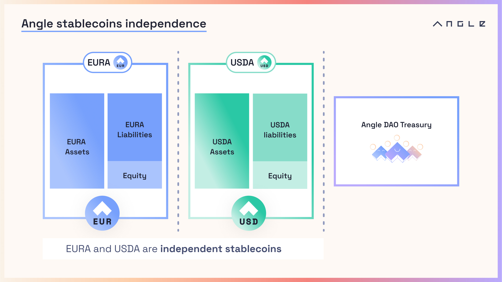
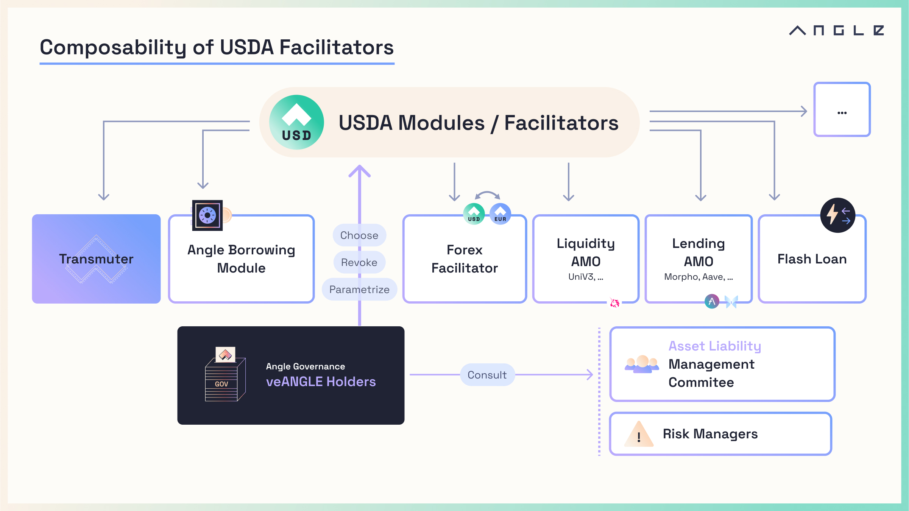

# 📐 Angle Documentation Portal

## 🏅 Introduction to Angle

[Angle](https://app.angle.money) is a decentralized, capital efficient and over-collateralized stablecoin protocol composed of smart contracts running on open blockchains.

It can be used to issue stablecoins designed to maintain the value of the assets they are pegged to.

The protocol consists of several different modules, or facilitators, from which stablecoins can be issued or minted.
Key modules include a [Borrowing module](borrowing-module/) allowing to borrow Angle stablecoins by providing collateral and a price stability module called [Transmuter](transmuter/README.md) that facilitates the exchange of stable assets for Angle stablecoins.

Additionally, the protocol is engaged into [Algorithmic Market Operations](other/amo.md) (AMOs), also known as Direct Deposit Modules, which play a crucial role in boosting the liquidity of the stablecoins across various protocols.

Angle earns a yield from all these modules, and part of it is automatically allocated [through savings products](savings/README.md) to stablecoin holders, so they can also earn a native yield on their assets.

In this documentation, we provide a detailed breakdown of the various components that constitute the Angle Protocol.

### [Stablecoins](stablecoins.md)

Angle is so far behind two independent stablecoins:

- **EURA** (previously agEUR), pegged to the value of the Euro - €. EURA holders can stake their stablecoins for **stEUR** in order to earn a native € yield.
- **USDA**: pegged to the value of the Dollar - $. USDA holders can stake their stablecoins for **stUSD** in order to earn a native $ yield.


EURA used to be known as agEUR but was rebranded in March 2024.


While they leverage the same infrastructure and sets of smart contracts, Angle stablecoins are independent of one another with fully segregated reserves.

### [Transmuter](transmuter/)

Transmuter is deployed on Ethereum. It works as a basket of different stablecoins that can be used to mint Angle stablecoins. Thanks to its dynamic fee model and its internal circuit breakers, the system is able to autonomously control its exposures to the assets it has in reserves and guarantee that the backing of each stablecoin is properly diversified. It is on top of that a trustless system that lets anyone and at any time (including during black swan events) redeem Angle stablecoins for a portion of the assets in the backing.

It is designed as a resilient improvement over the price stability module systems of protocols like [Maker](https://makerdao.com/en/) that showed their limits during the USDC depeg situation in March 2023.

### [Borrowing module](borrowing-module/)

Angle Borrowing module allows users to deposit collateral and borrow Angle stablecoins (debt) against their collateral. It is designed to enable getting leverage on almost any asset through a stablecoin loan, or to simply let people get access to stablecoins while keeping their exposure to a volatile asset or to a yield-bearing token.

### [Savings](savings/)

Angle Savings system is what allows Angle stablecoin holders to earn a native yield based on the returns generated by the protocol on its assets. It does not come with any extra composability risk, and there are no additional trust assumption between owning an Angle stablecoin and its staked version.

### Other Aspects

Angle is not limited to these key components. It has notably a complex [bridge infrastructure](other/cross-chain.md) designed to facilitate the cross-chain liquidity of its stablecoins. It also natively supports [flash loans](other/flash-loans.md) for its stablecoins.

Globally, each stablecoin of the protocol combines different modules/facilitators which are all controlled by the protocol governance. [This page](./stablecoins.md) introduces in more details which modules are live for which stablecoin.

### 🗳 Governance

Angle is a decentralized protocol governed by [a DAO](governance/angle-dao.md) encapsulating all holders of a governance token called ANGLE. Holders of the token have voting powers to propose and make changes to the underlying code of the Angle Protocol.

## ⚒️ [Developers Doc](https://developers.angle.money)

Angle is an open protocol on which anyone can permissionlessly build or suggest improvements. The protocol relies on an open-source codebase available [on Github](https://github.com/AngleProtocol).

There is a technical doc for developers and advanced users to understand how Angle protocol works under the hood and how to build on top of it.


The protocol's smart contracts have undergone several audits by Chainsecurity, Sigma Prime, and Code4rena. You can find the different audit reports [here](resources/audits/).


## 🖼 Branding

If you're writing an article, creating designs and animations about Angle, check out this [assets page](https://anglemoney.notion.site/Angle-Media-Assets-be211b3e9d7d4fb9965048825c88f66c?pvs=4) with all the visual elements about the Angle brand, including logos, icons and images.

## ✏️ [Contributing to this doc](https://github.com/AngleProtocol/angle-docs)

This documentation portal is maintained by Angle Labs, Inc. It is built to be the up-to-date source of truth for Angle Protocol production contracts and for Angle Labs products. If there is anything unclear or out of date, please [submit a pull request](https://github.com/AngleProtocol/angle-docs) to the `angle-docs` repository.
