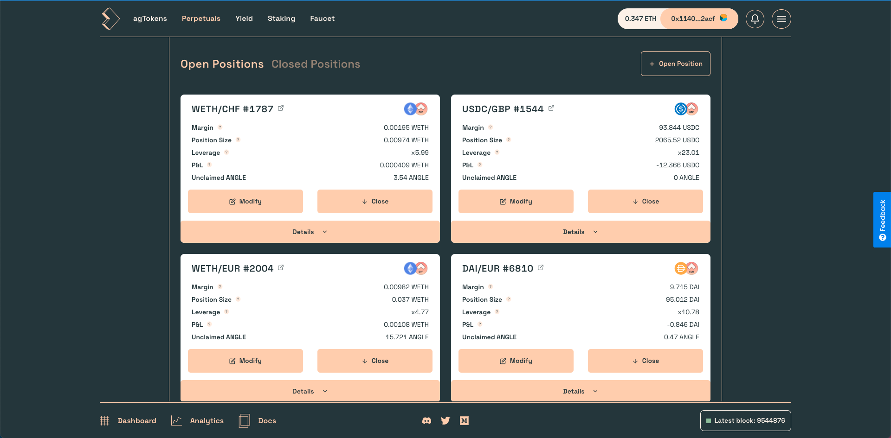
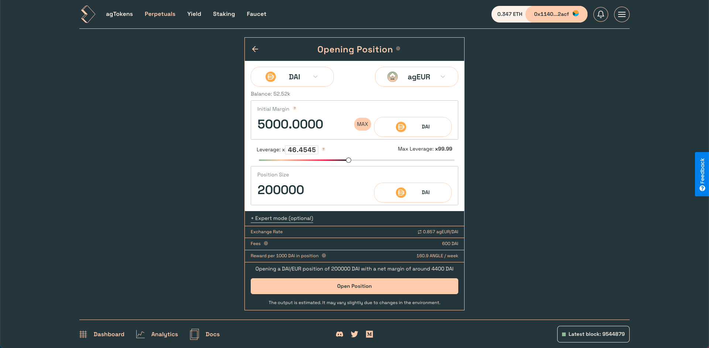
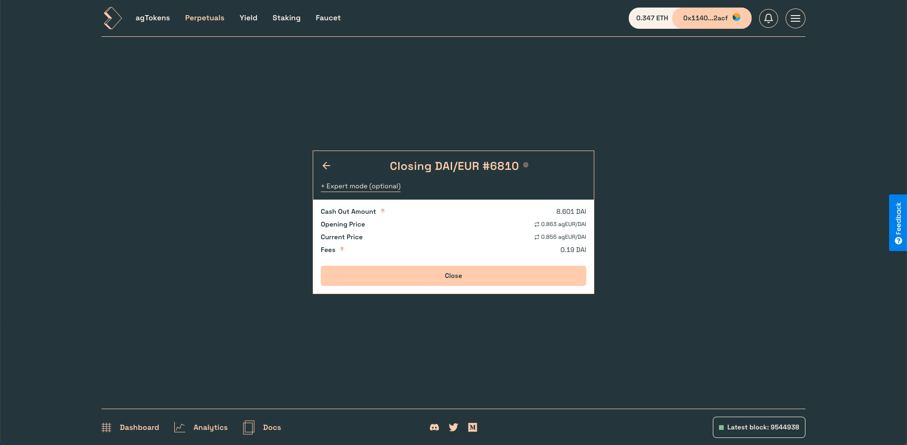
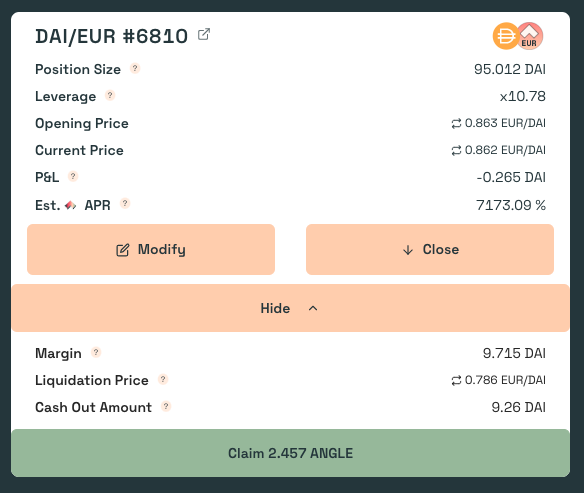

# Opening & Managing Perpetual Positions

## Opening

1. To open a position on Angle, click on the `+ Open Position`button and choose a collateral/stablecoin pair.
2. Then, select the amount of collateral you want to send to the protocol as margin for your position. Positions in Angle work similarly than isolated-margin exchanges, where margin is isolated between positions.
3. Now, you can choose your position size or leverage. This is the amount of underlying tokens you will be exposed to. (NB: leverage in Angle is computed as $$\frac{\texttt{margin + position size}}{\texttt{margin}}$$)
4. The collateral/stablecoin exchange rate and transaction fees are displayed. Note that the net initial margin of your position will be your initial margin input minus fees.
5. Clicking the `Open position` button will prompt you to confirm the transaction. The margin will be sent to the protocol and the leveraged position will be opened.
6. While it is opened, your position will automatically accrue ANGLE staking rewards.


If this is the first time opening a position on this collateral/stablecoin pair, you will need to approve your tokens first. If you have already approved a collateral for a stablecoin to issue agTokens or to deposit collateral, you will need to approve it again when opening a perpetual



Be careful when opening a position, updating and closing is locked for an hour. More info [here](app-faq.md).


## Updating

If you have open positions, you might want to add or remove margin to some of them. Doing so will update your leverage and change your liquidation price. There is no fee for updating the margin of a position.

1. On the HA positions page, click on the `Modify` button.
2. Enter an amount of collateral to add or remove from your position, or change its leverage. You can remove collateral up to reaching the max leverage allowed for the pair of the position. This max leverage can vary from x10 to x100 depending on the pair.
3. You will find current and updated info about your position.
4. Then, just confirm the transaction and it will send/withdraw the amount of collateral that was specified.
5. After the transaction is confirmed, you can go back to the Positions page to see your updated position.

## Closing

1. To close a position, click on the `Close` button of the positions you would like to close.
2. You can then check your position's opening and current prices, as well as the amount of collateral and potential ANGLE rewards you are going to receive upon closing.
3. Click on the `Close` button to confirm the transaction and receive your cash out amount (margin ± PnL) and potential ANGLE rewards.


When opening or closing a position, there is an expert mode to protect for important slippage in price or fees.


## Claiming ANGLE rewards

If you have an open position on Angle, it will automatically accrue ANGLE token rewards. You can see how much you can claim by clicking on the `Details` button at the bottom of the position, and claim your tokens by clicking on the `Claim` button as shown in the screenshot below.

