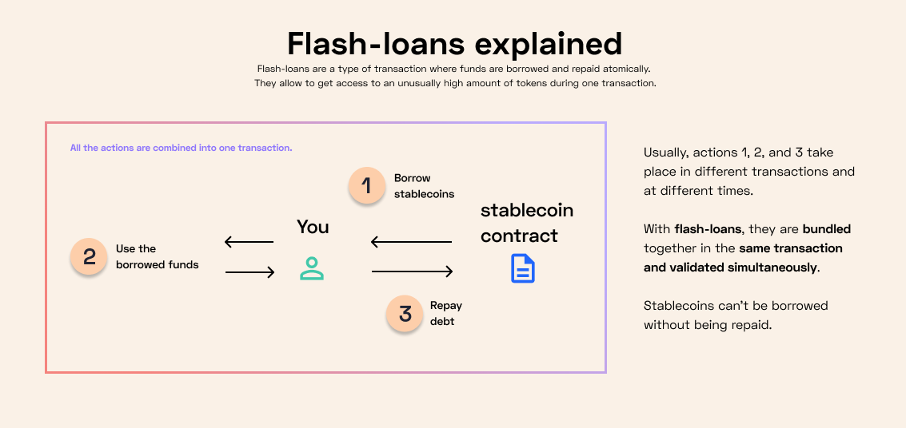

# ⚡️ Angle flash-loans

Flash-loans are now possible with agTokens!

## What are flash loans?

They are a type of loans that allow to borrow and repay tokens in one transaction. Thanks to that, the entity taking out the loan don't need to put down any collateral, as the lender is guaranteed to be paid back if the transaction is executed. This also allows them to borrow/mint huge amounts of agTokens through flash-loans.

## Flash loans with agTokens

Users can take out flash loans with agTokens. The main use case for flash loans is arbitrage between pools, which usually helps rebalancing liquidity over the ecosystem.

More info in our [developers documentation](https://developers.angle.money/overview/guides/flashloans).
