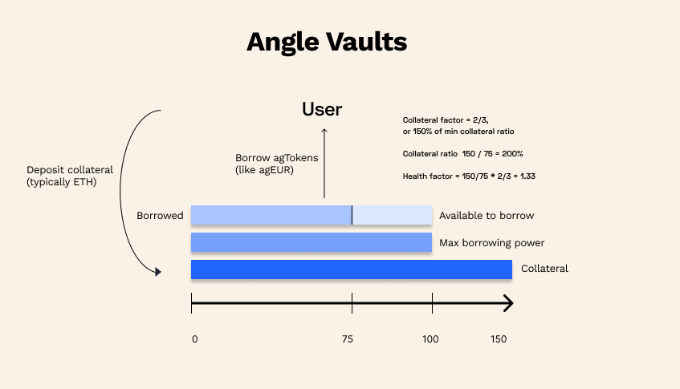
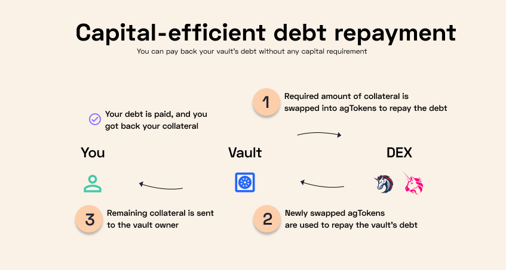
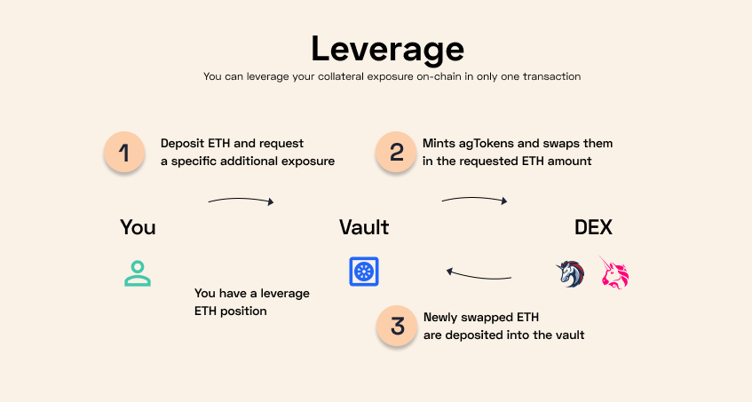

# 🏦 Vaults

The core mechanism of this module relies on a vault system. Users can deposit collateral in `VaultManager` contracts, and borrow a certain amount of agTokens from this vault as a debt that will have to be repaid later. By doing so, they can keep their exposure to the tokens deposited as collateral, while being able to spend the borrowed funds. They can also use this mechanism to increase their exposure to the collateral they own, on-chain and in one transaction.

## 🔎 TL;DR

Angle Borrowing module vault-based system lets you:

* Borrow agTokens from tokens deposited as collateral in the protocol
* Leverage collateral exposure in one transaction
* Transfer your debt between vaults to avoid liquidation
* Perform different actions on your vault in a single transaction and in a capital-efficient manner
* Take self-repaying loans

## Main features

### Borrowing agTokens

The main feature of vaults is the ability to **borrow** Angle stablecoins. A vault is opened when users deposit tokens as [**collateral**](../glossary.md) into a `VaultManager` contract. When doing so, they can choose to borrow a certain amount of agTokens against their collateral. The agTokens borrowed are minted and deposited into their wallets, for them to use however they want. For instance, one may want to borrow stablecoins to profit from stablecoins yield, while keeping exposure to their collateral.

Users with borrowed stablecoins should monitor their vaults' [health factor](../glossary.md). This metric keeps track of the "health" of the vault: it compares the collateral ratio of the vault with the minimum accepted. If the value of the collateral with respect to the agTokens borrowed decreases too much, the health factor will go below 1 and the vault can get [**liquidated**](liquidations.md).

#### Composable actions

With an opened vault, there are many different actions that can be performed beyond borrowing stablecoins: adding collateral, removing collateral from it, repaying the agToken debt. All these actions can be combined with one another in a single transaction.


For more details on how to combine transactions in a modular way with the protocol, you can check [this page](https://developers.angle.money/borrowing-module-contracts/smart-contract-docs/vaultmanager) of our developers documentation.


The advantage of this design is that it enables capital-efficient interactions with Angle vaults.

### Capital-efficient debt repayment

An application of this is that users can repay their debt without any capital requirement.

At some point, users may want to close their debt towards the protocol. Instead of having to get back the agTokens they initially borrowed, they can just use the collateral that is in the vault to have it swapped against their debt tokens. In this case, users can just get back the remaining collateral after the debt has been fully paid back.

On a similar note, it is this capital-efficient design that allows liquidators to participate in liquidations without bringing any stablecoin from their pocket. More is explained [here](liquidations.md).

### Leveraging collateral exposure

Users can also take advantage of Angle Borrowing module capital-efficiency features to borrow agTokens to **leverage their collateral exposure** in one transaction.

When users deposit collateral to open a vault, they can choose the Leverage feature and input the amount of additional exposure they want to the collateral token, up to a certain threshold. What the protocol does is that it mints the necessary quantity of agTokens, swaps it against the desired collateral, and deposits it back into the vault.


Leveraging collateral exposure is a very useful feature for users wanting to safely increase exposure to their collateral token on chain. It is however reserved to more advanced users as it increases liquidation risks.


### Self-repaying loans

Governance could vote to accept any collateral that can easily be liquidated on any chain for this module. As such, any yield-bearing asset could be used, meaning users could take loans with an interest rate smaller than what they are earning thanks to their yield-bearing asset in collateral: Angle Borrowing module hence opens the way to self-repaying loans.

## Additional details

Vaults are defined by a specific set of information:

* A collateral token that is deposited
* A debt token that is borrowed (the stablecoin)
* And a set of parameters:
  * [Collateral factor](../glossary.md)
  * [Minting fee](fees.md#minting-fee)
  * [Stability fee](fees.md#stability-fee)
  * [Liquidation surcharge](fees.md#liquidation-surcharge)
  * [Dust amount](./#dust-amount)

### Collateral Ratio

The most defining parameter of a vault is its **Collateral Ratio**. It defines the ratio between the collateral's value in stablecoin, and the value of the stablecoins borrowed.

$$
\texttt{Collateral Ratio} = \frac{\texttt{collateral value}}{\texttt{debt value}}
$$

The higher the collateral ratio, the "safer" the vault, as the price decline of the collateral needed to get liquidated and lose the collateral is much bigger.

Additionnally, each vault type has its own **collateral factor** parameter. It dictates the minimum ratio between the value of stablecoins borrowed and the value of collateral deposited. If this ratio drops below the CF, the vault risk being liquidated.

For example, if the CF of a vault type is at 2/3, or 150% of min collateral ratio, users need to deposit at least x1.5 more than what they want to borrow. In practice, this means that users wanting to borrow 1,000 agEUR need to deposit at least 1,500€ of ETH for example. If the value of their ETH deposit drops, pushing their CR below 150%, they are in risk of getting liquidated.

### Isolated positions & debt transfer

#### Various Collateral Types

There is one different smart contract per collateral type in Angle Borrowing module: these contracts are called `VaultManager` contracts. There could be for the same collateral asset different `VaultManager` contracts, corresponding to different parameters.

For instance, we could imagine for the same agToken ETH as a collateral with a minimum collateral ratio of 150% and a 1% interest rate on borrows and ETH with a minimum collateral ratio of 120% and an interest rate of 3%.

#### Isolated positions

Each `VaultManager` contract follows the standard of NFT contracts. As such, each vault position is represented by a NFT. This makes them isolated and transferrable. Additionally, this means that a position of an address in a vault is totally separated from a position of the same address in another vault, within the same `VaultManager` contract or within another contract.

One vault liquidation has no impact on the others.

#### Debt transfers

Thanks to the isolation of positions, one could become under a risk of liquidation, while the other has plenty collateral and a much higher collateral ratio.

In this case, users are able to perform a debt transfer, meaning that they will transfer part of their debt from one of their vault to another, without actually transferring stablecoins. Debt transfer is only possible between vaults related to the same stablecoin, but can be done with vaults linked to different collateral types.

A debt transfer operation increases the health ratio of the first vault, as it has less debt, and decreases that of the second. It allows users to rebalance their debt and collateral ratio between the different vaults they own in an efficient manner, as the transaction just involves an accounting operation.

### Dust Amount

To make sure the protocol doesn't accumulate bad debt, the protocol needs to enforce a minimum amount of agTokens to be borrowed. This is required to make sure that each position has enough debt so that it's always worth to liquidate it.

It's important to keep in mind that these debt-based models similar to Maker rely heavily on [liquidations](liquidations.md) to remain robust and collateralized. If the amounts to liquidate are too small, the profit made by liquidators could be too low so that it doesn't even cover gas cost, and is not profitable anymore. In that case, the protocol would be left holding under-collateralized positions.

### Keepers & Oracle

#### Keepers

Angle Borrowing module only relies on two types of keepers: liquidators, which erase risky positions and are key to the health of the system, and keepers to push the surplus stored in the `Treasury` contract to the protocol.

#### Oracle

Angle Borrowing module uses Chainlink price feeds, and may sometimes also rely on on-chain data. For the case of WStETH for example, the protocol needs to call some functions of the StETH contract besides the Chainlink feeds to get the EUR price of WStETH.

## Next

The next sections will dive in more details into some aspects of the vaults, such as [fees](fees.md), [liquidations](liquidations.md), the [whitelisting](whitelisting-and-volatile-assets.md) of specific addresses, and [token reactors](../../angle-borrowing-module/token-reactor.md).
