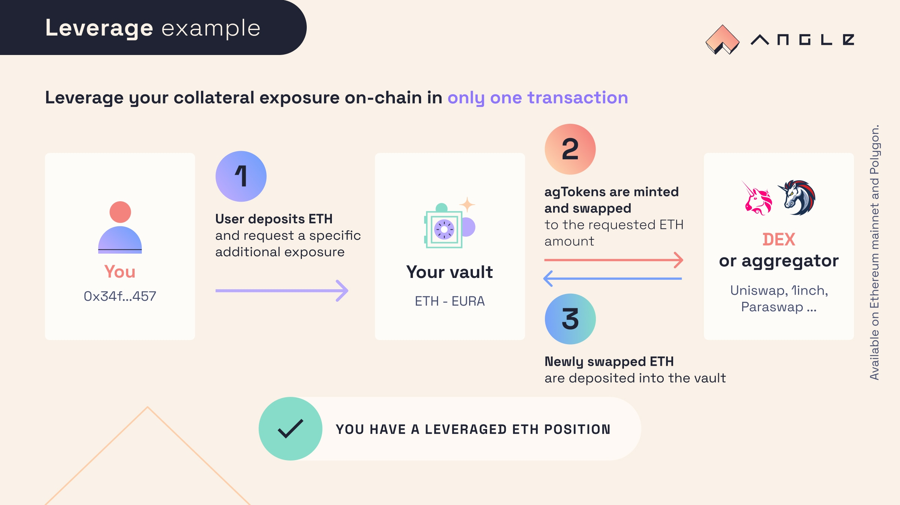
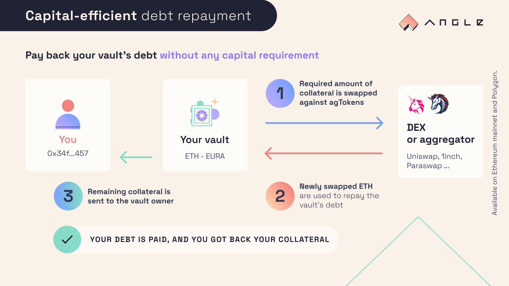

# 🏦 Vaults

This module's main mechanism is its vault system. Users can deposit collateral in `VaultManager` contracts, and borrow a certain amount of agTokens from this vault as a debt that will have to be repaid later. By doing so, they can keep their exposure to the tokens deposited as collateral, while being able to use or spend the borrowed funds. They can also use this mechanism to increase their exposure to the collateral they own, onchain and in one transaction.

## 🔎 TL;DR

Angle Borrowing module vault-based system lets you:

- Borrow agTokens from tokens deposited as collateral in the protocol
- Leverage collateral exposure in one transaction
- Take out self-repaying loans or earn a leveraged yield
- Transfer your debt between vaults to avoid liquidation
- Perform different actions on your vault in a single transaction and in a capital efficient manner

## Main features

### Borrowing agTokens

The main feature of vaults is the ability to **borrow** Angle stablecoins. A vault is opened when users deposit tokens as [**collateral**](../glossary.md) into a `VaultManager` contract. When doing so, they can choose to borrow a certain amount of agTokens against their collateral. The agTokens borrowed are minted and deposited into their wallets, for them to use however they want. For instance, one may want to borrow stablecoins to profit from stablecoins yield, while keeping exposure to their collateral.

Users with borrowed stablecoins should monitor their vaults' [health factor](../glossary.md). This metric keeps track of the "health" of the vault: it compares the collateral ratio of the vault with the minimum accepted. If the value of the collateral with respect to the agTokens borrowed decreases so much that the health factor goes below 1, then the vault can get [**liquidated**](liquidations.md).

### Leveraging collateral exposure

Users can also take advantage of Angle Borrowing module capital-efficiency features to borrow agTokens to **leverage their collateral exposure** in one transaction.

When users deposit collateral to open a vault, they can choose the Leverage feature and input the amount of additional exposure they want to the collateral token, up to a certain threshold. What the protocol does is that it mints the necessary quantity of agTokens, swaps it against the desired collateral, and deposits it back into the vault.


Leveraging collateral exposure is a very useful feature for users wanting to safely increase exposure to their collateral token on chain. It is however reserved to more advanced users as it increases liquidation risks.


### Leveraged yield & Self-repaying loans

Governance can vote to accept any collateral that can easily be liquidated on any chain for this module. As such, any yield-bearing asset can technically be used to borrow agTokens. It means that users can take out loans with an interest rate cost smaller than what they are earning from their yield-bearing collateral asset.

The Borrowing module is built such that there is no opportunity cost to deposit yield-bearing assets into it. Any external rewards earned by collateral assets (like staked Curve LP tokens earning CRV) can be claimed from Angle UI. Users earn the same rewards, or more, than what they'd be earning if they hadn't put their asset in Angle.

Support for yield-bearing tokens as collateral thus makes Angle Borrowing module a good place to earn a **leveraged yield on these assets**. If the borrowing cost is 0.5% and a collateral with an APR of 3% is used, a 4x leverage can **increase the effective returns** up to 10.5%, assuming collateral price remains constant.


Make sure to understand how the concerned tokens work and their associated risks before using them as collateral. More info about the risks in our blog post about [Leveraged yield in DeFi](https://www.angle.money/blog/learn/angle-explains-leveraged-yield-in-defi).


### Composable actions

With an opened vault, there are many different actions that can be performed beyond borrowing stablecoins: adding collateral, removing collateral from it, repaying the agToken debt. All these actions can be combined with one another in a single transaction.


For more details on how to combine transactions in a modular way with the protocol, you can check [this page](https://developers.angle.money/borrowing-module-contracts/smart-contract-docs/vaultmanager) of our developers documentation.


This design enables capital efficient interactions with Angle vaults.

### Capital-efficient debt repayment

An application of this is that users can repay their debt without any capital requirement.

At some point, users may want to close their debt towards the protocol. Instead of having to get back the agTokens they initially borrowed, they can just use the collateral that is in the vault to have it swapped against their debt tokens. In this case, users can just get back the remaining collateral after the debt has been fully paid back.

On a similar note, it is this capital efficient design that allows liquidators to participate in liquidations without bringing any stablecoin from their pocket. More is explained [here](liquidations.md).

### Optimized Liquidations

Liquidations in this borrowing system are designed to protect borrowers, making sure they're less affected than what they would be in other protocols by such events. This is possible thanks to the special liquidation features introduced by Angle including variable liquidation amounts, dynamic discount for liquidators based on Dutch auctions.


For more insight on liquidations, check out [this page](liquidations.md).


## Additional Features and Details

Vaults are defined by a specific set of information:

- A collateral token that is deposited
- A debt token that is borrowed (the stablecoin)
- And the following parameters:
  - [Collateral factor](../glossary.md)
  - [Mint fee](fees.md#minting-fee)
  - [Stability fee](fees.md#stability-fee)
  - [Repay fee](fees.md#repaying-fee)
  - [Liquidation surcharge](fees.md#liquidation-surcharge)
  - [Dust amounts](./#dust-amounts)

### Collateral Ratio & Collateral Factor

The most defining parameter of a vault is its **Collateral Ratio**. It defines the ratio between the collateral's value in stablecoin, and the value of the stablecoins borrowed.

$$
\texttt{Collateral Ratio} = \frac{\texttt{collateral value}}{\texttt{debt value}}
$$

The higher the collateral ratio, the "safer" the vault, as the price decline of the collateral needed to get liquidated and lose the collateral is much bigger.

Additionally, each vault type has its own **collateral factor** (CF) parameter. It dictates the minimum collateral ratio allowed for vaults of this type. If this ratio drops below this quantity defined by the CF (1/CF more precisely), the vault risks being liquidated.

For example, if the CF of a vault type is at 2/3, or 150% of min collateral ratio, users need to deposit at least x1.5 more than what they want to borrow. In practice, this means that users wanting to borrow 1,000 agEUR need to deposit at least 1,500€ of ETH for example. If the value of their ETH deposit drops, pushing their CR below 150%, they are in risk of getting liquidated.

### Isolated positions & debt transfer

#### Various Collateral Types

There is one different smart contract per collateral type in Angle Borrowing module: these contracts are called `VaultManager` contracts. There could be for the same collateral asset different `VaultManager` contracts, corresponding to different parameters.

For instance, we could imagine for the same agToken ETH as a collateral with a minimum collateral ratio of 150% and a 1% interest rate on borrows and ETH with a minimum collateral ratio of 120% and an interest rate of 3%.

#### Isolated positions & NFTs

Each `VaultManager` contract follows the standard of NFT contracts. As such, each vault position is represented by a NFT. This makes them isolated and transferrable. Additionally, this means that a position of an address in a vault is totally separated from a position of the same address in another vault, within the same `VaultManager` contract or within another contract.

One vault liquidation has no impact on the others.

#### Debt transfers

Thanks to the isolation of positions, one could become under a risk of liquidation, while the other has plenty collateral and a much higher collateral ratio.

In this case, users are able to perform a debt transfer, meaning that they can transfer part of their debt from one of their vault to another, without actually transferring stablecoins. Debt transfer is only possible between vaults related to the same stablecoin, but can be done with vaults linked to different collateral types.

A debt transfer operation increases the health ratio of the first vault, as it has less debt, and decreases that of the second. It allows users to rebalance their debt and collateral ratio between the different vaults they own in an efficient manner, as the transaction just involves an accounting operation.

### Interacting with multiple vaults at the same time

Angle is one of the first protocols to implement a permit function on a NFT/ERC721 contract to grant or revoke approval to an address for all the vaults of a contract with a gasless permit signature.

This allows users to interact with multiple vaults from different collaterals in just one transaction using a router contract. In this situation, by just granting approval with a signature to a router contract, they can for instance repay the debt from all their vaults at once, or perform multiple swap/wrapping transactions (e.g. from ETH to wstETH) before adding collateral to a vault.

### Dust Amounts

To make sure the protocol doesn't accumulate bad debt, the protocol has the possibility to enforce a minimum amount of agTokens to be borrowed. This can be used as a protection to make sure that each position has enough debt so that it's always worth to liquidate it.

It's important to keep in mind that this debt-based module relies heavily on [liquidations](liquidations.md) to remain robust and collateralized. If the amounts to liquidate are too small, the profit made by liquidators could be too low with respect to the gas costs, and liquidating is not profitable anymore. In that case, the protocol would be left with under-collateralized positions.

On top of the parameter for the minimum amount that can be borrowed, the protocol introduces a minimum amount of debt from which liquidators need to repay the whole debt of a position. As described in the [liquidation](liquidations.md) section, liquidators cannot always repay the full debt of a position when liquidating a position, except when the debt of this position is below a certain threshold specified for each collateral asset.

### Keepers & Oracle

#### Keepers

Angle Borrowing module only relies on two types of keepers: liquidators, which erase risky positions and are key to the health of the system, and keepers to push the surplus stored in the `Treasury` contract to the protocol.

#### Oracle

Angle Borrowing module uses Chainlink price feeds, and may sometimes also rely on onchain data. For the case of wstETH for example, the protocol needs to call some functions of the StETH contract besides the Chainlink feeds to get the EUR price of wstETH.

## Next

The next sections will dive in more details into some aspects of the vaults, such as [fees](fees.md), [liquidations](liquidations.md) and the [whitelisting](whitelisting-and-volatile-assets.md) of specific addresses.
