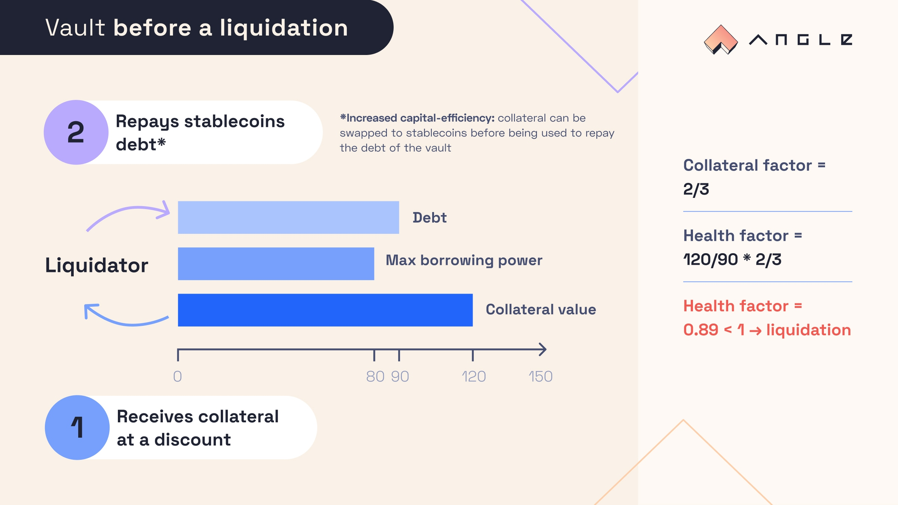
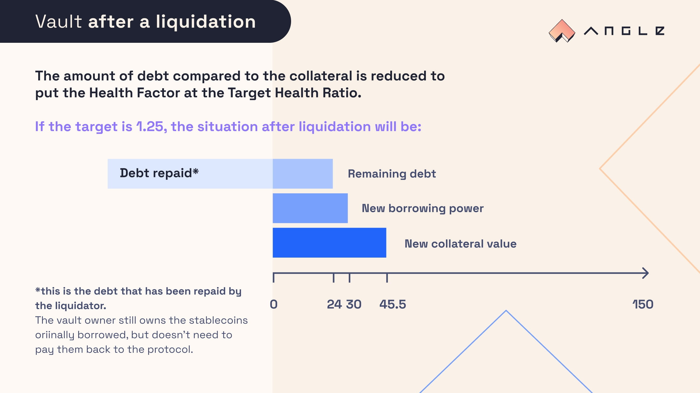

# 🎳 Liquidations

Liquidation is the mechanism by which external actors repay the debt of borrowers on their behalf when they become insolvent: it is the process that guarantees the robustness of the Borrowing module and that there is always more collateral than agTokens issued.

Angle Vaults can get liquidated if the value of the collateral deposited gets too low compared to the value of the agTokens borrowed. A liquidation situation for a vault depends on its [health factor](../../new-module/vaults/glossary.md) which depends on the [collateral factor](../../new-module/vaults/glossary.md) of the corresponding vault.

Liquidations in this Borrowing module are designed to be as much borrower friendly as possible, and to drastically improve over similar designs in relative protocols.

## 🔎 TL;DR

- Vaults with a health factor below 1 risk getting liquidated
- Liquidated vaults can lose part or all of their collateral. Owners of such vaults however get to keep the stablecoins they borrowed
- Angle comes with its unique set of liquidation features such as a variable liquidation amount, a dynamic discount for liquidators based on Dutch auctions, and a discount booster for veANGLE holders which make this system overall more borrower friendly than alternatives.

## How liquidations work

### Health Factor

Each vault has its own collateral ratio (`CR`). Together with the collateral factor (`CF`), they are used to compute the health factor of an open vault. For example, for a vault with 160€ worth of collateral and 100 agEUR borrowed, if the collateral factor is 2/3:

$$
\texttt{HF = CR * CF} \\ \texttt{HF} = 160/100 * 2/3 = 1.07
$$

If this health factor goes below 1, it means that the value of the collateral backing the stablecoin is too low compared to what was defined by the protocol and the position can get liquidated.

### What happens to a position getting liquidated?

Liquidating a position means repaying part or the entirety of the vault's debt (agTokens) against the collateral it holds (ETH or any other collateral token), usually at a discount.

After getting liquidated, a vault will either be empty, or both the amount of debt and collateral will have been reduced in a way that puts the Health Factor of the vault back above a healthy target.

This means that users will either lose their collateral completely (but won't have anything to pay back to the protocol) or lose part of their collateral and still have some debt towards the protocol.

From a liquidator perspective, there is **no capital requirement when liquidating Angle Vaults**. Liquidator receive the collateral of the vault first, before having to repay the collateral, which means they can atomically swap the collateral received at a discount to stablecoins to repay the debt they are liquidating.

## Details about liquidations within Angle

### Liquidation Surcharge (fee)

When a vault gets fully or partially liquidated, a liquidation surcharge is applied to what is being paid by the liquidator and captured by the protocol. In practice, this means that if the liquidation surcharge is 2%, when a liquidator repays 100 of the debt of a vault only 98 will be repaid and 2 will go to the protocol.

This is a way for the protocol to grow reserves especially from collaterals that often get liquidated.

### Variable Liquidations Amount

In Angle Borrowing module, **the amount of debt to repay during a liquidation is dynamic** and computed such that after the liquidation, the liquidated vault ends up in a level of “health” defined by a target parameter: the [target health factor](../../new-module/vaults/glossary.md). This is determined by the following equation:

$$
HF_{post}(x_{max}) = \frac{(c - \frac{x}{1-e})\times CF }{d-x(1-s)} = \texttt{Target Health Factor}
$$

With:

- `x` as the amount of stablecoin debt to repay
- `c` as the collateral's value in stablecoin
- `d` as the amount of stablecoin debt of the vault
- `e` as the liquidation discount
- `s` as the liquidation surcharge

In some conditions, the variables at liquidation are such that $HF\_{post}(x\_{max})$ is a decreasing function of `x`: the health factor can't be put back at a healthy value. In this case, liquidators are able to liquidate all of a position’s collateral to avoid leaving an amount of debt that is too small to repay. In such situation, it is possible that some of the debt is left unpaid. This will be pooled across contracts and accounted for as bad debt, to make sure no surplus is distributed until this debt is erased.

In practice, full liquidations should be extremely occasional and most vaults should get less than 50% of their position liquidated. This allows them to keep as much collateral in their vault as possible, and make liquidations in Angle Borrowing module less harmful to borrowers than elsewhere in the industry.

Liquidators do not have to repay the maximum amount that the protocol allows them to. The `x` variable described above is a maximum amount that liquidators can repay, and in the absence of dust amounts, liquidators can choose to repay any amount between 0 and `x`. Should a liquidator decide not to repay everything that's available, a position may face several successive liquidations.


If the debt of a liquidated vault is below what is called the `dustLiquidation` threshold set by governance for the collateral asset, liquidators must liquidate the full debt of the vault.


### Dynamic Discount

To incentivize liquidations, the protocol lets liquidators buy the available collateral at a **discount**, meaning that they get back more collateral than the amount of stablecoins they brought.

For example, if the liquidation discount is 5%, the liquidator will be able to get 100 of collateral by paying back only 95 of stablecoin debt.

This discount is dynamic, increasing linearly with the decrease of the concerned vault's health factor. The more unhealthy a vault is, the bigger the incentives for liquidators to come.

Precisely speaking, the discount given to a liquidator is defined by:

$$
e(HF) = a(1-HF)
$$

With `a` as the liquidation boost, a factor determining the slope of the function.

This opens some interesting dynamics for liquidators. What happens for a vault that can get liquidated is **a Dutch Auction on the discount** between liquidators. The first liquidator taking action to liquidate is the one which is willing to accept the smallest discount for the collateral upon repaying stablecoins.

This ensures that liquidators are given just what they need to make a profit, unlike in other protocols where they can make instantaneous 13% discount. This is part of what makes the liquidation process far more borrower friendly as liquidated vaults lose the smallest amount possible from their vault.

### Liquidation Booster

By being stakeholders in the protocol, liquidators holding veANGLE could get a higher discount than others depending on their veANGLE balance.

This would give utility to veANGLE, as well as incentivize veANGLE to liquidate before others, further aligning the interests of veANGLE holders with the protocol.

$$
a = \texttt{baseBoost} \times f(\texttt{veANGLE balance})
$$

Where `f` is a piecewise linear increasing function of the veANGLE balance, capped by a certain amount.


This feature may not always be activated, and governance has the choice to set it or not.


### No Capital Requirements

Liquidators can liquidate vaults without bringing in any capital. When liquidating, they receive the liquidated collateral at the beginning of the transaction, which allows them to swap it against the required amount of stablecoins to pay back the debt by the end of the transaction.

This decreases **a lot** the barriers to entry for potential liquidators and makes it more competitive, which is ultimately better for borrowers.

## Example

Let's say that the protocol has the following parameters for a given :

- `CF` = 2/3, as the collateral factor
- `c` = 120, as the collateral value expressed in stablecoin
- `d` = 90, as the debt value or stablecoins borrowed
- `s` = 2%, as the liquidation surcharge
- `e` = 10%, as the liquidation discount
- `x`, as the amount of stablecoins repaid by the liquidator

At this point, the vault has a Health Factor of:

$$
HF = \frac{c\times CF}{d}= \frac{120\times 2/3}{90} = 0.89
$$

As `HF < 1`, the vault should get liquidated. After being liquidated, the new Health Factor of the vault should be:

$$
HF_{post}(x) = \frac{c_{post}\times CF }{d_{post}} = \frac{(c - \frac{x}{1-e})\times CF }{d-x(1-s)} = \texttt{target health factor}
$$

Let's say that the Target Health Factor is equal to 1.25, such that we get an amount to repay `x = 67` after solving the equation $$HF_{post}(x) = \texttt{Target Health Factor}$$. We can decompose each component of the vault, and we get:

$$
c_{post} = 120 - \frac{67}{1-0.10} ≈ 120 - 74,5 ≈ 45,5
$$

$$
d_{post} = 90 - 67(1-0.02) = 90 - 66 = 24
$$

In this example, the liquidator can choose to repay up to 67 of stablecoin, and get back up to \~74,5 of collateral (effectively getting a discount).

## Developers doc

For more details on how to participate in liquidations, to take advantage of capital-efficiency features, you can have a look at our [developers documentation](https://developers.angle.money/overview/guides/liquidations-borrowing).
