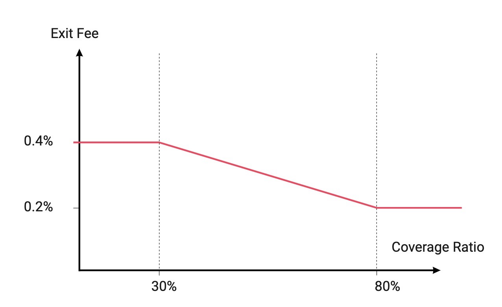

# 🛡️ Hedging Agents

## 🔎 TL;DR

* Hedging Agents (HAs) get perpetual futures from the protocol: they can get leveraged in one transaction on the evolution of the price of a collateral with a multiplier of their choice.
* They are here to insure the protocol against the volatility of the collateral brought by users. With enough HAs, the protocol could resist collateral price drops of up to 99%.
* HAs can make significant gains in case of price increase but also substantial losses when collateral price decreases.
* They pay small transaction fees (potentially around 0.3%) when they open their position and when they close it.
* Contrary to centralized exchanges, they do not have to pay funding rates for holding their positions.

## 🗺 Principle

Angle by essence is highly dependent on collateral volatility. If one stable seeker brings 1 wETH and gets 2000 agUSD, if the dollar price of wETH is afterwards divided by 2 (50% decrease - from 2000$ to 1000$), and the owner of the 2000 agUSD wants to get collateral back, the protocol would need to give this person 2 wETH: it thus needs to find somewhere in the market 1 wETH to maintain the stability of the tokens.

We say that the protocol needs to insure itself against the volatility of the collateral. While surges in collateral prices are beneficial to the protocol, drops as in the example above are less desirable. 

For this reason, Angle created a way to transfer the volatility to other actors willing to get leveraged on the collateral: the Hedging Agents (HAs). They are the agents insuring the protocol against drops in collateral prices or surges in stable asset price, making sure that the protocol has always enough reserves to reimburse users.

## 🔮 Perpetual Futures

Hedging Agents are taking perpetual futures from the protocol. When they come in the protocol to back a given stablecoin, they bring a certain amount of collateral (their margin), and choose an amount of the same collateral from the protocol they want to back (or cover, this is a synonym). The protocol then stores the oracle value and the timestamp at which they came in the protocol in what we call a perpetual, as well as the timestamp.

Hedging Agents are independent from one another, meaning that the actions of one Hedging Agent have no impact on the position of another Hedging Agent. 

Precisely speaking, if a HA enters with an amount `x` of collateral (`x`is the margin) and decides to cover the volatility of an amount `y` of the same collateral (`y` is the amount committed or the position size) that was brought by users minting stablecoins, then the protocol stores `x`, `y`, the oracle value and the timestamp at which this HA came in.

 At a given point in time this HA is entitled to get from the protocol:

$$
\texttt{cash out amount} = x+y\cdot (1-\frac{\texttt{initial oracle price}}{\texttt{current oracle price}})
$$

This formula means that a HA will get back her input `x`, plus or minus the capital gains or losses of the amount `y` she decided to back.

The `PnL` of the HA on this position is therefore:

$$
\texttt{PnL} = y\cdot (1-\frac{\texttt{initial oracle price}}{\texttt{current oracle price}})
$$

Since HAs bring collateral to the protocol, we define their leverage as:

$$
\texttt{leverage} = \frac{x+y}{y} =  \frac{\texttt{margin + amount committed}}{\texttt{amount committed}}
$$

### 📈 Price Increase Scenario

When the collateral price increases (with respect to the asset stablecoins are pegged to), besides their margin (that is the amount the brought initially), HAs are entitled to get the capital gains they would have made if they had owned the collateral they covered.

If the HA brought 1 wETH and decided to back 1 wETH from the protocol that was at first used to issue agUSD, and if the initial oracle price for wETH is such that 1 wETH is worth 2000$, then:

$$
x = 1, \space y=1
$$

$$
\texttt{initial oracle price} = 2000
$$

If the price of wETH increases to 4000$, then according to the formula above, this HA can claim and get from the protocol:

$$
\texttt{cash out amount} = 1.5 \space \texttt{wETH}
$$

The HA made 6000$ from her 2000$ initially. If she had just stayed long without getting leveraged, she would have only 4000$.

### 📉 Price Decrease Scenario

When the collateral price decreases (with respect to the asset stablecoins are pegged to), HAs have to pay using the amount they initially brought for the capital losses they would have made if they had owned the collateral they covered.

Back to the previous example, if the price of wETH decreases to 1000$, then the cash out amount of the HA becomes:

$$
\texttt{cash out amount} = 1 + 1 \cdot (1-2) = 0
$$

At this point the HA gets liquidated, and even if the price increases back again, the HA can no longer claim collateral back.

In general, the cash out amount of a HA can go to zero, if the price drops to:

$$
\texttt{current price} = \frac{y}{x+y}\cdot \texttt{initial price}
$$

## 💧 HAs Liquidations

In practice, and like in most centralized perpetual swaps exchanges, there is for each HA a maintenance margin meaning that if the value of the theorical cash out amount gets too small compared with the amount committed by the HA, then this HA can get liquidated. A HA can hence get liquidated even with a non null cash out amount.

Mathematically speaking, we define the margin ratio of a HA as:

$$
\texttt{margin ratio} = \frac{\texttt{margin + PnL}}{\texttt{amount committed}}
$$

Or to use the notations from before:

$$
\texttt{margin ratio} = \frac{x}{y} + (1-\frac{\texttt{initial oracle price}}{\texttt{current oracle price}})
$$

A HA can get liquidated if:

$$
\texttt{margin ratio} \leq \texttt{maintenance margin}
$$

## 🛏️ HAs Covered Amounts

When HAs enter the protocol, they specify an amount of collateral they want to back. Yet from  a protocol perspective, when an HA gets in the protocol, this HA insures a fixed amount of stablecoins. 

Why? Let's say that there is one HA in the protocol that entered at a time where the price of collateral with respect to the stablecoin was `p_e` and commits to an amount of collateral of `c`. HAs are not allowed to cover collateral that is not already in the protocol, to this extent, the amount `c` here must be collateral in the protocol's reserves, brought by a user minting stablecoins. 

If the HA cashes out at a moment in which the collateral is worth `p`, if we imagine that there was only `c` of collateral in the protocol before the HA came in, then the protocol ends up with:

$$
c - \texttt{PnL} =  c \cdot \frac{p_e}{p}
$$

This means that the protocol has enough in reserves for the burn of:

$$
c \cdot \frac{p_e}{p} \cdot p = c \cdot p_e \texttt{ stablecoins}
$$

This quantity remains constant and only depends on variables fixed upon HAs entry. So while HAs only see that they back an amount of collateral from users, from a protocol perspective, each HA insures the protocol for a fixed amount of stablecoins. This is what the accounting of the protocol keeps track of when determining when to let HAs come in or not.

The total amount covered by HAs for a given collateral/stablecoin pair is hence the sum of the product between the amount committed by HAs and their entry price: it is a measure of how many stablecoins you could burn right now thanks to HAs. 

$$
\texttt{HA stablecoin covered amount} = \sum_{i = 1}^n c_i p_{e,i}
$$

This quantity is compared to another quantity that represents how much collateral in stablecoin value you would need if every user brought back the stablecoins they minted and asked for the collateral they initially brought. For instance, if users bring 1 wETH to mint 2000 agUSD then the amount you would need to have in reserves to support the burn is 2000 USD of wETH. But if, after a price change, a user burns 1000 agUSD for 0.2 wETH, this quantity becomes 1000 USD of wETH. HAs are only allowed to cover a fraction of this quantity: this is called the `target covered amount` .

The coverage ratio of the protocol for a given stablecoin/collateral pair is hence defined as:

$$
\texttt{coverage ratio} = \frac{\texttt{HAs stablecoin covered amount}}{\texttt{target covered amount in stablecoin value}}
$$

## 🏢 Insurance of the Protocol Against Collateral Volatility

Above was explained how each HA helps to insure the protocol for the burn of a fixed amount of stablecoins regardless of the volatility of the collateral. Here we explain in a more imaged way how that clearly works in case of a price increase or decrease of the collateral.

If HAs have a 6x leverage and back all the collateral in the protocol that was used to issue stablecoins:

## 🪙 Transaction Fees

At Angle, Hedging Agents have to pay small transaction fees when they come in and when they cash out from the protocol. These transaction fees are computed on the amount that is committed by the HA. Entry and exit fees for HAs have different evolutions and depend on coverage curves that define the exact fees amount as a function of the coverage ratio.


Note that with Angle, there is no funding rate like in centralized exchanges proposing perpetual futures for holding perpetual futures.



The exact values of the transaction fees for HAs for the different collateral types and stablecoins are still to be determined.


### Entry Transaction Fees

The entry transaction fees for HAs is an upfront cost paid when the perpetual is created.

The more is covered (the higher the coverage ratio) the more expensive it gets to be an HA. Conversely, HAs should be incentivized to enter positions to help cover the protocol when the coverage ratio is low: they face low transaction fees in this case.

If an HA comes to the protocol with 1000 USDC for the agEUR stablecoin and commits to the variation of 2000 other USDC (the position size in this case is 2000 USDC), if the transaction fees are 0.3%, then the protocol considers that the HA has a margin of (1000 - (0.003  x 2000)) = 994 USDC to cover 2000 USDC.

### Exit Transaction Fees

Exit fees are paid by HAs when they cash out their perpetuals. The more collateral is covered by HAs, the less expensive it is to exit the protocol. When the coverage ratio is low, HAs should be discouraged to exit with higher transaction fees.

If a HA had an initial margin (initial amount brought) of 1000 USDC and covered 2000 USDC for the Euro stablecoin protocol, then with 0.3% transaction fees, the HA will get in USDC the current value of her perpetual according to the formula above minus 0.3% of 2000 (the amount covered).

### Fees For Increasing Or Decreasing Leverage

When HAs create a perpetual, they have the opportunity to increase or decrease their margin thus decreasing or increasing the leverage of their perpetual. Fees indeed depend on the position size (also called committed amount) of HAs, and since these add/remove operations do not modify the position size (just the margin), no fees are paid for such operations. 

