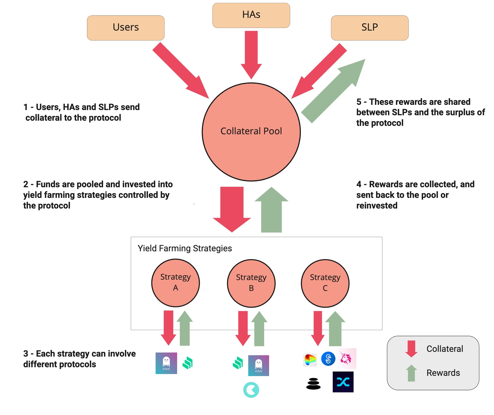

# 📈 Lending Strategies - Yield on Reserves

## 🔎 TL;DR

- The protocol makes yield on the reserves it holds by lending a portion of it to other platforms.
- To do so, the protocol relies on strategies which decide how much and in which protocols reserves should be placed.
- Angle is modular: there can be multiple strategies for a single collateral, each interacting with multiple platforms.
- Strategies are what enables the protocol to propose higher yield to SLPs than what they would get by lending directly to other protocols.

## 💡 Rationale

Lending a fraction of the reserves of the protocol to other lending platforms is part of what can make the protocol attractive to Standard Liquidity Providers. By lending reserves, the protocol can on the one hand propose interesting yield to Standard Liquidity Providers and on the other hand accumulate some surplus.

## 🎨 Design

The design of that has been heavily inspired by what [Yearn](https://yearn.finance) does. Angle relies on strategies, that themselves use Lender's contracts interacting with lending and other yield farming protocols.

Just like on Yearn, new strategies to get some yield on the protocol's collateral can be added along the way by governance votes. Each strategy can also support multiple lending platforms or protocols.

Each collateral for each stablecoin have its set of strategies to get some yield on it. For instance, for a agEUR stablecoin backed by USDC and DAI, we may have for the USDC collateral a single strategy trying to always optimize to get the best APY between Compound and Aave, and for the DAI stablecoin two strategies, one that just consists in lending to Compound and one that consists in optimizing between Aave and Cream.

The first strategy implemented simply consists in optimizing lending between Compound and Aave and pick the one with the best APY.

Since gas cost is quite high in Ethereum, users minting and burning, SLPs depositing and withdrawing, as well as HAs opening and closing positions never interact directly with strategy contracts. When they send or withdraw collateral to the protocol, their collateral goes or is taken from the protocol's reserves, and it is not directly lent or withdrawn from strategies.

The way collateral is lent or withdrawn from strategies and their corresponding lending platforms is through keepers calling the `harvest`function to withdraw or lend collateral to strategies.


It was preferred to get inspiration from Yearn rather than using Yearn directly in order to keep full control on the reserves and to remove a third party integration which would have taken up some fees.


## 💹 Debt Ratio

For each strategy associated to a collateral, it is possible to compute a debt ratio that corresponds to the ratio between what has been lent and the total amount of collateral in the pool \(what's kept in reserves + what has been lent across all strategies\). Each strategy has its target debt ratio. Below this debt ratio, keepers can call the `harvest` function to give more collateral to the strategy and above this debt ratio, collateral can be withdrawn from the strategy and hence from the corresponding lending platforms.


Keepers cannot choose the amount they lend or withdraw from lending platforms: this is automatically computed using the strategy's target debt ratio at each call to `harvest.`


## ✖️ Back To The Multiplier Effect For SLPs

Thanks to the lending strategies, SLPs get rewards not only from their capital, but also from that of Users and HAs. This allow them to get potentially higher yield than if they were farming only with their capital.
