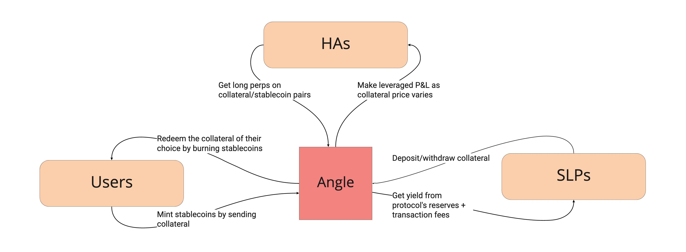

# 🔭 Angle Core Module Overview

## 🔎 TL;DR

* Angle Core module relies on three groups of stakeholders: stable seekers and holders, Hedging Agents and Standard Liquidity Providers.
* It can be used to issue multiple stablecoins, each with its own separate pools of backing collateral.

## Three Groups of Stakeholders

The Angle Core module relies on three types of agents which all benefit from it to maintain the stability of Angle stablecoins:

* **Stable Seekers or Users:** they can swap collateral against stable assets and conversely swap stable assets against a whitelisted collateral of their choice at oracle value and with no slippage. They pay small transaction fees when they mint and/or burn. Let's say that the price of wETH is 1000€, and the transaction fees 0.3%, then it is possible to swap 1 wETH for 997 EUR stablecoins. Conversely, with 1000 EUR stablecoins, if transaction fees are 0.3%, it is possible to get 0.997 wETH.
* **Hedging Agents (HAs):** they get leveraged positions with the multiple of their choice on a pair collateral/stablecoin in the form of perpetual futures. By doing so, they insure the Core module against the volatility of the collateral. On the one hand, if the price of the collateral they contribute to increases with respect to the value of the stablecoin, they can make leveraged capital gains, but on the other hand if the price decreases, they can lose a portion of the collateral they initially brought.
* **Standard Liquidity Providers (SLPs):** they lend money to the Core module and in return get part of the transaction fees induced by stable seekers minting and burning, as well as part of the returns made from lending some of the reserves to lending protocols (like Compound or Aave). They serve as the insurance of the insurance that is made up of HAs. They may face a small slippage when they exit if the Core module is not well collateralized.

## Generalization to Multiple Stable Assets

Angle Core module design can be used to issue multiple stablecoins, provided that there is an oracle for that. Angle could for instance build a token which market value is designed to remain equal to the temperature in New York City. The protocol has started with the agEUR (Euro stablecoin), and the idea is to follow with stablecoins pegged to other currencies like agGBP, or agCHF.

The idea is that each stablecoin is independent from other stablecoins in the Core module, meaning that the collateral pools are different in all cases. Being a Hedging Agent for the collateral DAI used to back Angle's agEUR implies nothing about being a Hedging Agent on the pool DAI/agCHF. The same goes for standard liquidity providers. You can be a standard liquidity provider for just the agEUR stablecoin, but not for the agCHF stablecoin.

Although this is unlikely to happen, if the stable EUR fails for some reason, it implies nothing for the stable CHF.

## Next ➡️

In the following pages, we will dive a bit more in-depth in the specificities of each stakeholder of Angle Core module, and explain in more detail how some essential bricks work.
