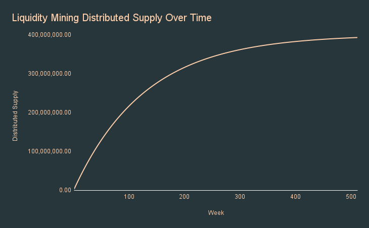

# 🎁 Staking - Getting Governance Tokens

## 🔎 TL;DR

A portion of Angle's governance tokens will be distributed to stable holders, SLPs and HAs through staking contracts.

## 💡 Rationale

Angle aims to be a decentralized protocol. To this extent, the protocol will only succeed if the ownership of the governance token backing the protocol is decentralized.

A vast portion of the governance tokens will be distributed through staking contracts by the protocol to Standard Liquidity Providers (in majority), Hedging Agents and stable holders.

While Hedging Agents will automatically accumulate governance tokens as they stay in the protocol, Standard Liquidity Providers as well as stable holders will have to stake their tokens (sanTokens for SLPs and agTokens for stable holders) in specific contracts to earn governance tokens. The protocol will leave them the opportunity to stake directly and seamlessly in the front after having minted.


Staking contracts of the protocol may not be released immediately at launch of the protocol on mainnet.


## 💐 Token Distribution

There will be one specific staking contract per sanToken and per agToken. The staking contracts for Hedging Agents are directly the contracts in which HAs' positions are stored.

The fewer people there will be in a staking contract, the more interesting it is going to be to participate in this staking contract because a similar amount of governance tokens will be shared among a smaller amount of people.

The distribution of governance tokens to the different staking contracts will be made by a contract controlled by governance. This contract will store for each staking contract a set of parameters like a duration for the distribution (100 blocks, a day, a week, a month, a year, ...), or a number of tokens to distribute across the duration.

400,000,000 ANGLE (40% of supply) are planned to be distributed through staking. The amount distributed will be divided by 1.5^(1/52) = 1.007827 every week, equivalent to dividing the distribution by 1.50 every year.

We built some simulations to evaluate how supply will evolve over time, you can take a look at this [Google Sheet](https://docs.google.com/spreadsheets/d/1yraSUH_7D-VMnCUsIYWWdW1pxL7bDxN3o0M5japQmeY/edit#gid=0).

## 📶 Token Accumulation

At each block, tokens will be distributed based on the rate specified by governance. If 1000 governance tokens are to be distributed for in 100 blocks (e.g, 10 governance tokens distributed each block), then stakers will receive at a each block a fraction of these 10 tokens depending on what they put in the staking contract and on what other stakers have put at the time of the block.

Once tokens are given to an address, this address can freely dispose of these tokens, as there is no vesting at stake.
