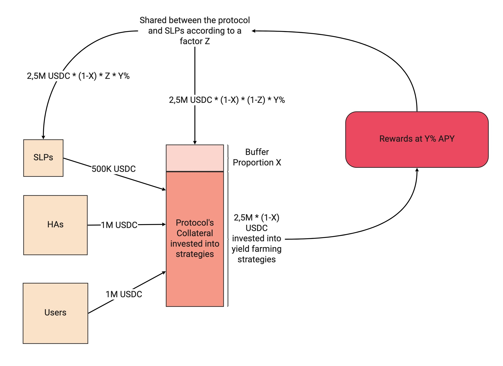

# 🍀 Standard Liquidity Providers

## 🔎 TL;DR

- Standard Liquidity Providers (SLPs) deposit collateral in the protocol against sanTokens, yield-bearing tokens that automatically accrue interests and fees.
- Angle is a marketplace between people who want volatility and people who want stability, SLPs serve as the buffer between these two kinds of people when they are not perfectly balanced.
- SLPs get transaction fees from users minting and burning as well as yield from reserves being lent. The protocol can guarantee them higher yield than what they would get on other lending platforms.
- They may face a small slippage when they exit the protocol if it is not enough collateralized.

## 🗺️ Principle

Standard Liquidity Providers are the buffer for the moments when hedging agents do not fully cover the collateral that was brought by users.

They entrust Angle with their liquidity and like liquidity providers in other protocols (Compound, Uniswap, Aave), they automatically accrue interests on the assets they brought. The risk for them is to incur a slippage when the protocol is not enough collateralized and they want to cash out.

## 🎁 Rewards

There are different incentives for SLPs to come to Angle:

- A fraction of the transaction fees induced by users minting and burning stable assets are redistributed to SLPs in proportion to how they contribute to the protocol.
- At each point in time, the protocol owns reserves which are only useful when redeemed by a user, a SLP or an HA. Part of the reserves is automatically transferred to strategies (like Yearn strategies) responsible for getting yield on it by, for instance, lending to protocols like Compound or Aave. SLPs gets a fraction of the returns made by these strategies.

The fraction of transaction fees and the fraction of lending returns going to SLPs correspond to two different parameters controlled by governance.

Note that SLPs are also able to stake their positions (in the form of sanTokens) to receive governance tokens.

## ✖ Multiplier Effect

In general, the less SLPs there are, the more a single SLP, for a similar amount invested, receives transaction fees, governance tokens, and interests. This mechanism thus incentivizes SLPs to re-collateralize the protocol when it is not collateralized enough because of a lack of SLPs.

For the lending returns, there is an even more interesting multiplier effect for SLPs.

Let's assume that 80% of the protocol's reserves are lent to Compound with a 10% APY and that 50% of the lending returns are given to SLPs. By directly lending their 500,000 USDC to this strategy, SLPs would earn 500K \* 10% = 50K USDC per year.

With Angle, they get a multiplier effect on their collateral coming from the collateral of users and HAs on which they also receive yield

In that case, they would effectively get 2.5M \* 80% \* 10% \* 50% = 100,000 USDC / year, or double what they would earn by lending directly to Compound.

This multiplier effect becomes less interesting the more SLPs bring collateral to the protocol compared to users and HAs.

## 🥅 Slippage

When the collateral ratio is too small, in order to guarantee that any owner of agEUR is able to redeem collateral with agEUR, SLPs can face a slippage when they exit.

For instance if the slippage is 10%, then a SLP willing to get 100 of collateral back will only get back 90, and the 10 of collateral difference will never be recovered.

The slippage factor depends on the collateral ratio: the smaller the collateral ratio, the bigger the slippage for SLPs exiting. Above a certain collateral ratio (120%), SLPs face no slippage. They can be consulted in the Fees section of the [analytics](https://analytics.angle.money/#/USDC/EUR) for each Pool.


The structure of the slippage function is updatable by the governance or the guardian.



While the collateral ratio is a quantity that relates to a stablecoin, the slippage functions faced by SLPs is specific to each collateral. For instance for a collateral ratio of 100%, the slippage may be 0.3% for SLPs that brought DAI and of 0% for SLPs that brought USDC.


## 🏦 Recollateralization Incentives

One rule that can be set to incentivize SLPs to re-capitalize a pool when the overall collateral ratio of the protocol is too low is putting aside progressively part of the transaction fees that should arrive to SLPs of this pool.

These fees would only be recovered by SLPs once the pool becomes collateralized again, and they would be distributed in a proportion that depends on the composition of the pool at the time of re-collateralization. This means that a new SLP giving money to re-collateralize a pool may receive transaction fees for transactions that occurred before her arrival in the pool.

 (2) (1) (9).png>)
