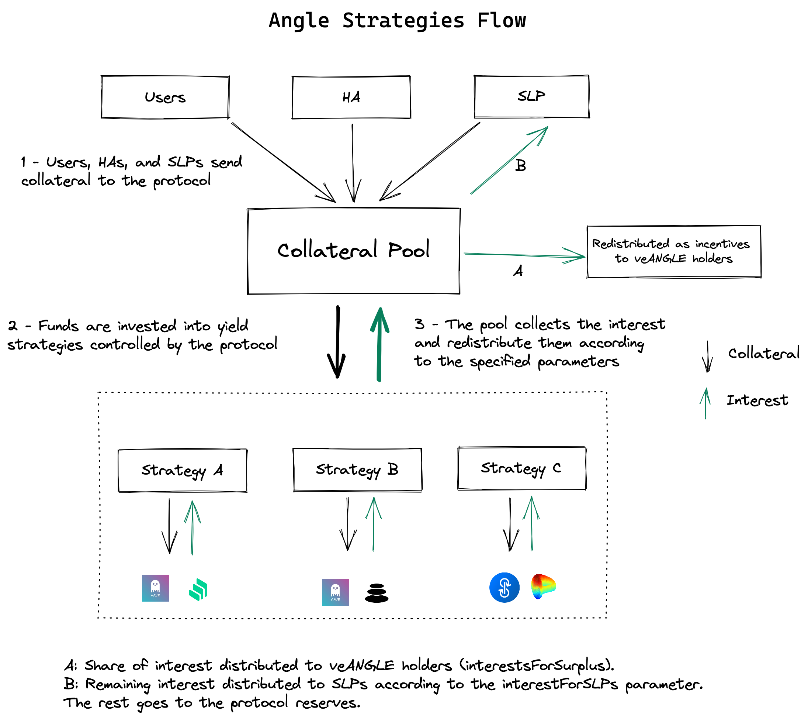

# 📈 Lending Strategies - Yield on Reserves

## 🔎 TL;DR

* Angle Core module earns interest on the reserves it holds by lending it to other platforms.
* To do so, it relies on strategies which decide how much and in which protocols reserves should be placed.
* This mechanism is modular: there can be multiple strategies for a single collateral, each interacting with multiple platforms.
* Strategies are what enable the Core module to offer higher yield to SLPs than what they would get by lending directly to other protocol.

## 💡 Rationale

Lending a fraction of the reserves to other lending platforms is part of what makes the Core module attractive to Standard Liquidity Providers. By lending reserves, it can at the same time offer interest to Standard Liquidity Providers, accumulate some reserves, and incentivize veANGLE holders.

The distribution of interest between SLPs, veANGLE holders, and reserves, is dictated by two parameters that can be found in [Angle Analytics](https://analytics.angle.money). More information in the [SLPs FAQ page](standard-liquidity-providers/faq-slps.md#do-slps-get-all-transaction-fees-and-lending-returns-from-the-protocol).

## 🎨 Design

The design of that has been heavily inspired by what [Yearn](https://yearn.finance) does. Angle Core module relies on strategies, that themselves use Lender's contracts interacting with lending and other yield farming protocols.

Just like on Yearn, new strategies to get some yield on the Core module's collateral can be added along the way by governance votes. Each strategy can also support multiple lending platforms or protocols.

Each collateral for each stablecoin has its set of strategies to get some yield on it. For instance, for a agEUR stablecoin backed by USDC and DAI, we may have for the USDC collateral a single strategy trying to always optimize to get the best APY between Compound and Aave, and for the DAI stablecoin two strategies, one that just consists in lending to Compound and one that consists in optimizing between Aave and Euler.

Since gas cost is quite high in Ethereum, users minting and burning, SLPs depositing and withdrawing, as well as HAs opening and closing positions never interact directly with strategy contracts. When they send or withdraw collateral to Angle Core module, their collateral goes or is taken from its reserves, and it is not directly lent or withdrawn from strategies.

The way collateral is lent or withdrawn from strategies and their corresponding lending platforms is through keepers calling the `harvest`function to withdraw or lend collateral to strategies.


It was preferred to get inspiration from Yearn rather than using Yearn directly in order to keep full control on the reserves and to remove a third party integration which would have taken up some fees.


## 💹 Debt Ratio

For each strategy associated to a collateral, it is possible to compute a debt ratio that corresponds to the ratio between what has been lent and the total amount of collateral in the pool (what's kept in reserves + what has been lent across all strategies). Each strategy has its target debt ratio. Below this debt ratio, keepers can call the `harvest` function to give more collateral to the strategy and above this debt ratio, collateral can be withdrawn from the strategy and hence from the corresponding lending platforms.


Keepers cannot choose the amount they lend or withdraw from lending platforms: this is automatically computed using the strategy's target debt ratio at each call to `harvest.`


## ✖️ Multiplier Effect For SLPs

Thanks to the lending strategies, SLPs get rewards not only from their capital, but also from that of Users and HAs. This allow them to get potentially higher yield than if they were farming only with their capital. More info in the SLP page below.


[standard-liquidity-providers](standard-liquidity-providers/)


## 🤓 Strategies details

### Base strategy

The first strategy implemented simply consists in optimizing lending between Compound and Aave in order to maximize the global APY.

### Folding strategies

Angle Core module now also relies on more advanced types of strategies that use **folding**. The idea behind folding is to lend capital, borrow from it and then re-supply the borrowed assets in order to profit from governance tokens rewards which can offset the borrowing cost.

Usually, folding strategies in DeFi simply target a specific leverage for which teams are confident enough, and know they can make an additional profit. However this does not guarantee a profit in all cases, can be sub-optimal, and most of all requires human intervention and monitoring.

**Angle folding strategy automatically compute the optimal quantity of assets to borrow and re-supply on-chain to maximize its yield.**

This makes it both more efficient that other folding strategies, and a clear improvement compared to the base strategy.

As of April 2022, a single folding strategy for USDC on Aave has been implemented.


The state of the strategies used for different collateral types can be tracked on [Angle Analytics](https://analytics.angle.money).

