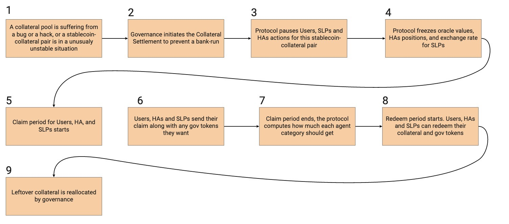
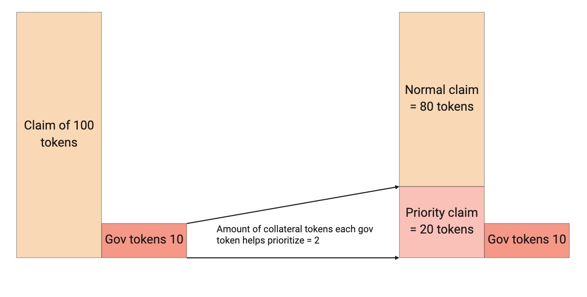
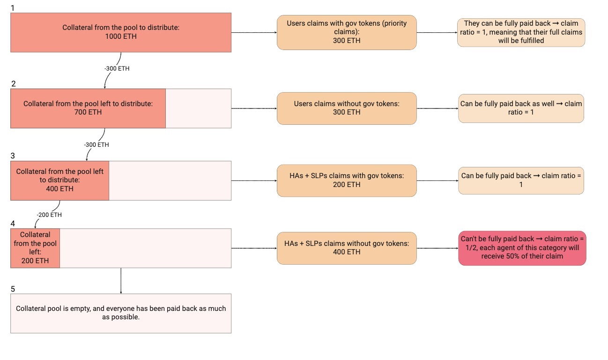
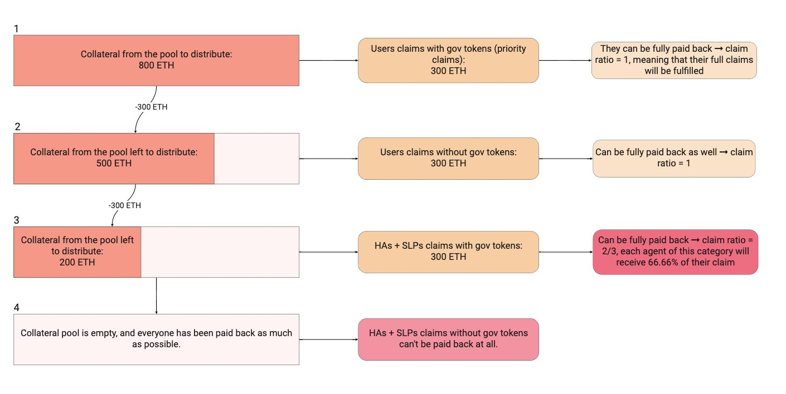
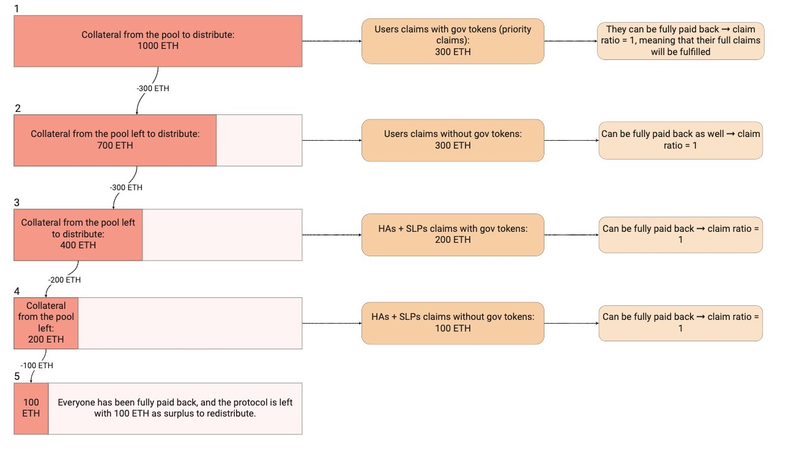

# ⌛ Collateral Settlement

## 💊 Use Cases

Collateral settlement is the process by which the Core module goes through after a collateral is revoked for a stablecoin. The goal of the process is to redistribute what remained of that collateral in the Core module. The settlement process chooses how much of this collateral each category of stakeholders \(users, HAs, SLPs\) is going to get based on the claims they made, and then reimburses each user, HA or SLP who made a claim based on that.

Besides a long term unstable position of the Core module requiring it to stop relying on a collateral, collateral settlement can also be activated by governance in case of a major security breach or a cyber-attack.

## 🎨 Design of the Process

The main risk with protocols ensuring full convertibility is the risk of bank run. In economics, to avoid situations of bank runs, one solution is to eliminate the notion of sequentiality. By backwards induction, this dis-incentivizes people from rushing out, and thus nips in the bud the risk of bank run.

The emergency shutdown mechanism has been designed to make sure there is no sequentiality in the process, and that the first-arrived to redeem collateral will not necessarily be the first-served.

While this process was built to prioritize stablecoin holders, it has also been thought to favor governance tokens owners, which incentivizes users to get involved in the governance of the protocol. On a side note, this is a way to create an upwards pressure on the governance token price, thus making some mechanisms like Olympus Pro more efficient.

## ⏱️ Process Timeline

The collateral settlement process starts by freezing transactions and oracle prices. There is then a claim period during which stable holders, HAs and SLPs can come and redeem collateral.


The length of the claim period is still to be determined.


Stable holders (users) can do so by sending stablecoins associated to this collateral. In the process, they can choose to send governance tokens, and depending on the fraction they sent, they will be treated preferably by the Core module. The value of the claim of stable holders in collateral is only computed at the end of the claim period.

HAs who had perpetuals of the concerned collateral can come, point to a perpetual they own, and make their claim. The value of their claim is computed based on the oracle value at the time at which settlement was initiated.

SLPs can claim collateral by sending their sanTokens. Again here, HAs and SLPs can also choose to send governance tokens to see a portion of their claim treated preferably.

After the claim period, the contract computes the amount it has in reserves, converts the claims of users which were in stablecoin value in collateral value and then computes the total amount of claims and how much of collateral each category of stakeholders should receive. The Core module pays back stable holders with governance tokens first, then stable holders without governance tokens, followed by HAs and SLPs which had governance tokens, and lastly HAs and SLP without governance tokens.

Each stakeholder in a category therefore gets reimbursed proportionally to their claim with a proportional ratio that depends on their category. It is hence possible that stable holders which came with governance tokens are fully reimbursed, that stable holders without governance tokens only get half of their claim and that others do not get anything back. If a category \(like LPs with governance tokens\) is not fully paid back, then the following categories \(in this case LPs without governance tokens\) won't be paid back as well.

## 🏰 Governance Token Holders Privilege

The way governance tokens are handled by the process is the following: there is a proportional ratio that is defined and that maps the number of governance tokens brought to the amount of collateral that is claimed and that is going to be treated preferably.

For instance let's say that this ratio is 2. This means that for each governance token brought, there are 2 collateral tokens \(or stablecoins in the case of users\) that are going to be considered as part of a claim with governance tokens, meaning that this claim will be reimbursed first after the claim period. If a stable holder brings 10 governance tokens and 100 stablecoins, then with a proportional ratio of 2, the protocol will consider that there is a claim from this user of 20 stable tokens involving governance tokens and that should be reimbursed in the first tranch of reimbursement \(after this amount is converted to a collateral amount\), and that there is a second claim of 80 stablecoins that will be treated after all the claims with governance tokens have been reimbursed.

## 🌊 Waterfall Between the Different Categories of Stakeholders

At the end of the claim period, the Core module computes how much each category should get. There is an order with which each category gets reimbursed. If one category is not fully paid back, then the following ones will not get anything. This is illustrated by the following examples. Note that they illustrate situations after which the value of user claims in stablecoins has been converted to collateral:

## 🪢 Remarks

The collateral settlement process concerns a single collateral type for a given stablecoin. To trigger the complete emergency shutdown of a stablecoin, collateral settlement should be initiated for all collateral accepted for this stablecoin.

If different collateral settlements are triggered for a same stablecoin, stablecoin holders have the possibility to redeem the collateral of their choice. If two collaterals `A` and `B` are being settled, to prevent stablecoin holders from all redeeming collateral `A` and not collateral `B` thus penalizing SLPs and HAs of collateral `A`, the Core module caps the amount it is possible to claim for users for a given stablecoin. The cap is set to the same quantity as the one used to compute Hedging Agents hedge: it is the amount of collateral corresponding to the outstanding stablecoin value.

Another remark is that the reason why stable holders are not handled with the same oracle value as HAs is to prevent arbitrages among them during collateral settlement. If the value used to compute the claims in collateral was that of the beginning of the claim period \(the one used for HA\), then if this value decreased during the claim period meaning that stable holders would end up getting less than what they would get at current oracle value: there could be incentives for them not to claim anything because they could be treated at a more advantageous oracle value by burning their stablecoins and asking for a collateral that is not being settled.

If after a collateral settlement process there is collateral left because of a surplus, or because not all stable holders and LPs came to claim during the claim period, governance has the ability to allocate the leftover collateral where it wants to \(for instance to SLPs of another collateral type\).
