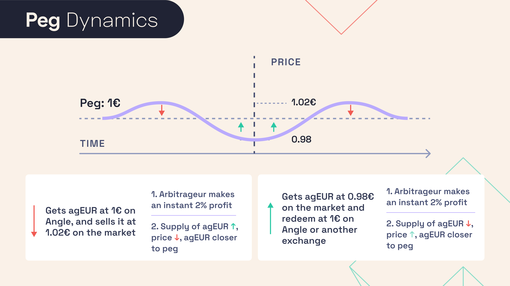
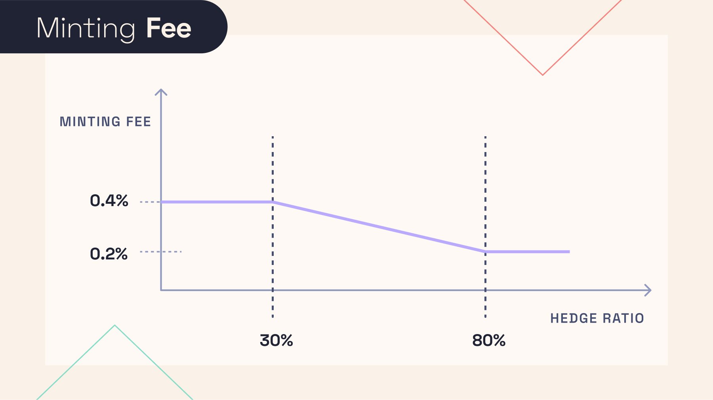
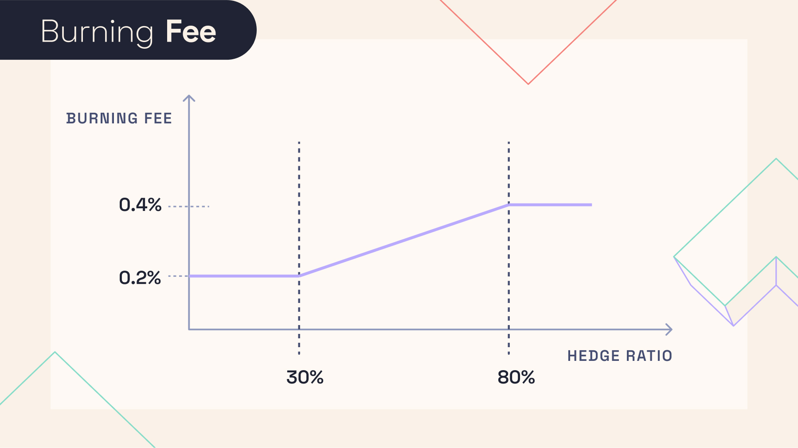

# 💱 Stable Seekers and Holders

## 🔎 TL;DR

- Users of Angle Core module can mint stablecoins at oracle value by giving collateral to the Core module.
- They can always burn their stablecoins and get collateral in exchange at oracle value too.
- The experience for users is that of a swap except for the fact that there is no slippage on the price at which transactions are executed.
- They pay small transaction fees (potentially around 0.3%) when they mint and when they burn.

## 🗺️ Principle

Angle Core module is designed to be as simple as possible from a user perspective and like USDC (or also USDT), it relies on full convertibility of collateral and stable assets, meaning users can swap collateral against stablecoins as well as stablecoins against collateral at any time.

To generate a stable asset, a user just has to send a whitelisted collateral to the Core module. An oracle then determines how many stablecoins (`ERC-20`tokens) need to be minted and sent to the user. Like in an AMM swap, the collateral received by the Core module does no longer belong to the user.

The same procedure works when users are willing to cash out. They just have to send their stablecoins to the Core module and specify the collateral they want in exchange. In return, they get the chosen collateral in an amount depending on the collateral price specified by the oracle and on the transaction fees. The stablecoins received by the Core module are then burnt.

## 🖨️ Minting

Let's focus on the case of a stable Euro (agEUR), backed by USDC as collateral (and other collateral types too). If 1 USDC is worth 1€, and if the transaction fees are 0.1%, then a user giving 1000 USDC to the Core module will receive 999 newly minted agEUR.

The 1000 USDC given by the user are now in the Core module's reserves.

## 🕯️ Burning

If a user owns 1000 agEUR and wants to burn it for collateral, they can do so using the collateral they want. Let's say that DAI and USDC are the two collaterals backing agEUR. The user can choose to get DAI or USDC against their 1000 agEUR.

If according to the oracle 1 DAI is worth 1€, and if the transaction fees are 0.3%, then this user will get 997 DAI out of their 1000 agEUR.

## ⚖️ Stability

### Reason

The convertibility permitted by the swaps described above is what makes the tokens minted stable. Direct arbitrage opportunities arise whenever the token trades at a price different from its peg.

Let’s say that 1 agEUR trades at a price above 1€. The incentive is to mint agEUR for 1€ worth of collateral and then sell these newly minted agEUR for more than 1€ on the market. This reduces the price closer to 1€.

If 1 agEUR trades at a price below 1€, the incentive is to buy agEUR on the market for less than 1€ and get 1€ worth of collateral by swapping the agEUR bought using Angle. This increases the price closer to 1€.

### Deviations From Peg

Opportunities for arbitrage are however reduced when there are mint and burn transaction fees. With a 0.3% transaction fee on each side, it is no longer profitable to do arbitrage for price deviations of less than 0.3%, meaning in this case that the price of the stablecoins can vary between 0.997€ and 1.003€.

Also, as specified in the 🔱 [Oracles page](../other-aspects/oracles.md) 🔱, it is possible, for some stablecoin/collateral pairs, that the mint oracle price differs from the burn transaction price in some cases. In these situations, deviations of price from peg larger than observed transaction fees may occur.


A stablecoin is only stable relative to the value of the oracle that was chosen to track the price of the underlying asset. For a stablecoin/collateral pair, if the on-chain price-feed has some latency with respect to the real price feed, as the stablecoin tracks the price of the on-chain feed, the evolution of its price may slightly lag behind that of the real price feed.


## 🪙 Transaction Fees

Transaction fees are taken from users minting and burning. While this is a way to prevent front-running attacks (details [here](https://blog.angle.money/angle-research-series-part-2-fees-and-front-running-resistance-for-users-393e0ae14b20)), it also helps to incentivize liquidity providers contributing to Angle Core module.

The structure of the mint transaction fees differs from that of the burn transaction fees. In all cases, like in a utilization curve for a lending protocol, fees depend on the coverage ratio that is the ratio between the amount covered by HAs and the amount that HAs should cover for this collateral type. The curve specifying the value of the fees as a function of the coverage ratio is called a coverage curve. You can see the current fees situation in [Angle's analytics](https://analytics.angle.money) page.

- Minting: The concept is that the higher the coverage ratio, the more the Core module is able to cover the collateral from people issuing new stablecoins, and the lower the minting fees should be.

- Burning: The less collateral is covered by Hedging Agents, the bigger the volatility risk faced by the Core module is for this collateral type, the cheaper it is to burn and hence to decrease this risk.


The exact amount and values of these transaction fees are still to be determined. You can see the current fees situation in [Angle's analytics](https://analytics.angle.money) page.


Regardless of the amounts chosen, this fee structure has been made so that fees depend on the type of collateral used. If the collateral is volatile, and having it hedged by HAs is more important, fees can vary more importantly along the coverage curve than less volatile collaterals.


For non-volatile collateral types like USDC and DAI, mint fees may for instance be as small as 0.1% regardless of the coverage by Hedging Agents.


Governance could also vote to induce a dependency of the transaction fees on the collateral ratio of the Core module for mint and burn fees.

## ❌ Slippage

Mint and burn transactions are always executed at oracle value, meaning that there is no slippage in the price of the transaction. Regardless of the size of the transaction, the price at which it is executed remains the same.

However, too big transactions may affect the transaction fees structure (because they can move the coverage ratio and hence the coverage curve), and face different transaction fees than other smaller transactions would have at the same oracle price.

Given that oracle values may change between the time at which users submit their transactions and the time at which they are executed, the Core module has a form of slippage protection for users that allow them in a mint/burn transaction to specify the minimum amount of stablecoins/collateral they are ready to get from the transaction.
