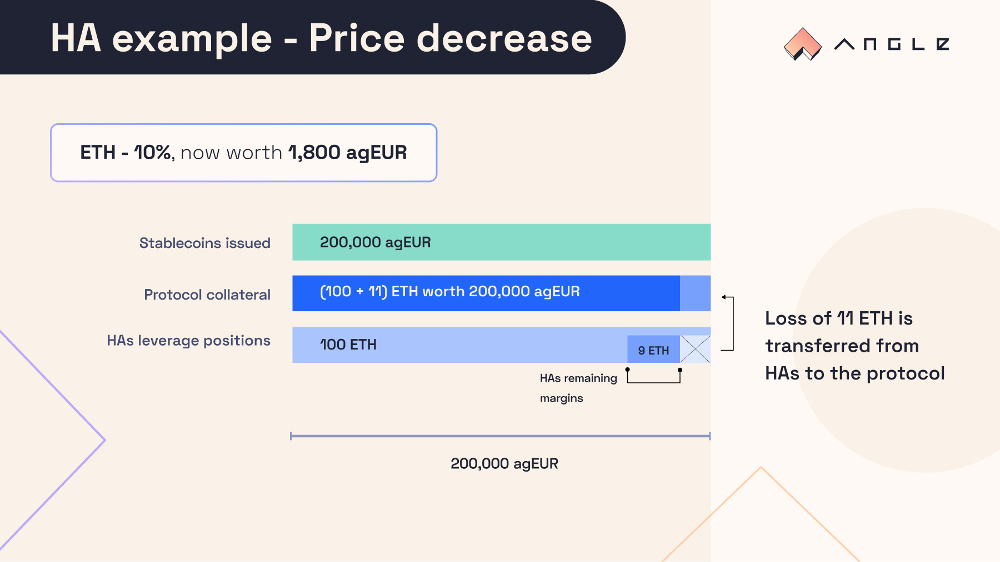

# 🛡 Hedging Agents

## 🔎 TL;DR

- Hedging Agents (HAs) open perpetual futures from the Core module: they can get leveraged in one transaction on the evolution of the price of a collateral with a multiplier of their choice.
- They are here to insure the Core module against the volatility of the collateral brought by users. With enough demand for HAs, Angle Core module could resist collateral price drops of up to 99%.
- HAs can make significant gains in case of price increase but also substantial losses when collateral price decreases.
- They pay small transaction fees (potentially around 0.3%) when they open their position and when they close it.
- Contrary to centralized exchanges, they do not have to pay funding rates for holding their positions.

## 🗺 Principle

Angle Core module is by essence highly dependent on collateral volatility. Let's say one stable seeker brings 1 wETH against 2000 agEUR and the price of wETH then decreases by 50% (from 2000€ to 1000€). The Core module then needs to find 1 wETH to ensure the redeemability of the 2000€ of stablecoins and maintain their stability.

We say that the Core module needs to insure itself against the volatility of the collateral. While surges in collateral prices are beneficial, drops, as in the example above, are less desirable.

For this reason, the Core module transfers this volatility to other actors looking to get leverage on the collateral: Hedging Agents (HAs). They are the agents insuring the Core module against drops in collateral prices, making sure that it always has enough reserves to reimburse users.

## 🔮 Perpetual Futures

Hedging Agents are taking perpetual futures from the Core module. When they come in to open a position, they bring a certain amount of collateral (their margin), and choose an amount of the same collateral from the Core module they want to hedge (or cover/back). The contract then stores the oracle value and timestamp at which they opened a position.

Hedging Agents are independent from one another, meaning that the actions of one Hedging Agent have no impact on the position of another Hedging Agent.

Precisely speaking, if a HA enters with an amount `x` of collateral (`x`is the margin) and decides to take on the volatility of an amount `y` of the same collateral (`y` is the amount committed, or the position size) that was brought by users minting stablecoins, then the contract stores `x`, `y`, the oracle value and the timestamp at which this HA came in.

At any given point in time, the HA is entitled to get from the Core module:

$$
\texttt{cash out amount} = x+y\cdot (1-\frac{\texttt{initial oracle price}}{\texttt{current oracle price}})
$$

This formula means that the HA will get back their input `x`, plus or minus the capital gains or losses of the amount `y` they decided to back.

The **PnL** of the HA on this position is therefore:

$$
\texttt{PnL} = y\cdot (1-\frac{\texttt{initial oracle price}}{\texttt{current oracle price}})
$$

Since HAs bring collateral to the protocol, we define their **leverage** as:

$$
\texttt{leverage} = \frac{x+y}{x} = \frac{\texttt{margin + amount committed}}{\texttt{margin}}
$$

### 📈 Price Increase Scenario

When the collateral price increases (with respect to the asset stablecoins are pegged to), besides their margin (amount brought initially), HAs are entitled to get the capital gains they would have made if they had owned the collateral they hedged.

If an HA brought 1 wETH and decided to back 1 wETH at a wETH price of 2000€, then:

$$
x = 1, \space y=1
$$

$$
\texttt{initial oracle price} = 2000
$$

If the price of wETH increases to 4000€, then according to the formula above, the HA can get from the Core module:

$$
\texttt{cash out amount} = 1.5 \space \texttt{wETH}
$$

The HA made 6000€ from their initial 2000€. If they had just stayed long without leverage, they would have only 4000€.

### 📉 Price Decrease Scenario

When the collateral price decreases (with respect to the asset stablecoins are pegged to), HAs will incur losses on their margin as if they had owned the collateral they covered.

Back to the previous example, if the price of wETH decreases to 1000€, then the cash out amount of the HA becomes:

$$
\texttt{cash out amount} = 1 + 1 \cdot (1-2) = 0
$$

At this point, the HA is liquidated and their collateral goes to the protocol. They cannot claim anything.

In general, the cash out amount of a HA can go to zero if the price drops to:

$$
\texttt{current price} = \frac{y}{x+y}\cdot \texttt{initial price}
$$

## 💧 HAs Liquidations

In practice, and like in most centralized perpetual swaps exchanges, there is a maintenance margin meaning that if the value of the theorical cash out amount gets too small compared with the amount committed by a HA, then this HA's position can get liquidated. HAs can hence get liquidated even with a non null cash out amount.

Mathematically speaking, we define the margin ratio of a HA as:

$$
\texttt{margin ratio} = \frac{\texttt{margin + PnL}}{\texttt{amount committed}}
$$

Or to use the above notations:

$$
\texttt{margin ratio} = \frac{x}{y} + (1-\frac{\texttt{initial oracle price}}{\texttt{current oracle price}})
$$

A HA can get liquidated if:

$$
\texttt{margin ratio} \leq \texttt{maintenance margin}
$$

## 🛏️ HAs Hedged Amounts

When HAs enter Angle Core module, they specify a position size denominated in collateral, representing an amount of the collateral reserves they are hedging. Yet from a contracts perspective, when HAs come in, they insure a fixed amount of stablecoins.

This quantity remains constant and only depends on variables fixed upon HAs entry. So while HAs only see that they back an amount of collateral from users, from a smart contract perspective, each HA insures the Core module for a fixed amount of stablecoins. This is what the accounting of the Core module keeps track of when determining when to let new HAs come in or not.

The total amount hedged by HAs for a given collateral/stablecoin pair is hence the sum of the product between the amount committed by HAs and their entry price: it is a measure of how much stablecoins issued are backed and insured.

This quantity is compared to the amount of collateral `in stablecoin value` needed by the Core module to pay back users in case they all want to burn their stablecoins. For example, if some users bring 1 wETH to mint 2000 agEUR, and others burn 1000 agEUR, the amount to hedge is 1000 EUR of wETH. HAs can hedge a fraction of this quantity (close to 100%): this is called the target hedge amount.

The hedge ratio of Angle Core module **for a given stablecoin/collateral pair** is hence defined as:

$$
\texttt{Hedge Ratio} = \frac{\texttt{Total amount hedged by HAs in stablecoin}}{\texttt{Total value of stablecoins issued}}
$$

## 🏢 Insurance of the Core module Against Collateral Volatility

Here we explain in a more imaged way how the Core module can always have enough collateral to pay back users burning stablecoins in case of price changes of the collateral.

If HAs have a 6x leverage and back all the collateral in the Core module that was used to issue stablecoins:

## 🪙 Transaction Fees

In Angle Core module, Hedging Agents have to pay small transaction fees when they open and close positions. These transaction fees are computed on the amount that is committed by the HA (the position size). Entry and exit fees for HAs depend on hedging curves, which define transaction fees for HAs based on the hedging ratio of the Core module.


Note that on Angle Core module, there is no funding rate to be paid by perpetual futures holders as opposed to most perps exchanges. This allow traders to hold their positions longer at a much lower cost.



The exact values of the transaction fees for HAs depend on the hedge ratio (sometimes referred to as coverage ratio) of the specific agToken/collateral pair.


### Entry Transaction Fees

The entry transaction fees for HAs is an upfront cost paid when HAs open a position.

The higher the hedging ratio, the more expensive it gets to be an HA. Conversely, HAs should be incentivized to enter positions to help hedge the Core module when the hedging ratio is low: transaction fees would be lower in this case.

Let' say a HA comes to the Core module with 1 wETH and opens a 2 wETH poisition (hedging the Core module against the changes in price of these 2 wETH). If the transaction fees are 0.3%, then the contracts consider that the HA has a margin of (1 - (0.003 x 2)) = 0,994 wETH for a position of 2 wETH.

### Exit Transaction Fees

Exit fees are paid by HAs when they close their perpetuals. The more collateral is hedged by HAs, the less expensive it is to exit the Core module. When the hedging ratio is low, HAs should be discouraged to exit with higher transaction fees.

If a HA had an initial margin of 1 wETH and a position size of 2 wETH, then with 0.3% transaction fees, they will get in wETH the current value of their perpetual according to the cash out formula above minus 0.3% of 2 wETH (the amount hedged at the opening).

### Fees To Add or Remove Margin

When HAs open a perpetual, they have the opportunity to add or remove to their margin thus decreasing or increasing their leverage. As entry and exit fees depend only on the position size (or committed amount) of HAs, and these add/remove operations do not modify it, no fees are paid for such operations.
