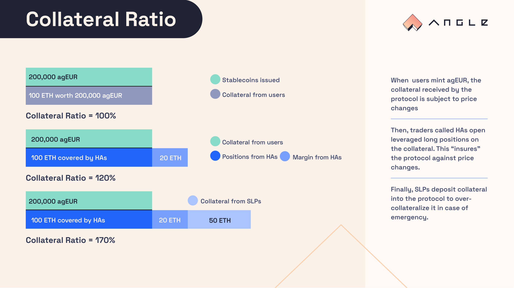

# 📊 Collateral Ratio

## 🔎 TL;DR

Thanks to its two types of liquidity providers (HAs and SLPs), Angle Core module is over-collateralized.

## 📐 Collateral Ratio Structure

Angle Core module is over-collateralized but capital efficient. There is however no target collateral ratio with this module. The way governance can influence the collateral ratio is through the structure of the slippage for SLPs, of the transaction fees taken from users minting and burning stablecoins or from HAs joining or exiting the Core module.

The Core module's collateral ratio depends on the yield targeted by Standard Liquidity Providers and on the average leverage chosen by Hedging Agents.

## 💻 Collateral Ratio Estimation

In Angle Core module, over-collateralization comes from both HAs and SLPs capital. Let's try to estimate how over-collateralized it could be in theory, starting with 100 of collateral coming from users.

If HAs cover all the collateral from users with a leverage of 3, meaning that they brought 50 of collateral to commit to 100, the Core module is collateralized at 150%.

In the Core module, SLPs earn a portion of the yield and rewards coming from lending the collateral. Now let's imagine that 80% of the collateral is lent, and that they are looking to earn twice as much yield as they would on another protocol like Compound or Aave.

By bringing 100 of additional collateral, SLPs would earn yield on 80% x 250 = 200, that is twice the collateral that they brought initially. This means that they would earn a yield that is twice higher than what they could get by using their collateral in another platform: this corresponds to what they target in this example.

In that case, the Core module would be collateralized at 250%.

