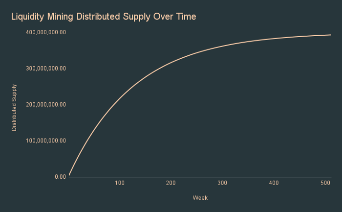

# 🚀 ANGLE Token

## 🎨 Design and Inflation

ANGLE's total initial supply is 1 billion and there is no planned token inflation.

The only address with minting capability is the Angle DAO Timelock.

ANGLE's tokenomics was upgraded in January 2022 with the ability to lock ANGLE into veANGLE, similarly to what Curve does with CRV/veCRV. More info about veANGLE can be found [here](veANGLE/).

## 🧬 Tokenomics

The main purposes of the ANGLE token are to get as many people involved as possible in the governance of the protocol, and to incentivize users, Standard Liquidity Providers and Hedging Agents. Its ownership should be decentralized.

The vision for the ANGLE distribution is that it needs to be multi-year, extended, and sustainable until the protocol reaches ubiquity. With this in mind, the token distribution was broken down as follows:

### Liquidity Mining

40% of tokens are being distributed through staking contracts for agTokens holders, HAs, SLPs. LPs on other external pools and protocols are also being incentivized.

For more details on Angle's staking contracts, you can look at [this page](/governance/staking.md).

Every week, governance is able to adjust the distribution of tokens between the different types of stakeholders through [gauge votes](../governance/veANGLE/gauges.md). The amount of ANGLE distributed is divided by 1.5^(1/52) = 1.007827 every week, equivalent to dividing the tokens emission by 1.50 every year.

5% of the ANGLE's weekly emissions are still controlled by the Core Team to be allocated without any vote by veANGLE holders.

Leftover tokens meant to be distributed by this medium are stored on the [`AngleDistributor` contract](https://etherscan.io/address/0x4f91F01cE8ec07c9B1f6a82c18811848254917Ab).


[This document](https://docs.google.com/spreadsheets/d/1fxTBGEnOnzvpdBaeiDzy1j-g5-s75IhGPU8aOdu786g/edit?usp=sharing) summarizes where these 5% of the weekly ANGLE emissions are deployed.


### DAO Treasury

20% of the tokens are controlled by the DAO Treasury: the DAO is able to vote for how and where to allocate these tokens.

This Treasury can be used to build protocol reserves through different incentives like Olympus Pro bonding programs, DAO-to-DAO swaps, or more, and to increase incentives through specific rewards programs.

ANGLE tokens from the DAO Treasury are stored on the governance multisig.

2% of these funds were however put in a [multisig](https://etherscan.io/address/0xe02f8e39b8cfa7d3b62307e46077669010883459) controlled by the Angle Core Team (called the `AngleMaster`) to get more flexibility when it comes to implementing programs like Olympus Pro.

This multisig is a 2/3 Gnosis multisig controlled by distinct Core Team members of the protocol (the 3 co-founders of the project).

### Grants and Partnerships

12% of the initial ANGLE are held by the Core Team in a multi-sig. These tokens are available for distribution to the Community as grants or bug bounties, to strategic partners like exchanges for listing, but also to the most active and helpful community members as well as to advisors helping the protocol grow.

Tokens from this pocket are stored in the `AngleMaster` multisig. Note that 1 of these 12% of tokens have been lent to Wintermute, our partner in charge of market making in centralized exchanges.

### Core team and early backers

These tokens are subject to a **3 years linear vesting**, to make sure that the core team and early backers remain fully committed to the protocol and the community.

- 18% to the Angle Core Team
- 10% to early backers

With this vesting schedule, liquidity distributed through liquidity mining to the Community is guaranteed to be bigger than that going to team and early backers.

In order to reduce the exposure of the funds potentially at risk in this contrat (this contract has been forked from Maker's `DssVest`), not all the 18% of the tokens that have to be distributed to the team + early backers + advisors have been initially put in the [Vesting contract](https://etherscan.io/address/0x43365213237ab259c707bc2cbc3e07d123ae2ad5). The `AngleMaster` multisig regularly transfers tokens to this contract based on what's leftover in it.

For more details on the tokenomics, this article adds some details:


Angle Tokenomics

