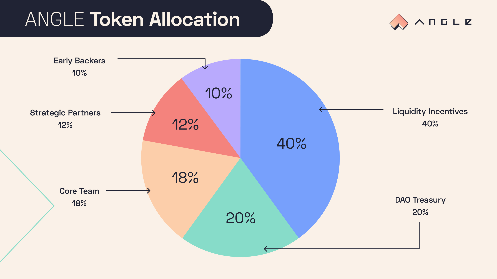
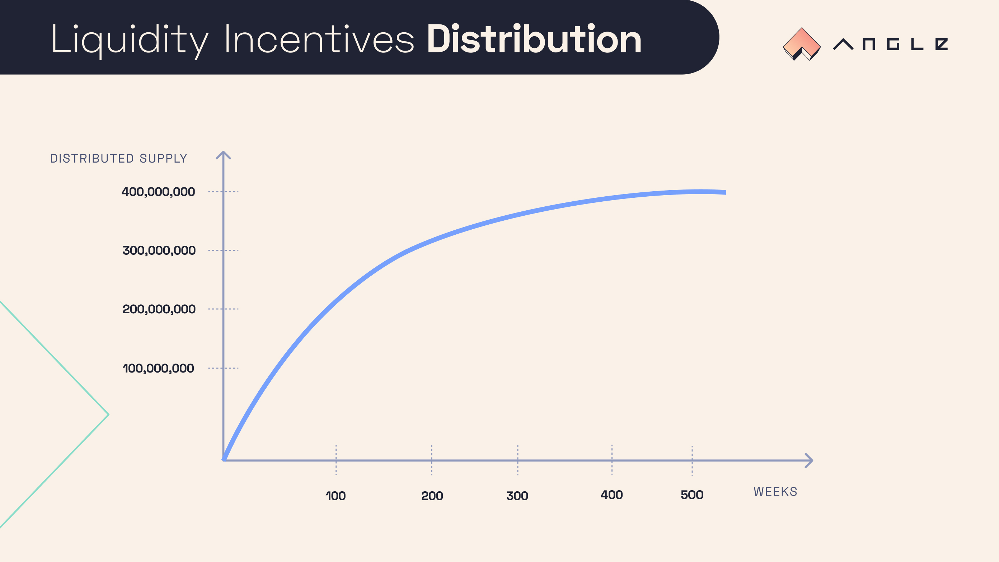

# 🚀 ANGLE Token

## 🎨 Design and Inflation

ANGLE's total initial supply is 1 billion and there is no planned token inflation.

The only address with minting capability is the Angle Governor Multisig.

## 🧬 Tokenomics

The ANGLE token is the backbone of the Angle Protocol allowing it to be governed in a fully decentralized way.

The vision for the ANGLE distribution is that it needs to be multi-year, extended, and sustainable until the protocol reaches ubiquity. With this in mind, the token distribution is broken down as follows:

### 🪐 Liquidity Mining

40% of tokens are being distributed for Angle stablecoins holders providing liquidity on external pools and protocols (like UniV3, Curve, or Morpho).

The amount of ANGLE that can be distributed is divided by 1.5^(1/52) = 1.007827 every week, equivalent to dividing the tokens emission by 1.50 every year.

Since April 2024, ANGLE token emissions are controlled by a liquidity committee composed so far of the members of [Angle guardian multisig](./guardian.md). In practice this liquidity committee issues far less (up to 90%) ANGLE token than planned in the initial emission schedule of the protocol, and the unused ANGLE tokens could be burnt later on.

The responsibility of the liquidity committee is to ensure the optimal use of ANGLE incentives for the growth of Angle stablecoins and community. veANGLE holders can vote on amending and adjusting the composition of Angle liquidity committee.


[This spreasheet](https://docs.google.com/spreadsheets/d/1fxTBGEnOnzvpdBaeiDzy1j-g5-s75IhGPU8aOdu786g/edit?usp=sharing) summarizes all liquidity emissions by the protocol and its liquidity committee and tracks the difference between the planned emission schedule and the smaller amount of tokens that's actually been issued since launch in 2021.



Till April 2024, ANGLE emissions were ran through a gauge system managed from a contract called the [`AngleDistributor` contract](https://etherscan.io/address/0x4f91F01cE8ec07c9B1f6a82c18811848254917Ab).


### DAO Treasury

20% of the tokens are controlled by the DAO Treasury: the DAO is able to vote for how and where to allocate these tokens.

This Treasury can be used to build protocol reserves through different incentives and to increase incentives through specific rewards programs.

ANGLE tokens from the DAO Treasury are stored on the Timelock contract on mainnet.

2% of these funds were however put in a [multisig](https://etherscan.io/address/0xe02f8e39b8cfa7d3b62307e46077669010883459) controlled by the guardian multisig signer (called the `AngleMaster`) to get more flexibility when it comes to implementing liquidity programs. This multisig is a 2/3 Gnosis multisig controlled by the 3 co-founders of the protocol.

### Grants and Partnerships

12% of the initial ANGLE are held by Angle Labs in a multi-sig. These tokens are available for distribution to the Community as grants or bug bounties, to strategic partners like exchanges for listing, but also to the most active and helpful community members as well as to advisors helping the protocol grow.

Tokens from this pocket are stored in the `AngleMaster` multisig.

### Angle Labs team and early backers

These tokens are subject to a **linear vesting of 3 years (starting October 2021)**.

- 18% to Angle Labs team members
- 10% to early backers

With this vesting schedule, liquidity distributed through liquidity mining to the Community is guaranteed to be bigger than that going to team and early backers.

In order to reduce the exposure of the funds potentially at risk in this contract (this contract has been forked from Maker's `DssVest`), not all the 18% of the tokens that have to be distributed to the team + early backers + advisors have been initially put in the [Vesting contract](https://etherscan.io/address/0x43365213237ab259c707bc2cbc3e07d123ae2ad5). The `AngleMaster` multisig regularly transfers tokens to this contract based on what's leftover in it.

## Changelog

- January 2022: ANGLE's tokenomics was upgraded with the ability to lock ANGLE into veANGLE, similarly to what Curve does with CRV/veCRV. More info about veANGLE can be found [here](veANGLE/).
- October 2022: [it was voted](https://snapshot.org/#/anglegovernance.eth/proposal/0x478e838b67f2dffcff6160d4c8adc9622d67db985c981e4cad45c031e284fd63) to reduce ANGLE inflation by 20% with respect to the planned schedule. The week over week decrease factor of 1.007827 remains the same though.
- March 2023: ANGLE emissions were paused during this period and resumed late April 2023.
- April 2024: Angle gauge system was deprecated and ANGLE emissions are now ran by a liquidity committee in charge of optimizing the resource allocation of the protocol.
