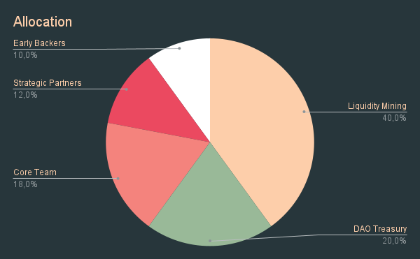

# 🚀 ANGLE Token

## 🎨 Design and Inflation

ANGLE's total initial supply is 1 billion and there is no planned token inflation.

The only address with minting capability is the Angle DAO Timelock.

Since January 2022, ANGLE's tokenomics has been upgraded and the ability to lock ANGLE into veANGLE, similarly than with CRV/veCRV or FXS/veFXS, has been introduced. More info about veANGLE can be found [here](veANGLE/).

## 🧬 Tokenomics

The main purposes of the ANGLE token are to get as many people involved as possible in the governance of the protocol, and to incentivize users, Standard Liquidity Providers and Hedging Agents. Its ownership should be decentralized.

The vision for the ANGLE distribution is that it needs to be multi-year, extended, and sustainable until the protocol reaches ubiquity. With this in mind, the token distribution is broken down as follows:

### Liquidity Mining

40% of tokens are being distributed through staking contracts for agTokens holders, HAs, SLPs. LPs on other external pools are also being incentivized. For more details on Angle's staking contracts, you can look at this [page](../concepts/staking.md).

Every week, governance will be able to adjust the distribution of tokens between each stakeholder. The amount of ANGLE distributed will be divided by 1.5^(1/52) = 1.007827 every week, equivalent to dividing the tokens emission by 1.50 every year.

Details on how ANGLE token owners can vote to allocate the liquidity mining supply are available on [this page](veANGLE/gauges.md).

5% of the ANGLE's weekly emissions is still controlled by the Core Team and is allocated without any vote by veANGLE holders.


[This document](https://docs.google.com/spreadsheets/d/1fxTBGEnOnzvpdBaeiDzy1j-g5-s75IhGPU8aOdu786g/edit?usp=sharing) summarizes where these 5% of the weekly ANGLE emissions are deployed.


### DAO Treasury

20% of the tokens are controlled by the DAO Treasury: the DAO will be able to vote for how and where to allocate these tokens.

The Treasury is controlled by the DAO, and can be used to build protocol reserves through different incentives like Olympus Pro bonding programs, DAO-to-DAO swaps, or more, and to increase incentives through specific rewards programs.

### Grants and Partnerships

12% of the initial ANGLE are held by the Core Team in a multi-sig. These tokens are available for distribution to the Community as grants or bug bounties, to strategic partners like exchanges for listing, but also to the most active and helpful community members as well as to advisors helping the protocol grow.

### Core team and early backers

Tokens subject to a **3 years linear vesting**, to make sure that the core team and early backers remain fully committed to the protocol and the community.

* 18% to the Angle Core Team
* 10% to early backers

With this vesting schedule, liquidity distributed through liquidity mining to the Community is guaranteed to be bigger than that going to team and early backers.

For more details on the tokenomics, this article adds some details:


Angle Tokenomics

