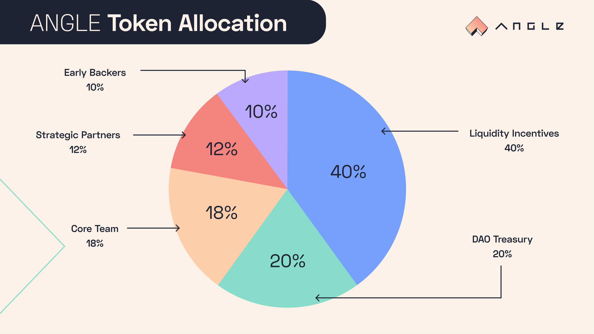
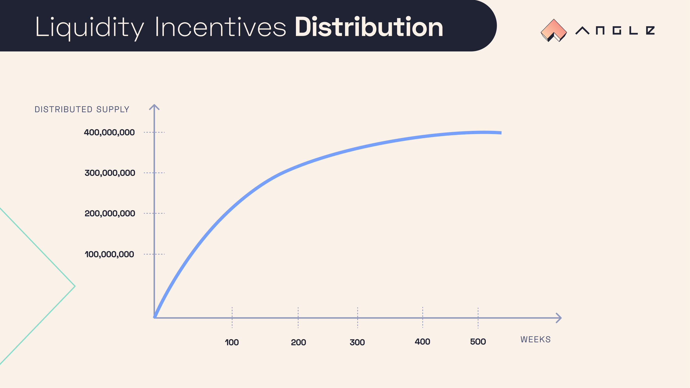

# 🚀 ANGLE Token

## 🎨 Design and Inflation

ANGLE's total initial supply is 1 billion and there is no planned token inflation.

The only address with minting capability is the Angle Governor Multisig.

## 🧬 Tokenomics

The ANGLE token is the backbone of the Angle Protocol allowing it to be governed in a fully decentralized way.

The vision for the ANGLE distribution is that it needs to be multi-year, extended, and sustainable until the protocol reaches ubiquity. With this in mind, the token distribution is broken down as follows:

### 🪐 Liquidity Mining

40% of tokens are being distributed to Angle stablecoin holders holders providing liquidity on external pools and protocols (like UniV3 or Curve).

The amount of ANGLE distributed is divided by 1.5^(1/52) = 1.007827 every week, equivalent to dividing the tokens emission by 1.50 every year.

In practice the rate of emission is lower than this, and emissions to grow the utilization of the protocol are allocated by the protocol [guardian multisig](./guardian.md) following a rate that cannot exceed the planned rate of emission.


[This document](https://docs.google.com/spreadsheets/d/1fxTBGEnOnzvpdBaeiDzy1j-g5-s75IhGPU8aOdu786g/edit?usp=sharing) presents the breakdown of the incentives used by the guardian address of the protocol.


### DAO Treasury

20% of the tokens are controlled by the DAO Treasury: the DAO is able to vote for how and where to allocate these tokens.

This Treasury can be used to build protocol reserves through different incentives and to increase incentives through specific rewards programs.

ANGLE tokens from the DAO Treasury are stored between the emergency multisig and the Timelock contract on mainnet.

### Grants and Partnerships

12% of the initial ANGLE are held by Angle Labs [in a multi-sig](https://etherscan.io/address/0xe02F8E39b8cFA7d3b62307E46077669010883459), referred to as the `AngleMaster` multisig. These tokens are available for distribution to the Community as grants or bug bounties, to strategic partners like exchanges for listing, but also to the most active and helpful community members as well as to advisors helping the protocol grow.

### Angle Labs team and early backers

These tokens are subject to a **linear vesting of 3 years (starting October 2021)**.

- 18% to Angle Labs team members
- 10% to early backers

With this vesting schedule, liquidity distributed through liquidity mining to the Community is guaranteed to be bigger than that going to team and early backers.

In order to reduce the exposure of the funds potentially at risk in this contract (this contract has been forked from Maker's `DssVest`), not all the 18% of the tokens that have to be distributed to the team + early backers + advisors have been initially put in the [Vesting contract](https://etherscan.io/address/0x43365213237ab259c707bc2cbc3e07d123ae2ad5). The `AngleMaster` multisig regularly transfers tokens to this contract based on what's leftover in it.

## Changelog

- January 2022: ANGLE's tokenomics was upgraded with the ability to lock ANGLE into veANGLE, similarly to what Curve does with CRV/veCRV. More info about veANGLE can be found [here](veANGLE/).
- October 2022: [it was voted](https://snapshot.org/#/anglegovernance.eth/proposal/0x478e838b67f2dffcff6160d4c8adc9622d67db985c981e4cad45c031e284fd63) to reduce ANGLE inflation by 20% with respect to the planned schedule. The week over week decrease factor of 1.007827 remains the same though.
- March 2023: ANGLE emissions were paused during this period and resumed late April 2023.
- March 2024: The gauge system was removed and emissions are now controlled by the guardian multisig of the protocol.
