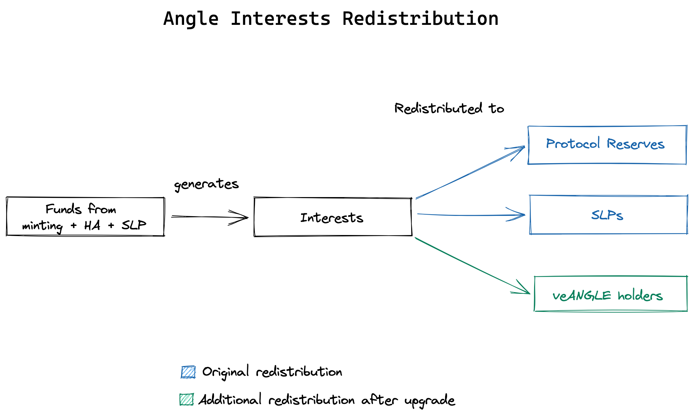

# 📈 Interests for veANGLE holders

One benefit of owning veANGLE is the redistribution of part of the interests earned by the protocol.

Until the upgrade, the interests generated were redistributed to SLPs as profit, and to the protocol as surplus/reserve. Now, they are also shared to veANGLE holders as an incentive for taking part in the governance of the protocol.

## Interests redistribution

### Share of interests for veANGLE holders

The share of interests redistributed to veANGLE holders is a parameter that can be set and updated by Governance. The goal is that this parameter is high enough to bring added value to veANGLE holders, but not too high to damage the reserves being built by the protocol and the yield earned by SLPs.

### Redistribution

The protocol will distribute interests in the form of Angle tokens, beginning by redistributing sanUSDC_EUR.

In practice, if the redistribution of interests to veANGLE token holder is at 30%, here is what is going to happen:

- 30% of all interests generated will be converted to USDC
- the USDC will be deposited into the protocol against sanUSDC_EUR
- the sanUSDC_EUR will be redeemable by veANGLE holders
- After having redeemed their sanUSDC_EUR, veANGLE holders will be able to withdraw USDC from the protocol, or keep sanUSDC_EUR and enjoy the interests generated for SLPs.
