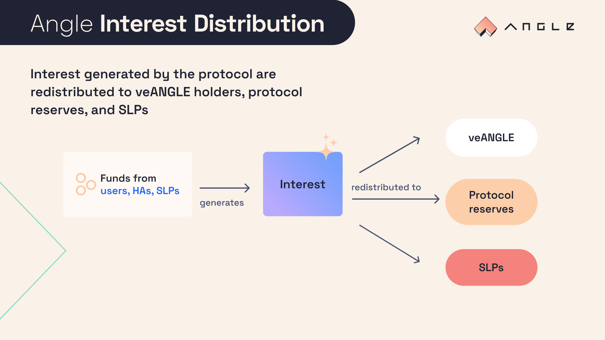

# 📈 Interest

## 🔎 TL;DR

- One benefit of owning veANGLE is the redistribution of part of the interest earned by the protocol.
- A portion of the interest generated by the protocol is shared to veANGLE holders as an incentive for taking part in the governance of the protocol.

## 💝 Interest redistribution

### Share of interest for veANGLE holders

The share of interest redistributed to veANGLE holders is currently at 50%, and can be updated by Governance. The idea is that this parameter should be high enough to bring added value to veANGLE holders, but not too high to damage the reserves being built by the protocol and the yield earned by SLPs.

### Redistribution

The protocol distributes interest in the form of sanUSDC_EUR.

In practice, the redistribution of interest to veANGLE token holder is currently at 50%. Here is how it is happening:

- 50% of all interest generated are converted to USDC.
- The USDC are deposited into the protocol against sanUSDC_EUR.
- The sanUSDC_EUR are then redeemable by veANGLE holders according to the distribution detailed below.

### ⏲️ Timeline

Fees are distributed weekly. The proportional amount of fees that each user is to receive is calculated based on their veANGLE balance relative to the total veANGLE supply.

This amount is calculated at the start of the week. The actual distribution occurs at the end of the week based on the fees that were collected. As such, users that create a new vote-lock should expect to receive their first fee payout at the end of the following epoch week.

The available sanUSDC_EUR balance to distribute is tracked via something that is called the “token checkpoint”. This is updated at minimum every 24 hours. Fees that are received between the last checkpoint of the previous week and first checkpoint of the new week are split evenly between the two weeks.

## 💱 Swap Process

As mentionned above, all profits of the protocol are converted into USDC before being deposited in the protocol as sanUSDC_EUR.

The protocol has implemented its own process and smart contracts to handle the conversion: this is handled on a per-coin basis.

So far the system implements conversions using a mix of 1Inch, UniswapV3, UniswapV2, and Sushi swaps.

Such swaps can only be performed by trusted addresses as it could lead people to front-run the protocol for swaps and plan for elaborate sandwich attacks.
