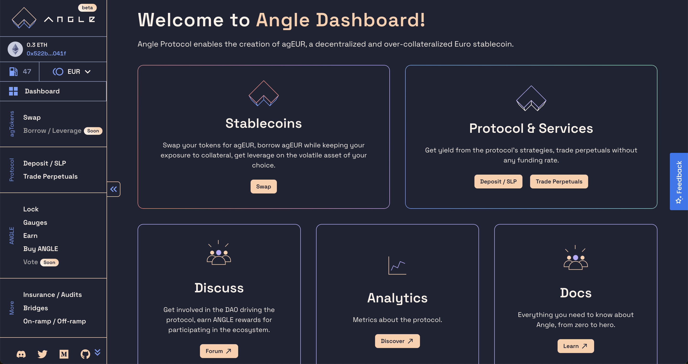

# 📔 App Guides

This section contains guides to interact through [app.angle.money](https://app.angle.money) with the main features of the different modules of the Angle protocol.

In particular, you will learn how to play with the app and more particularly to:

- Buy and sell agEUR
- Open, modify, and close a perpetual position
- Deposit collateral into the protocol to get yield in the form of sanTokens
- Borrow stablecoins from the Borrowing module
- Get leverage through the Borrowing module

## UI tour

The new Angle App contains all the features related to the protocol in one place. All the necessary pages can be accessed from the sidebar on the left. It contains three main sections: **agTokens**, **Protocol**, and **ANGLE**. External partners can also be found in the **More** section, and everything you need to know about the protocol is under **Info** at the bottom.

### agTokens

Under the **Swap** tab, users can buy or sell agEUR from multiple tokens.


[getAgeur.md](getAgeur.md)


In the **Borrow / leverage** one, they can deposit collateral to be allowed to borrow agEUR on top of their deposit. They can also use this mechanism to get leverage on the token they deposited directly within the Angle app in one transaction.

### Protocol

In the protocol section, Anglers can **deposit** tokens to earn yield, and **trade** perpetuals on forex or crypto.


[slp-pools.md](slp-pools.md)



[ha-positions.md](ha-positions.md)


### ANGLE

Everything related to ANGLE & veANGLE can be found in the ANGLE section.

Users can **lock** ANGLE to get veANGLE, vote on rewards distribution (**gauge** tab), stake their funds to **earn** ANGLE tokens, and **buy** ANGLE with any tokens directly from the same UI!

The governance-related guides can be found in the [Governance guides](/guides/veangle-guides/README.md).

