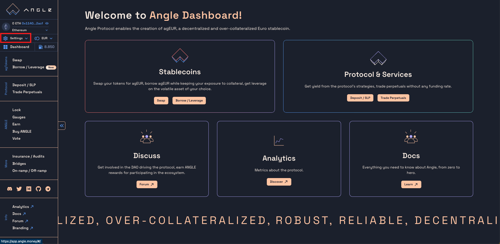
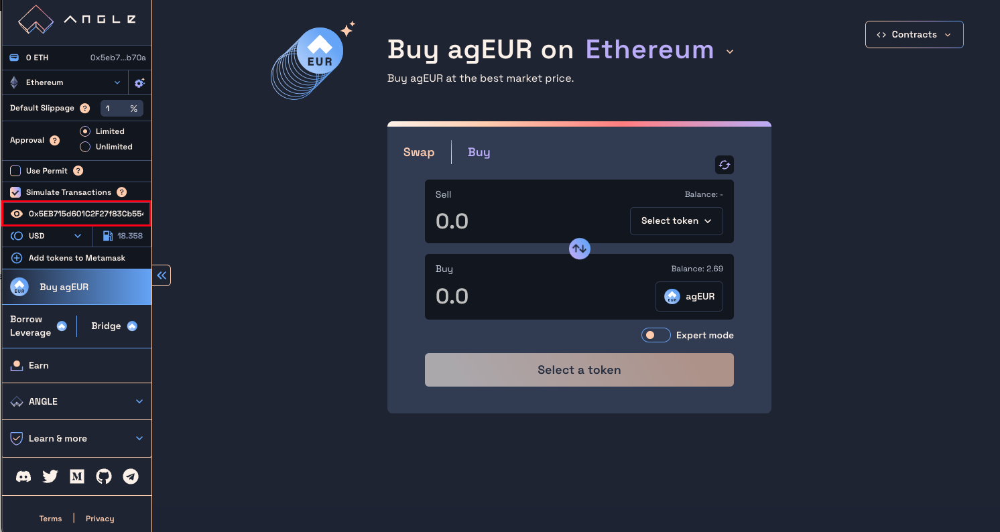

# 📔 App Guides

This section contains guides to interact through [app.angle.money](https://app.angle.money) with the main features of the different modules of the Angle protocol.

You will learn how to play with the app and more particularly to:

- Buy and sell agEUR: `Swap`
- Borrow agEUR or get leverage on the crypto assets of your choice using the Borrowing module: `Borrow / Leverage`
- Open, modify, and close a perpetual position: `Trade Perpetuals`
- Deposit collateral into the protocol to get yield in the form of sanTokens: `Deposit / SLP`

## UI tour

The Angle App contains most of the features related to the protocol. Pages can be accessed from the sidebar on the left under three main sections: **agTokens**, **Protocol**, and **ANGLE**. External partners can also be found in the **More** section, and everything you need to know about the protocol is under **Info** at the bottom.

### agTokens

Under the **Swap** tab, you can buy or sell agEUR from multiple tokens.


[Swap - Get agEUR](/guides/app-guides/getageur.md)


In the **Borrow / Leverage** one, you can deposit collateral to be allowed to borrow agEUR on top of your deposits. You can also use this mechanism to get leverage on the tokens deposited directly within the Angle app in one transaction.


[Borrow / Leverage](borrow-ageur.md)


### Protocol

In the protocol section, you can **deposit** tokens to earn yield, and **trade** perpetuals on forex or crypto.


[Deposit / SLP](slp-pools.md)



[Trade Perpetuals](ha-positions.md)


### ANGLE

Everything related to ANGLE & veANGLE can be found in the ANGLE section.

You can **lock** ANGLE to get veANGLE, vote on rewards distribution (**gauge** tab), stake their funds to **earn** ANGLE tokens, and **buy** ANGLE with any tokens directly from the same UI!

Governance-related guides can be found in the [Governance guides](../veangle-guides/).

### App Menu and Settings

On the top-left corner, there is an app menu with different features and settings. In the general menu, you can **choose** your **network** and the **currency** denominating the values you see on the app. By clicking on the eye icon to the right of your address, you can activate the transaction simulator mode detailed below.

Just below that, there is a `Settings` button. Among those settings, you can choose:

- A default slippage for your transactions
- To have unlimited or limited approvals
- To use permit signatures instead of approval transactions when possible
- To impersonate an address
  

#### Impersonator guide

The Angle app lets people impersonate other addresses, and see what the person controlling this address would on the app.

It allows contributors to debug user issues, and users to preview the UI/UX or someone else's positions.

Here are the steps to impersonate another address:

1. Connect your wallet.
2. Click on `Settings` in the top left corner.
3. At the bottom of the Settings section, there is an eye icon with an input to the right. Enter any address, and the connection will change.
   
   
4. You can now navigate the app as if you were controlling this address.
   

Obviously, it is not possible to confirm any transaction while connected on the app through an external address. However, they will be simulated them with Tenderly!

#### Transaction simulator with Tenderly

In the App menu, you can see an eye to the right of your address. When lighted, you won't be prompted to confirm the transactions, but you will be redirected on Tenderly where they will be simulated and you will see a summary.

This is very useful for users looking to test the app without actually passing transactions. It also helps users make sure that they are not getting scammed and the transactions happen as they should.

When impersonating another address, the simulation mode is active by default. [Here](https://dashboard.tenderly.co/public/angle/app/simulator/11a6bfca-e5bf-4928-bc34-a02aacf74921) is an example of the Tenderly simulator output when trying to close vault #6 of address `0x5004...`.
