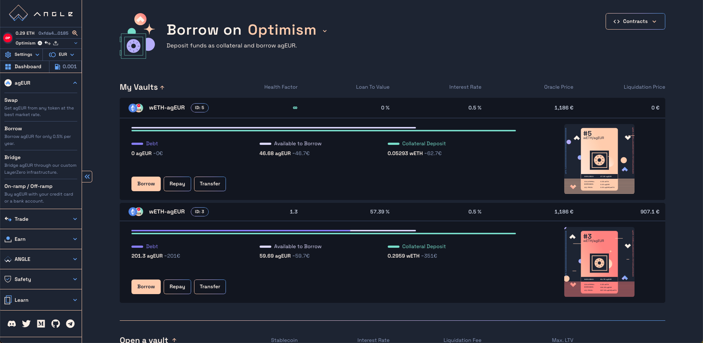

# Borrowing agEUR

The [Angle Borrowing module](/borrowing-module/README.md) lets you borrow agEUR from crypto collateral **on different chains**.

Essentially, you can deposit your crypto into a vault, to get a stablecoins loan in exchange. If the value of the crypto you deposited goes below a certain amount compared to the value of your loan, you can get [liquidated](/borrowing-module/vaults/liquidations.md).

When borrowing agEUR, you can directly swap the borrowed agEUR into more of the token originally used as collateral to get leverage. You can learn more about the mechanism [here](/borrowing-module/vaults/README.md#leveraging-collateral-exposure), and follow our guide here.

In this guide, we will look at how to **borrow agEUR** from collateral deposit.

## Add Collateral & Borrow agEUR

To borrow agEUR, you need to **deposit** collateral tokens into a **vault**. Different vaults accept different tokens which have their specific loan-to-value (LTV). This means that you are able to borrow up to a certain amount of stablecoins from the amount deposited.

For example, wETH LTV at 84% on Optimism means that if you deposit 1,000 € worth of wETH on Optimism, you can borrow up to 840 agEUR from this vault.

You can borrow agEUR in the same transaction that you deposit collateral to your vault. Once a vault is created, it is possible to deposit more collateral without borrowing more stablecoins.

Here are the steps to follow to deposit collateral and borrow agTokens:

1. Go to the `Borrow` section of the [Angle App](https://app.angle.money/#/borrow)
2. Select the type of vault to create, defined by the collateral and stablecoin token
3. Enter the amount of collateral you want to deposit in the first input.
4. Enter the amount of stablecoins you want to borrow in the second input.
   A summary of the changes on your vault and wallet will be displayed on the right.
5. Click on the bottom right button to `Approve` and `Send` your transaction.
6. (optional) If your transaction requires a wrapping, you'll need to sign a permit for the router contract to interact with your vault and perform the desired transaction.


Depending on the chain, there may be a minimum amount to borrow of agEUR. On Ethereum mainnet, this amount is 10,000 agEUR. This is to limit the risk of having small bad debts that are not repaid by users nor liquidators.


## Repay your debt or close your vault.

Once a vault is created, you can repay part of your debt up to the dust amount, or close it completely. You can also withdraw some collateral up to the minimum LTV.

When repaying your debt, you have two options: use your vault collateral, or use your debt token. If you choose to repay your debt with your vault collateral, the tokens will be swapped to debt tokens on your behalf and used to repay your debt.

Here for example, wETH will be swapped into 1 agEUR to repay part of the vault's debt. 0.01 wETH of the vault's collateral will also be withdrawn.

Here are the steps to Repay debt, withdraw collateral, or close your vault:

1. Go to the `Borrow` section of the [Angle App](https://app.angle.money/#/borrow)
2. Click on the `Repay` button on your vault.
3. Tick the box above the inputs to repay all your debt and close your vault. You will get all the remaining collateral.
4. Enter the amount of collateral you want to remove
5. Enter the amount of stablecoins debt you want to repay in the second input.
6. Choose whether to use your collateral or your agEUR wallet balance to repay your debt.
7. Click on `Send` to confirm the transaction.

## Monitoring your positions

After opening vaults, you can monitor their health on the main Borrow page.

