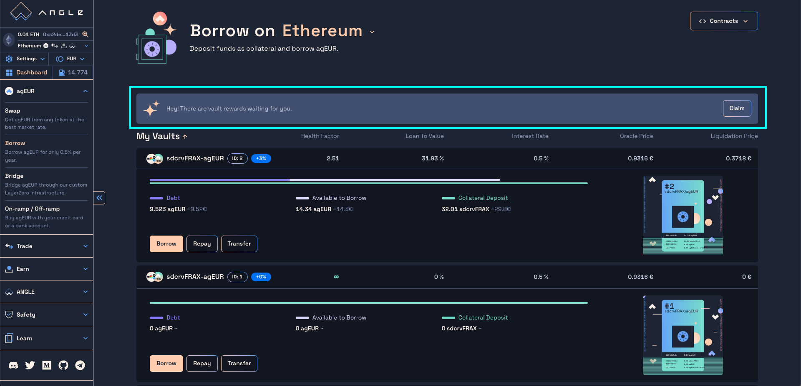

# 🏦 Borrow

The [Angle Borrowing module](/borrowing-module/README.md) lets you borrow Angle stablecoins like agEUR from crypto collateral **on different chains**.

Essentially, you open a vault with a specific token as collateral, and can get a stablecoin loan in exchange. If the value of the vault collateral goes below a certain amount compared to the value of your loan, you can get [liquidated](/borrowing-module/vaults/liquidations.md).

When opening a vault, you can deposit any token and it will be automatically swapped into the selected vault collateral. When borrowing a stablecoin, you can directly swap the borrowed stablecoin into more of the token originally used as collateral to get leverage. All of this is done in the same transaction.

Learn more about the mechanisms [here](/borrowing-module/vaults/README.md#leveraging-collateral-exposure).


The borrowing page functionalities are the same whether you're coming it to it for agEUR or another stablecoin. In this guide, we specifically look at agEUR borrowing use cases, but anything that is true for agEUR holds for others.


## Add Collateral & Borrow

To borrow an Angle stablecoin, you need to **deposit** collateral tokens into a **vault**. Different vaults accept different tokens which have their specific loan-to-value (LTV). This means that you are able to borrow up to a certain amount of stablecoins from the amount deposited.

For example, wETH LTV at 84% on Optimism for agEUR means that if you deposit 1,000 € worth of wETH on Optimism, you can borrow up to 840 agEUR from this vault.

You can deposit any token you want in the app, and it will be swapped to the collateral token of the selected vault. You can also borrow a stablecoin in the same transaction that you deposit collateral to your vault. Once a vault is created, it is possible to deposit more collateral without borrowing more stablecoins, and the other way around.

Here are the steps to follow to deposit collateral and borrow agTokens:

1. Go to the `Borrow` section of the [app](https://app.angle.money/borrow) and choose the network on which you want to open your vault
2. Select the type of vault to create, defined by the collateral and stablecoin token
3. Select the token and amount you want to deposit in the first input. If the token is different from the vault collateral, the former will automatically be swapped to the latter.
4. Enter the amount of stablecoins you want to borrow in the second input.
5. Click on the bottom right button to send your transaction. You can also `simulate` the transaction before confirming it.
   _If your transaction requires a wrapping, you'll need to sign a permit for the router contract to interact with your vault and perform the desired transaction._

In the below example, 200 DAI are swapped to ~0.15 wETH to be deposited as collateral in the vault, and 50 agEUR are borrowed.


A summary of the changes on your vault and wallet is displayed on the right. You can access all the steps of the transaction by clicking on the `Transaction Details` dropdown.


Note that once a vault is opened, you can monitor its health and status from the main Borrow page. From there, you can also choose to add collateral or borrow more from it. To do this just click on the `Add / Borrow` button of your opened vault.

## Using a yield-bearing asset as collateral to borrow

Some vaults have collateral tokens that earn a return for holders, like staked Curve LP tokens.

Using these allow you to get paid while borrowing a stablecoin. Opening a vault with yield-bearing assets is similar, but one feature becomes much more valuable: the ability to deposit any token.

In the case of yield-bearing assets, the tokens sent are swapped to the underlyings of the yield-bearing asset, and deposited in the platform they earn yield from. For example, in the case of Curve LP tokens, the underlyings are deposited on Curve, the LP tokens obtained staked on Convex, and used as collateral in a vault.

All external rewards accumulated by the vault's staked collateral can be [claimed](#claim-your-rewards) from the Angle app in one transaction, such that there is **no opportunity cost to use Angle** to stake tokens and borrow stablecoins from it.


To check out all these steps, click on the `Transaction Details` on the right side of the screen.


In the following example, 20 FRAX are deposited in the Curve FRAXUSDC pool, the LP tokens are staked on Stake DAO, and deposited as collateral in the vault. 10 agEUR are also borrowed from the vault

## Repay your debt or close your vault

Once a vault is created, you can repay part of your debt or close it completely. You can also withdraw some collateral up to the minimum LTV.

When repaying your debt, you can either use your vault collateral balance, your wallet balance, or a mix of both. If you choose to repay your debt with your vault collateral, the tokens are swapped to debt tokens on your behalf and used to repay your debt.

Here are the steps to Repay debt, withdraw collateral, or close your vault:

1. Go to the `Borrow` section of the [app](https://app.angle.money/borrow)
2. Click on the `Remove / Repay` button on your vault.
3. Tick the box above the inputs if you want to repay all your debt and close your vault. You will get all the remaining collateral.
4. Enter the amount of collateral you want to remove and the token you want to receive in your wallet.
5. Enter the amount collateral you want to use to repay your debt in the bottom left input.
6. Enter the amount of debt token from your wallet balance you want to use to repay your debt.
7. Click on the bottom right button to send your transaction. You can also `simulate` the transaction before confirming it.

For example, in the following screenshot, 0.01 wETH is swapped into ~12.45 agEUR to repay part of the vault's debt, and 10 agEUR from the wallet is used to repay some of the remaining agEUR debt.


A summary of the changes on your vault and wallet is displayed on the right. You can access all the steps of the transaction by clicking on the `Transaction Details` dropdown.


## Transfer debt between two positions

Angle Borrowing module enables you to transfer your stablecoin debt between two of your vaults on the same chain but with potentially different collateral assets.

If one of your vault has a health factor of 1.05 (and is therefore close from liquidation), and if the stablecoin of the vault is agEUR, you may want to transfer the agEUR debt of this vault to that of another vault you control which has a higher health factor.

This operation does not involve any collateral transfer and is very efficient gas-wise: it's thus a way to cheaply avoid liquidations.

Here are the steps to transfer debt between two vaults:

1. Go to the `Borrow` section of the [app](https://app.angle.money/borrow)
2. Click on the `Transfer` button on the vault for which you want to increase the stablecoin debt
3. Pick the vault from which you want to take debt: the vault you select at this step is the vault which debt is going to be decreased
4. Enter the amount of stablecoin debt you want to transfer to your vault
5. Click on the bottom right button to send your transaction. You should see a summary of the evolution of the health factors of the two concerned vaults before launching the transaction.

## Claim your rewards

Staked tokens accumulating external rewards can be used as collateral in an Angle vault. You can **claim all your vaults collateral rewards** directly **from the Angle App** in just one transaction. To do so, click on the `Claim` button at the right of the highlighted card below.

