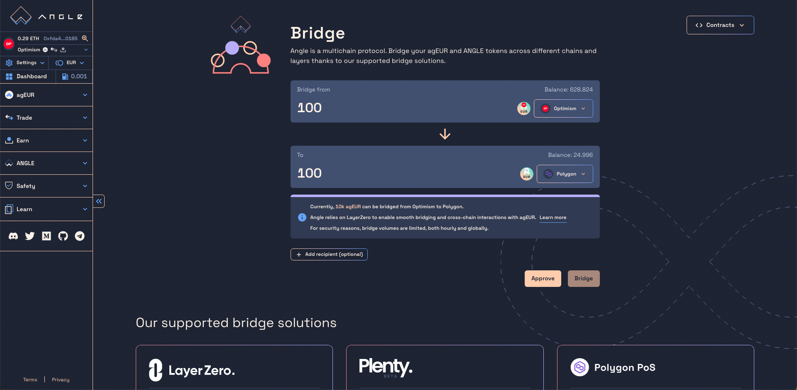

# Bridging agEUR with the Angle App

Angle allows to bridge agEUR to many EVM-compatible networks. More information can be found in [this](../../../other/cross-chain/README.md) page.

We recently deployed our own implementation of LayerZero which can be used on the [Bridge page](https://app.angle.money/#/bridge) of the app. Follow this guide to learn how.

## How to bridge agEUR using LayerZero implementation

To bridge agEUR from a network to another, you simply need to enter the amount you want to send, and select the destination network.

There are two other aspects users need to be careful about:

1. **Bridge limits**
2. Enough funds on the **origin chain** to pay for tx fees on the origin and destination chains.

### Bridge limits

Angle's LayerZero implementation has a total and a hourly limit. The total limits limit how much token can be held by the bridge contract on each chain. The hourly limits limit how much can be bridged to and from each chain.

If the limits are reached, you won't be able to bridge and will have to wait until they are reset. Information on the current limits is displayed in the callout below the inputs.

### Funds required to pay for transaction fees

When bridging from a network to another, you need enough gas token on the origin chain to pay for bridge transactions **both on the origin and destination chains**.

For example, if you bridge from Polygon to Ethereum mainnet, where tx fees are higher, you will need more MATIC than usual on Polygon to pay for the transactions.
