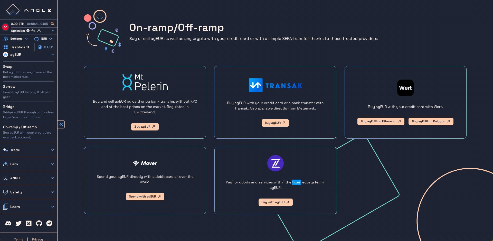

# 💳 Using on & off ramp services for agEUR

## Buying agEUR with credit card or bank transfer

agEUR is supported by a wide range of on-ramp partners which make it accessible from a simple credit card payment or bank transfer. Our on/off-ramp partners include:

- Mt Pelerin
- Transak
- Wert.io

All of them are accessible from the main Angle interface on the [On-ramp / off-ramp](https://app.angle.money/#/ramp) page.

The only thing you need beyond a credit card is a wallet (like [Ledger](https://www.ledger.com) or [Metamask](https://metamask.io)) to receive the agEUR the on-ramp provider will send you.

These providers usually let you receive the agEUR on the Ethereum or Polygon network.


Note that these partners may ask users to enter personal information above a certain amount.


## Selling & spending agEUR

If you want to spend agEUR or get EUR back to your bank account, you have a few options:

- Send money back directly to your bank account through one of our off-ramp partners listed above.
- Spend it through [Mover](https://faq.viamover.com/what-does-mover-do) or [Fizen](https://fizen.io/) crypto debit cards
