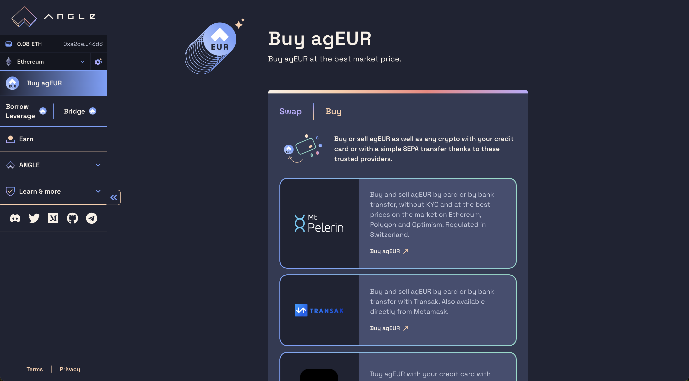

# 💱 Buy Angle stablecoins

If you are new to crypto, follow our [guide for new crypto users](../../newbie.md) first. Otherwise, keep reading here to see how you can get agEUR and other Angle stablecoins directly from Angle.

Angle stablecoins can be bought from the [swap and buy page](https://app.angle.money/swap) of the Angle app. This page leaves two main possibilities:

- swap: that is to say buy or sell through an onchain transaction
- on-ramp/off-ramp: that is to say buy or sell with a credit card or a bank transfer

## Swap

The app integrates 1inch (which integrates agEUR's native mint & burn mechanism on Ethereum) to provide the best rates to buy or sell Angle stablecoins from an onchain transaction.

### Buying onchain

Here are the steps to buy onchain:

1. Go to the [Swap page](https://app.angle.money/swap) of the app.
2. Select the `Swap` toggle
3. Select network on which you want to get the stablecoin.
4. Select the stablecoin you want to buy
5. Select the token you want to buy the stablecoin with. You can also copy any token's address you like.
6. Enter the amounts you want.
7. The app integrates 1inch and will automatically fetch the best rates for you in the background.
8. Approve your tokens. More precisely, to interact with Angle (and any other DeFi protocol), you need to approve (this is a transaction which costs ETH) or give permissions (signature) for the tokens you want to spend. This depends on the tokens used and not on the protocol.
9. Once the permission has been signed or the approval transaction has been executed, you can confirm the transaction to buy the stablecoin.


You can refresh the rates by clicking on the circled arrow on the top right of the inputs.


### Selling onchain

Selling an Angle stablecoin through the Swap page works exactly in the opposite way. Click on the arrow between the two inputs to put the stablecoin (e.g agEUR) as `From` token. You can then select the token you want to swap the stablecoin for, enter an amount and confirm your transaction.

## On-ramp / Off-ramp

agEUR is supported by a wide range of on-ramp and off-ramp providers which make it accessible from a simple credit card payment or bank transfer. All of these are listed in the Buy toggle of the [swap and buy page](https://app.angle.money/swap).

Supported on/off-ramp solutions include:

- Mt Pelerin
- Transak
- Wert.io

### Buying agEUR with credit card or bank transfer

To buy agEUR with a credit card or a bank transfer, the only thing you need beyond a credit card is a wallet (like [Ledger](https://www.ledger.com) or [Metamask](https://metamask.io)) to receive the agEUR the on-ramp provider will send you.

These providers usually let you receive the agEUR on the Ethereum or Polygon network.


Note that these partners may ask users to enter personal information above a certain amount.


### Selling & spending agEUR

If you want to spend agEUR or get EUR back to your bank account, you have a few options:

- Send money back directly to your bank account through one of our off-ramp partners listed above.
- Spend it with [Fizen](https://fizen.io/) crypto debit card.
- agEUR is also integrated with [Mover](https://faq.viamover.com/what-does-mover-do), allowing anyone to top-up a debit card and spend agEUR in real life. Check out [this guide](https://faq.viamover.com/angle-protocol/how-to-top-up-mover-debit-card-with-ageur-tokens) to learn how to send agEUR to your Mover card.
- Swap your agEUR to a token which can be cheaply off-ramped (like EURe) as described [in this guide](../../use-cases/ageur-power-usecase.md#withdrawing-ageur-to-a-bank-account)
