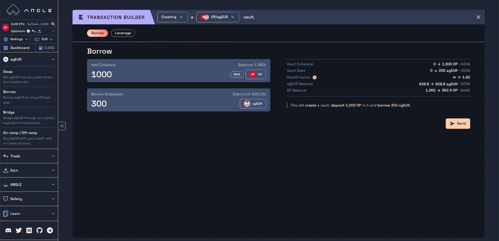

# Borrowing agEUR 

The [Angle Borrowing module](/borrowing-module/README.md) lets you borrow agEUR or get leverage on your crypto directly from the [Angle App](https://app.angle.money/#/borrow). 

Essentially, you can deposit your crypto into what is called a vault, to get a stablecoins loan in exchange. If the value of the crypto you deposited goes below a certain amount compared to the value of your loan, you can get [liquidated](/borrowing-module/vaults/liquidations.md). 


You have the possibility to use ETH and stETH instead of wETH and wstETH. In this case, transactions will require two permit or approval transactions: one to approve the wrapping of your tokens by the router contract, and another one for the actual transaction. 


## Add collateral and borrow agEUR

To borrow agEUR, you need to **deposit** collateral tokens into a **vault**. Different vaults accept different tokens which have their specific loan-to-value (LTV). This means that you are able to borrow up to a certain amount of stablecoins from the amount deposited.  

For example, wETH LTV is at 84% meaning that if you deposit 1,000 € worth of wETH, you can borrow up to 840 agEUR from this vault. 

You can borrow agEUR in the same transaction that you deposit collateral to your vault. Once a vault is created, it is possible to deposit more collateral without borrowing more stablecoins. 

Here are the steps to follow to deposit collateral and borrow agTokens: 
1. Select the type of vault to create, defined by the collateral and stablecoin tokens
2. Select the `Add/Borrow` action
3. Enter the amount of collateral you want to deposit in the first input. 
4. Enter the amount of stablecoins you want to borrow in the second input. 
A summary of the changes on your vault and wallet will be displayed on the right. 
5.  Add the actions to go to the next step. You will find a summary of your transaction. 
6.  Click on `Approve` to approve the tokens to be used by the protocol through a permit signature or an approval transaction. 
7. (optional) If your transaction requires a wrapping, you'll need to sign a permit for the router contract to interact with your vault and perform the desired transaction.
8.  Finally, click on `Send` to send your transaction. 


There is a minimum amount to borrow of 10,000 agEUR to limit the risk of having small bad debts that are not repaid by users nor liquidators. 


## Repay debt and remove collateral

Once a vault is created, you can repay part of your debt up to the dust amount. You can also withdraw some collateral up to the minimum LTV. 


If you want to repay all your debt and withdraw all your collateral, you can directly [close your vault](#close-vault).


When repaying your debt, you have two options: use your vault collateral, or use your debt token. If you choose to repay your debt with your vault collateral, the tokens will be swapped to debt tokens on your behalf and used to repay your debt.  

For example here, the user is using his collateral (wETH) to repay 1,000 agEUR of debt, and removing 0.2 wETH from the vault. 

Here are the steps to Repay debt or Remove collateral: 
1. Select your vault you want to modify (make sure you select the correct ID)
2. Select the `Repay/Remove` action
3. Enter the amount of collateral you want to remove in the first input. 
4. Enter the amount of stablecoins debt you want to repay in the second input. A summary of the changes on your vault and wallet will be displayed on the right. 
5.  Add the actions to go to the next step. You can then click on `Send` to send your transaction. 

## Close vault

If you want to repay all your debt and remove all your collateral, you can directly use the `Close` feature. This repays all your debt and sends you the remaining collateral. 

With Angle, you don't need to bring debt token to repay your debt. By leaving the `Use collateral only` option checked, the protocol will swap your collateral tokens to agEUR to repay your debt and send you the remaining funds. 

If you have agEUR in your wallet and prefer to use those, you can check the `Use agEUR` option. In this case, the protocol will use all the agEUR in your wallet to repay your debt, and some of your collateral if needed. Then, you will receive the remaining funds back in your wallet. 

To close your vault, you only need to verify the information and click on `Add step` to go to the next section, and validate the transaction. 


It might be that you want to repay your debt or close your vault by using agEUR, but don't have enough in your wallet. In this case, if you select the `Use agEUR` option, the contract will use all the agEUR in you wallet and the remaining debt will be repaid by swapping the required amount of collateral into agEUR. You will the leftover collateral amount. 


### Slippage details

When using collateral to repay your debt or closing a vault, the protocol will swap collateral tokens into debt tokens (ETH to agEUR for example). It uses 1inch, a DEX aggregator, to get the best prices possible. 

Depending on the size of the swap and on available liquidity on-chain, there can be slippage. In this case, you will have a slippage input to specify the maximum amount of price slippage you want to tolerate during your swap. 

This applies when [repaying debt](#repay-debt-and-remove-collateral) or [closing vault](#close-vault).

## Take debt from another vault

Another feature available with the Angle Borrowing module is to transfer the debt from one vault to another. 

For example, imagine your vault #1 is close to liquidation, and your vault #2 is over-collateralized. In this case, you can simply transfer debt from vault #1 to #2 and equilibrate the situation of the two vaults. 

To take debt from a vault: 
1. Select the vault you want to add debt to
2. Select the `Take Debt from` action
3. Select the vault you want to take debt from
4. Input the amount of debt you want to take from this vault into the originally selected one. 
5. Check all the information about the change of the concerned vaults, add the step and confirm the transaction. 


This will increase the liquidation price of the vault you add debt to, so make sure to double check your liquidation price before executing the transaction. 


