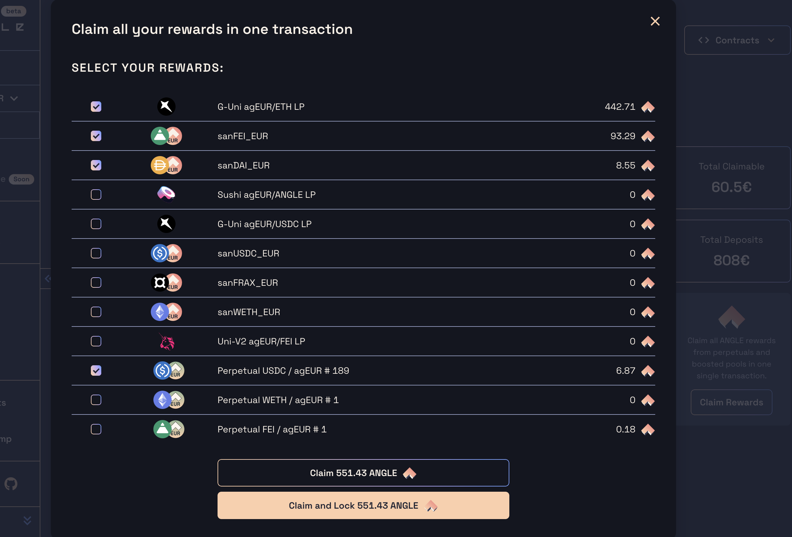

# 🍀 Staking and Uniswap V3 incentive mechanism

ANGLE tokens are issued every week and distributed to different stakeholders of the Angle ecosystem based on what is voted by veANGLE holders [here](https://app.angle.money/gauge). Among other things, the protocol incentivizes Uniswap V3 Liquidity Providers of some specific pools through [the Merkl system](../../../side-products/merkl/).

The [Earn page](https://app.angle.money/earn) of the app lists all the yield opportunities linked to Angle and displays in particular the pools and farms where it is possible to earn ANGLE tokens. It is on this page that liquidity providers on Angle gauges (excluding Uniswap V3 pools) can claim their ANGLE rewards.

In this guide, we explain how to be eligible for ANGLE rewards as a UniswapV3 liquidity provider and how all LPs on gauges can claim their rewards.

## Incentives for Uniswap V3 Liquidity Providers

Angle rewards Uniswap V3 Liquidity Providers (LPs) with the Merkl mechanism. This mechanism, relying on an offchain computation script, rewards LPs granularly according to the efficiency of the liquidity they provide. In turn, they have the opportunity to provide liquidity in the way they want and can fully benefit from the flexibility offered by Uniswap V3.

Currently the Uniswap V3 pools that are eligible to this system are the following:

- [Uniswap V3 agEUR-ETH](https://info.uniswap.org/#/pools/0x8db1b906d47dfc1d84a87fc49bd0522e285b98b9) (0.05%) on Ethereum mainnet
- [Uniswap V3 agEUR-USDC](https://info.uniswap.org/#/pools/0x735a26a57a0a0069dfabd41595a970faf5e1ee8b) (0.01%) on Ethereum mainnet
- [Uniswap V3 agEUR-USDC](https://info.uniswap.org/#/polygon/pools/0x3fa147d6309abeb5c1316f7d8a7d8bd023e0cd80) (0.01%) on Polygon

Some important things to note on Merkl:

- You can provide liquidity directly on Uniswap or through a supported liquidity manager like Gamma or Arrakis and be directly rewarded for it
- You do not need to stake liquidity anywhere to be eligible for rewards
- Rewards can be claimed from the [Merkl app](https://merkl.angle.money)
- All positions earn different rewards and get a different APR: your actual APR depends on the volume of the pool, the range you are providing liquidity on, and the price of the pool
- veANGLE holders are earning boosted rewards with respect to users who do not own any veANGLE
- only in-range liquidity is rewarded with incentives.


You can find more details on the mechanism in [the Merkl section](../../../side-products/merkl/) of the documentation


## Claiming ANGLE tokens

The App Earn page leaves multiple options for claiming your ANGLE tokens if you're involved in a gauge of the protocol:

- Claim from multiple gauges in **one transaction** by clicking on the `Claim Rewards` button on the right. When using this modal, you can select/unselect the gauges you want to claim rewards from and then:
  - **`Claim ANGLE`**: this claims your ANGLE rewards from all the selected gauges (except the UniswapV3 related ones) in one transaction.
  - **`Claim and Lock ANGLE`**: this claims your ANGLE rewards from all the selected gauges (except the UniswapV3-related ones) in one transaction **and** locks them into your existing ANGLE lock. This increases your veANGLE balance and doesn't affect your lock expiration date. _NB: this is only possible if you already have ANGLE locked. You can lock ANGLE_ [_here_](https://app.angle.money/lock)_._

- Claim from a specific gauge by clicking on the `Claim` button in the modal below the input:

