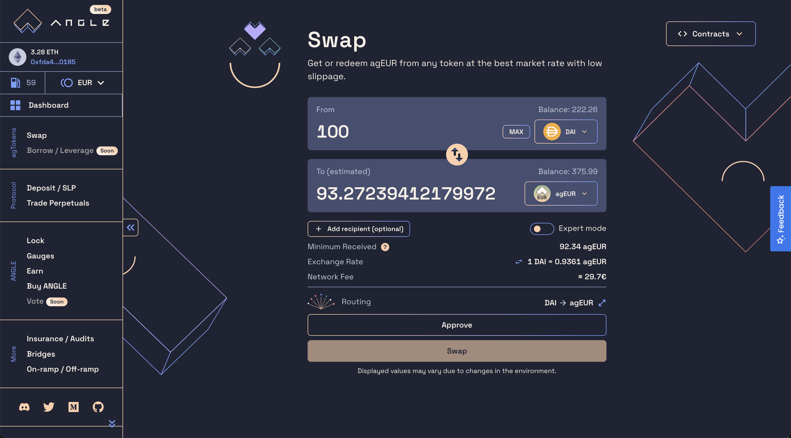
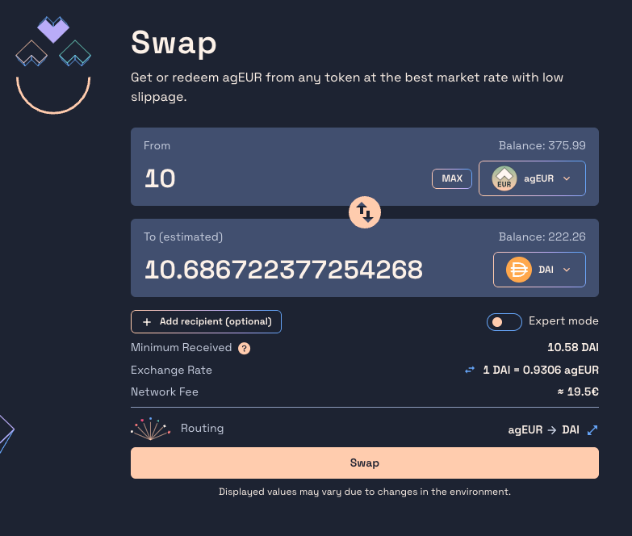

# 💶 Get agEUR

agEUR is a **EUR-pegged stablecoin**, meaning that it's built to mirror the value of the EUR. The objective behind stablecoins is to create tokens that hold their value against some tangible references, like central bank currencies, and make them available on decentralized and open blockchains such as Ethereum.

If you are new to crypto, follow first our [guide for new crypto users](newbie.md). Otherwise, keep reading here to see how you can get agEUR on the blockchain, or directly from your money at the bank.

## 🔎 TL;DR

There are multiple ways to buy agEUR:

1. With any crypto-tokens directly from the [Angle App](https://app.angle.money) or on a decentralized exchange (DEX)
2. With your credit card or bank transfer by using one of our **on-ramp partners**

## Buying agEUR on-chain

There are different places on which you can buy agEUR on-chain. You can do it:

- Directly with the Angle Protocol through the [Angle App](https://app.angle.money).
- From DEXes on Ethereum or on other chains like Solana, Fantom, Polygon. agEUR exists with deep liquidity on many decentralized exchanges of different chains. Best solution at the moment on Ethereum mainnet remains to use [Uniswap](https://app.uniswap.org) or an aggregator like [1inch](https://app.1inch.io/#/1/swap/ETH/agEUR).

Angle App is built to minimize cost for acquiring agEUR (and ANGLE) with any token but it is possible that there are temporarily better prices to get it from other tokens on DEXes.

Here we'll breakdown the process of buying agEUR on the [Angle App](https://app.angle.money).

### On Angle

Before anything, to buy agEUR on Angle (and on any DEX), you need ETH in your wallet to pay for your network gas fees. You also need to have in your wallet the token you want to use to get agEUR. ETH is notably one of these.

Then:

1. Go to [app.angle.money](https://app.angle.money/#/swap).
2. Select the token you want to spend to buy agEUR. If your token in not in the collaterals list, it will be swapped using 1inch to the cheapest collateral available. Supported collaterals for the moment are ETH, DAI, USDC, FEI, FRAX
3. Enter the amount of tokens you want to exchange or to buy
4. Approve your tokens. More precisely, to interact with Angle (and any other DeFi protocol), you need to approve (this is a transaction which costs ETH) or give permissions (signature) for the tokens you want to spend. This depends on the tokens used and not on the protocol. You can learn more about approving tokens [here](/guides/app-guides/app-faq.md).
5. Once the permission has been signed or the approval transaction has been executed, you can confirm the transaction to buy agEUR.

You now have agEUR, a stablecoin that mirrors the value of the EUR!

## Buying agEUR with credit card or bank transfer

agEUR is supported by a wide range of on-ramp partners which make it accessible from a simple credit card or bank transfer:

- Mt Pelerin
- Transak
- Wert.io

All of them are accessible from the main Angle interface on the [On-ramp / off-ramp](https://app.angle.money/#/ramp) page. The only thing you need beyond a credit card is a wallet (like [Ledger](https://www.ledger.com) or [Metamask](https://metamask.io)) to receive the agEUR the on-ramp provider will send you.

These providers usually let you receive the agEUR on the Ethereum or Polygon network. You might face high fees for low amounts due to Ethereum transaction costs.


Note that these partners may ask users to enter personal information above a certain amount.


## Selling agEUR

If you want to exchange your agEUR back to another token, you have a few options:

- Swap them against another token directly on [Angle](https://app.angle.money/#/swap) or a DEX like [Uniswap](https://app.uniswap.org).
- Send money back directly to your bank account through our off-ramp partner Mt Pelerin.
- Spend it through [Mover](https://faq.viamover.com/what-does-mover-do) crypto debit card

### On the Angle App

Swapping agEUR back to another token on Angle is a similar process than buying agEUR.

1. Go to [app.angle.money](https://app.angle.money/#/swap),
2. Select agEUR as the `from` token for the swap and the token you want to receive in exchange.
3. Click on `Swap` and confirm the transaction in your wallet. This will exchange your agEUR for the tokens you selected. Note that you do not need an approval to perform this operation.

### With Mt Pelerin

If you want to send your agEUR from your wallet as EUR in your bank account, you can do so by using [Mt Pelerin](https://www.mtpelerin.com). The Swiss based company allows users to send cryptocurrency and receive the equivalent directly in their bank account.

There are no fees on Mt Pelerin for first time users selling less than 500 agEUR, and no KYC is needed for less than \$1k of volume a day.

### By spending it through Mover debit card

agEUR is integrated with Mover which allows to top-up their debit card using agEUR. This exchanges them to EUR and make them instantly available in real life! 

Check out [this guide](https://faq.viamover.com/angle-protocol/how-to-top-up-mover-debit-card-with-ageur-tokens) to learn how to send agEUR to your Mover card. 

## Links and resources

For more information on agEUR, check out these resources:

- [agEUR value proposition article](https://blog.angle.money/angles-value-proposition-for-stablecoin-holders-68ee9a72d80b?source=collection_home---4------17-----------------------)
- [Angle agEUR Analytics](https://analytics.angle.money/#/agEUR)
- [Coingecko - Market Info](https://www.coingecko.com/fr/pi%C3%A8ces/ageur)
- [Dune Analytics Dashboard](https://dune.xyz/SebVentures/Angle-Dashboard)
- [agEUR on Etherscan](https://etherscan.io/token/0x1a7e4e63778b4f12a199c062f3efdd288afcbce8)


A complete list of all agEUR integrations can be found on our Discord [here](https://discord.com/channels/835066439891157012/907535810067304458/907537277939482636).
