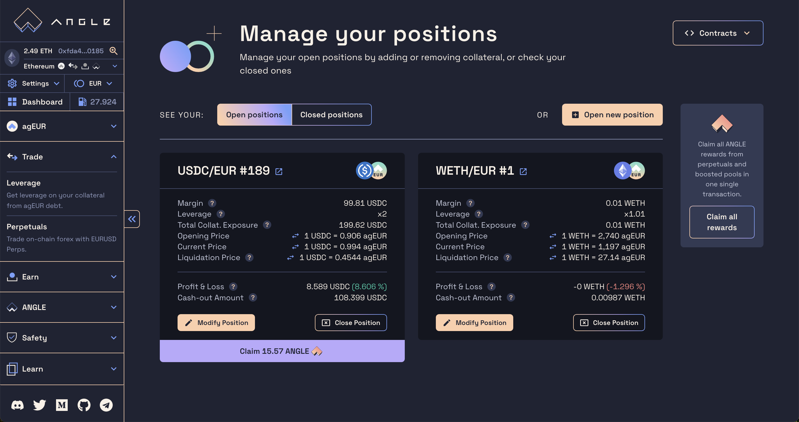
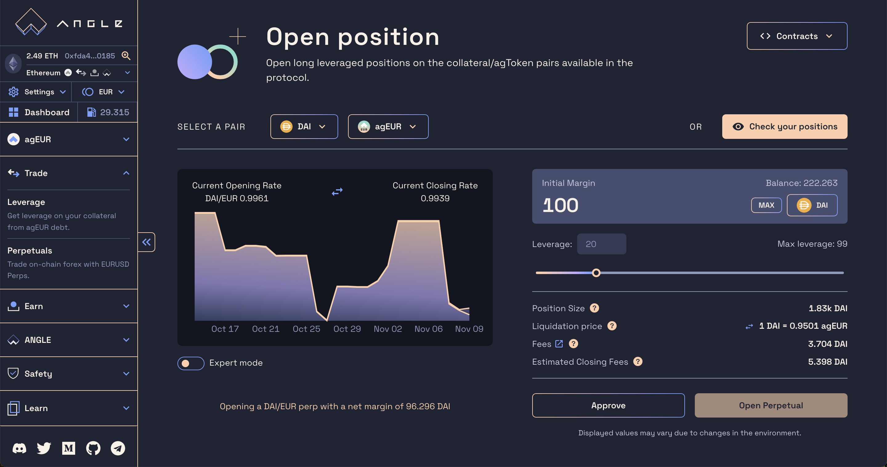
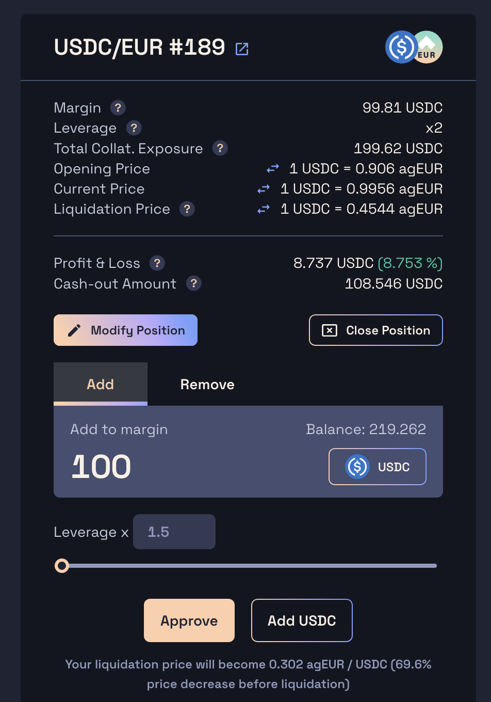
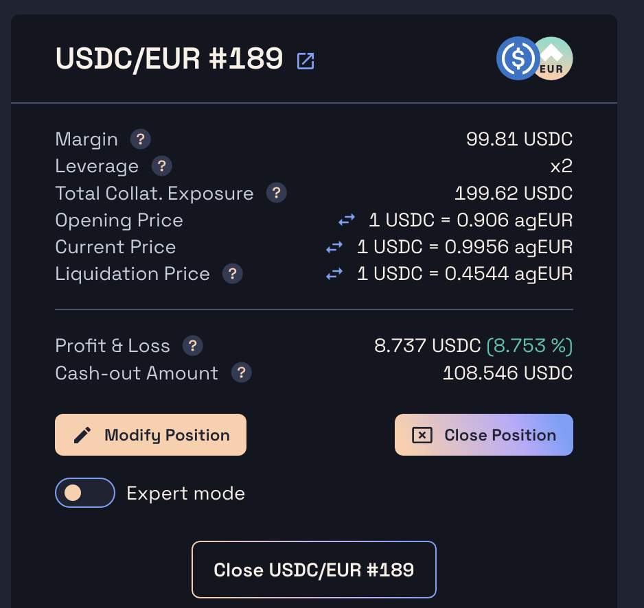

# Opening & Managing Positions

Angle lets you open long collateral/stablecoin leverage positions. This means that if the protocol accepts USDC as collateral, and can issue agEUR, users can open USDC/agEUR long positions, betting that the USD will increase in value against the EUR.

You can read more about this mechanism [here](/core-module/hedging-agents/README.md).

## Opening a position

1. To open a long position on Angle, head to [app.angle.money](https://app.angle.money/#/perpetuals) and select a collateral you want to long.
2. Then, select the amount of collateral you want to send to the protocol as margin for your position. Positions in Angle work similarly than isolated-margin exchanges, where margin is separated between positions.
3. Now, you can choose your leverage. This will determine your position size that is to say the amount of underlying tokens you will be exposed to. Leverage in Angle is computed as $$\frac{\texttt{margin + position size}}{\texttt{margin}}$$
4. The collateral/stablecoin exchange rate and transaction fees are displayed. Note that the net initial margin of your position will be your initial margin input minus fees. You'll also see the amount of ANGLE rewards you'll get with your position.
5. If this is the first time opening a position on this collateral/stablecoin pair, you will need to approve your tokens with a transaction or a signature first.
6. Once that is good, clicking the `Open perpetual` button will prompt you to confirm the transaction. The margin will be sent to the protocol and the leveraged position will be opened.

For more advanced users, there is an expert mode which can be used to protect yourself against changing oracle or fees conditions in the environment.


Be careful when opening a position, updating and closing is locked for an hour. More info [here](/guides/app-guides/app-faq.md).


While your position is open, depending on the asset you are longing, it may automatically accrue ANGLE rewards.
In all cases, once your perp is open, you own a leveraged position, meaning you can make leveraged gains if the price of the collateral you are longing increases with respect to that of the asset the stablecoin is pegged to, and leveraged losses if the price decreases.

## Updating a position

If you have open positions, you might want to add or remove margin to some of them to increase your leverage or protect yourself from a potential liquidation. There is no fee for updating the margin of a position.

1. On the HA positions page, click on the `Modify Position` button.
2. Enter an amount of collateral to add or remove from your position, or change its leverage. You can remove collateral up to reaching the max leverage allowed for the pair of the position. This max leverage can vary from x10 to x100 depending on the pair.
3. You will find current and updated info about your position.
4. Then, just confirm the transaction and it will send/withdraw the amount of collateral that was specified.

## Closing a position

1. To close a position, simply click on the `Close Position` button of the positions you would like to close.
2. You can check your position's opening and current prices, as well as the amount of collateral (the cash-out amount) and potential ANGLE rewards you are going to receive upon closing directly in the position card.
3. Click on the `Close` button to confirm the transaction and receive your cash out amount (margin ± PnL) and potential ANGLE rewards.


When closing a position, there is also an expert mode to protect for important slippage in price or fees.


## Claiming ANGLE rewards

Open positions on Angle may automatically accrue ANGLE token rewards. You can claim your tokens by clicking on the purple `Claim` button at the bottom of each card, or claim ANGLE from all your perps in one transaction from the button on the right.

