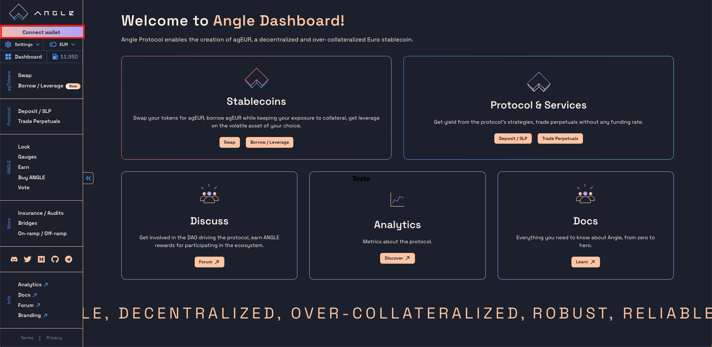
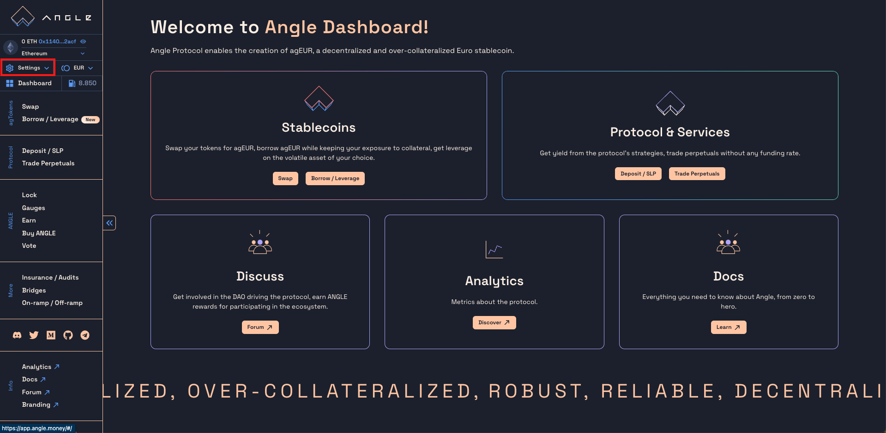
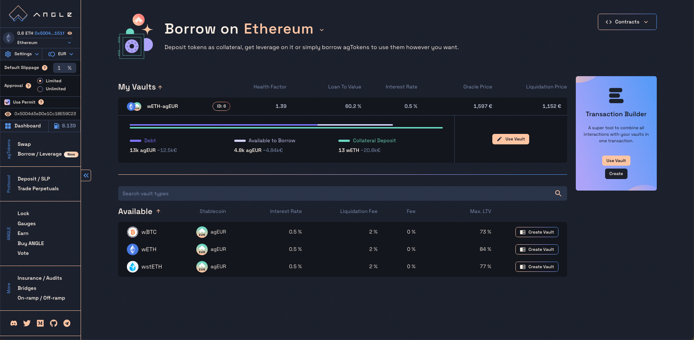

# 🕵️‍♂️ Impersonate any address

All mainnet Ethereum addresses and transactions are public. Thanks to this, the Angle app lets people impersonate any address, and see what the person controlling the address would on the app.

It allows contributors to debug user issues, and users to preview the UI/UX or someone else's positions.

## Impersonator guide

Here are the steps to impersonate another address:

1. Connect your wallet.
   

2. Click on `Settings` in the top left corner.
   

3. At the bottom of the Settings section, there is an eye icon with an input to the right. Enter any address, and the connection will change.
   
   

4. You can now navigate the app as if you were controlling this address.
   

Obviously, it is not possible to confirm any transaction while connected on the app through an external address.
