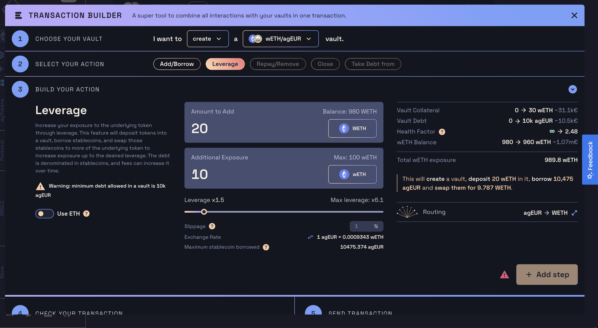

# Leverage on crypto with agEUR

The Angle Borrowing module can be used to get leverage on crypto deposited as collateral with agEUR, directly from the [Angle App](https://app.angle.money/#/borrow). 

This works by borrowing agEUR, swapping them into the token originally deposited as collateral, and depositing this token back into the vault. You can learn more about the mechanism [here](/borrowing-module/vaults/README.md#leveraging-collateral-exposure). 

Note that at the difference of simple borrowing, leveraging increases your exposure to the collateral token and make the overall position more risky.  

## How to leverage

### Steps

Here are the steps to get leverage with Angle: 
1. Select your vault and the `Leverage` action. 
2. Input the amount of collateral that you want to deposit
3. Input the amount of additional exposure you want on the collateral token, or choose your leverage from the slider.
4. Make sure to double check the summary on the screen and click on `Add step` to move on to the final section. 
5. Approve your tokens to be used by the protocol through a permit signature or an approval transaction. 
6. (optional) If using non-wrapped tokens, approve the router contract to interact with your vault to do the transaction. 
7. Finally, send the transaction to be executed. 


You have the possibility to use ETH and stETH instead of wETH and wstETH. In this case, transactions will require two permit or approval: one to approve the wrapping of your tokens by the router contract, and another one for the actual transaction. 


### Slippage

When leveraging with Angle, the protocol borrows stablecoins from your vault to swap them to the collateral token you want to leverage on. It uses 1inch to swap tokens to get the best prices possible. 

Depending on the size of the swap and available liquidity on-chain, there might be slippage. In this case, you will find a slippage input to specify the maximum amount of price slippage you want to tolerate during your swap. 

The value you input as slippage will change the amount of stablecoins borrowed to make sure you get the output amount you desire.


If slippage is too low, it's possible that the swap won't give the required amount and that the transaction reverst. In this case, you will have to increase the slippage parameter to send the transaction. 


## Monitoring your position

When leveraging, you are more exposed to price changes in both ways. In the case of Angle vaults, this means that a decrease in price brings you faster to liquidation depending on the size of your leverage. 

For example, with a leverage of 3 and maximum LTV (loan-to-value) of 84%, a 20% price drop can get you liquidated. 

It's important to always keep an eye on your Health Factor and LTV to make sure you are safe from liquidation.

