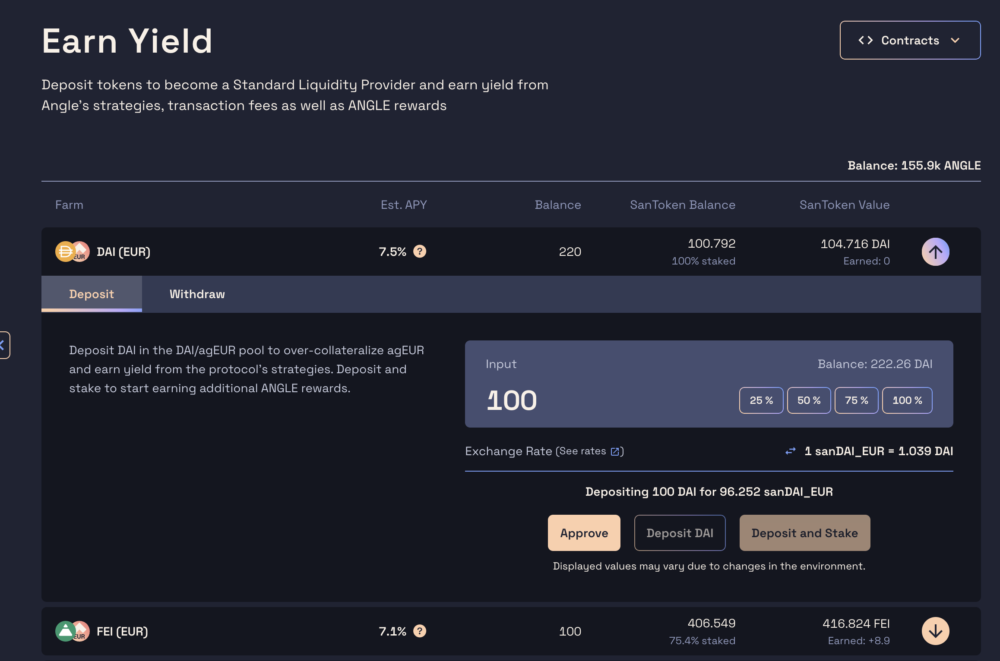
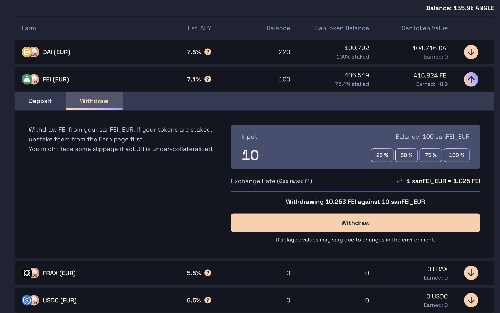

# Deposit Tokens for Yield

Each collateral/stablecoin pair on Angle has a dedicated pool of collateral, which funds are invested into yield-earning strategies to put the protocol capital to work and earn interest.

Users, called Standard Liquidity Providers or SLP, can deposit their tokens into those pools to earn a part of the yield generated by the protocol. Technically, when doing so, they get other tokens called sanTokens which allow users automatically and passively accrue yield.

While we say that Standard Liquidity Providers are adding liquidity to a "pool", contrarily to what is done in decentralized exchanges, in the case of Angle, they just need to add one token to earn some yield, and this token has to be the collateral token.
For instance, you can only add DAI to get sanDAI_EUR, and the `EUR` here is just used to know that it is DAI backing the Euro (€) stablecoin of the protocol.


You can read more about this in the [SLP page](../../core-module/standard-liquidity-providers/).


Deposit tokens in the Angle protocol to earn yield can be done from [this page](https://app.angle.money/#/deposit).

## Deposit

1. Choose the pool you would like to deposit your tokens in and click on the `Deposit` section of the corresponding card.
2. Enter the amount of tokens you want to put in the pool. You might need to approve the token through a transaction or a signature.
3. You have two options: `Deposit`, and `Deposit and Stake`.
   - **`Deposit`** will send your collateral to the pool, and you will receive the associated sanTokens
   - **`Deposit and Stake`** will deposit your collateral into the protocol, generate the associated sanTokens, and stake them automatically in the related gauge. You can see your staked tokens from the [App](https://app.angle.money/#/earn). You will start accumulating ANGLE rewards.

In all cases, after depositing or depositing and staking, you'll be owning sanTokens which automatically accrue interest and yield.

## Withdraw

1. To withdraw your funds, if you have staked your sanTokens in the gauge contract, you will need to unstake them [on this page](https://app.angle.money/#/earn) first. If you have not, then there's nothing you need to do.
2. Then, just click on the `Withdraw` button of the card corresponding to the token you want to unstake, and input the number of tokens you want to withdraw. The transaction will convert your sanTokens to the tokens you have staked, and you'll automatically get all the fees you have accrued as you were a SLP.


It's possible that all collateral is invested in yield [strategies](/core-module/lending.md). In this case, the strategies need to be harvested to free up some liquidity. This function is permissionless, so you can do it yourself or wait for someone else to do it. A button to harvest will show up on the screen.  


