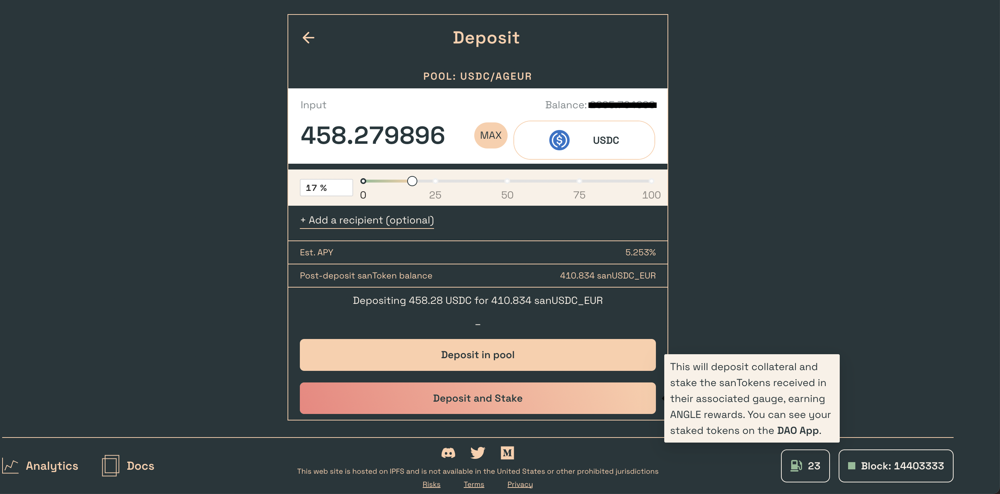

# Deposit Tokens for Yield

Each collateral/stablecoin pair on Angle has a dedicated pool, which funds are invested into yield-earning strategies to put the protocol capital to work and earn interests. Users, called Standard Liquidity Providers or SLP, can deposit their tokens into those pools to earn a part of the yield generated by the protocol. You can read more about this in the [SLP page](../../concepts/standard-liquidity-providers/).

You can deposit tokens in the pools of your choice from [this page](https://app.angle.money/#/slp):

1. Choose the pool you would like to deposit your tokens in and click on `Deposit`.
2. On the deposit page, enter the amount of tokens you want to put in the pool. You might need to approve the token through a transaction or a signature.
3. You now have two options: `Deposit`, and `Deposit and Stake`.
   * **`Deposit`** will send your collateral to the pool, and you will receive the associated sanTokens, which automatically accrue interest.
   * **`Deposit and Stake`** will deposit your collateral into the protocol, generate the associated sanTokens, and stake them automatically in the related gauge. You can see your staked tokens from the [DAO App](https://dao.angle.money/#/stake). You will start accumulating ANGLE rewards on top of the interest of the sanTokens.
4. To withdraw your funds, you will need to unstake your sanTokens from the [DAO App](https://dao.angle.money/#/stake) first. Then, just click on the `Withdraw` button on the Pools page, and input the number of tokens you want to withdraw.


After you receive sanTokens, you can stake those sanTokens in the incentives page to earn ANGLE rewards.


## Deposit

## Withdraw

