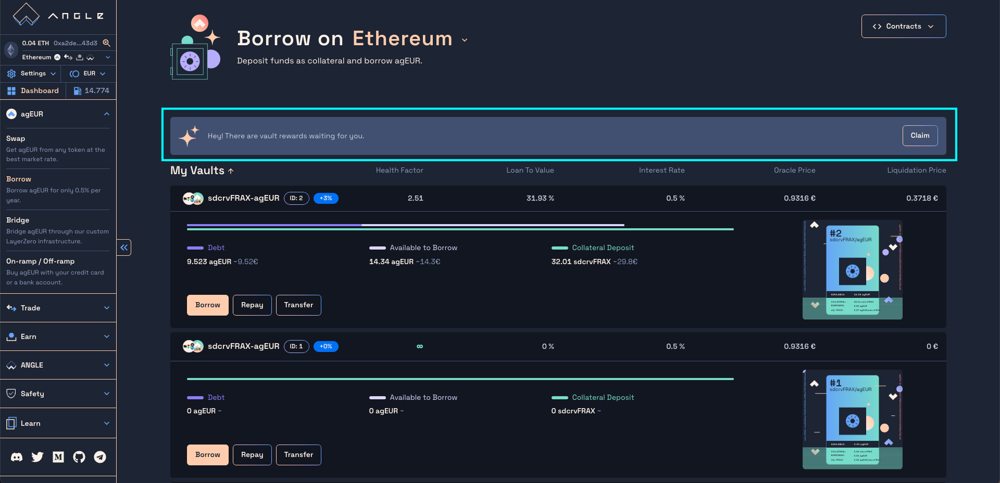

# ⚖️ Get leverage on crypto through agEUR debt

The [Angle Borrowing module](/borrowing-module/README.md) lets you borrow agEUR from crypto collateral **on different chains** and use it to **leverage your exposure to your collateral**.

When borrowing agEUR, you can directly swap the borrowed agEUR into more of the token originally used as collateral to leverage your exposition in the same transaction.

## Add collateral & get leverage

Here are the steps to leverage your collateral exposure:

1. Go to the `Borrow` section of the [app](https://app.angle.money/#/borrow) and choose the network on which you want to open your vault
2. Select the type of vault to create, defined by the collateral and stablecoin token.
3. Select the token and amount you want to deposit in the first input. If the token is different from the vault collateral, the former will be swapped to the latter.
4. Enter the amount of additional exposure of collateral you want in the second input.
5. Click on the bottom right button to send your transaction. You can also `simulate` the transaction before confirming it.
6. _If your transaction requires a wrapping, you'll need to sign a permit for the router contract to interact with your vault and perform the desired transaction._

In this example, a user deposits 20 FRAX in an LUSD vault, and ask for 40 LUSD of additional exposure. In the background, the 20 FRAX are swapped to LUSD and enough agEUR to buy 40 LUSD tokens are borrowed from the vault and swapped to LUSD. The user USD exposure goes from 20 to 60.

After the operation, this vault has 60 LUSD as collateral and ~38.23 agEUR of debt.

## Leverage your yield

Some vaults accept yield-bearing tokens as collateral. The borrowing power of these vaults can be used to borrow agEUR and swap it for more of the yield-bearing tokens, effectively multiplying your returns.

For example, if the borrowing cost is 0.5% and a collateral with an APR of 3% is used, a 4x leverage can **increase the effective returns** up to 10.5%, assuming collateral price remains constant.

To open a vault with yield-bearing assets as collateral, you can follow the same steps described above after selecting a vault with a return displayed in a blue tag.

All external rewards accumulated by the vault's staked collateral can be [claimed](#claiming-your-rewards) directly from the Angle app in one transaction, such that there is **no opportunity cost to use Angle** to stake tokens.

## Repay your debt or close your vault

Once a vault is created, you can repay part of your debt or close it completely. You can also withdraw some collateral up to the minimum LTV.

When repaying your debt, you can either use your vault collateral balance, your wallet balance, or a mix of both. If you choose to repay your debt with your vault collateral, the tokens are swapped to debt tokens on your behalf and used to repay your debt.

Here are the steps to Repay debt, withdraw collateral, or close your vault:

1. Go to the `Borrow` section of the [app](https://app.angle.money/#/borrow)
2. Click on the `Repay` button on your vault.
3. Tick the box above the inputs if you want to repay all your debt and close your vault. You will get all the remaining collateral.
4. Enter the amount of collateral you want to remove and the token you want to receive in your wallet.
5. Enter the amount collateral you want to use to repay your debt in the bottom left input.
6. Enter the amount of debt token from your wallet balance you want to use to repay your debt.
7. Click on `Send` to confirm the transaction.

For example, in the following screenshot, 0.01 wETH are swapped to ~12.45 agEUR to repay part of the vault's debt, and 10 agEUR from the wallet is used to repay some of the remaining agEUR debt.


A summary of the changes on your vault and wallet is displayed on the right. You can access all the steps of the transaction by clicking on the `Transaction Details` dropdown.


## Monitoring your positions

You can monitor your vaults' health from the main Borrow page.

## Claiming your rewards

As mentioned previously, staked tokens accumulating external rewards can be used as collateral in an Angle vault. You can claim all your vaults collateral rewards directly from the Angle App in just one transaction. To do so, click on the `Claim` button at the right of the highlighted card below.

