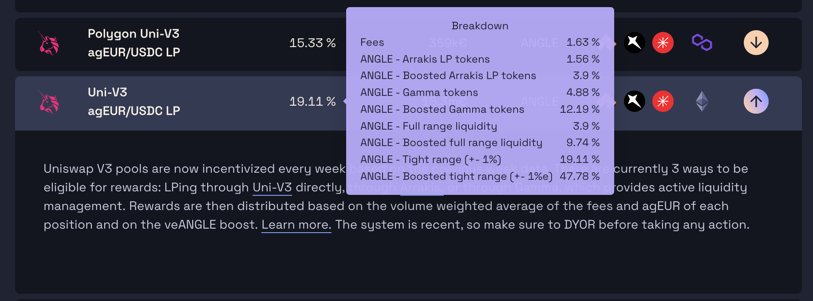

# UniV3 LP incentives in Angle

Angle implemented a specific mechanism to reward UniV3 liquidity providers according to their added value to the protocol. Basically, it allows to reward LPs more granularily according to the efficiency of the liquidity they provide. In turn, they have the opportunity to provide liquidity in more complex ways that benefit from all Uniswap V3 possibilities.

You can find more details on the mechanism in [the original announcement](https://blog.angle.money/a-new-incentivization-mechanism-for-uniswap-v3-liquidity-8ce32fa611b1). Here, we will detail how the incentives are split and how you can provide liquidity on pools to earn ANGLE rewards.

## Incentives distribution

### General

Every week, the distribution of incentives going to each pool is voted by veANGLE holders [here](https://app.angle.money/#/gauge).

### Uniswap V3 pools

Then, for each Uniswap V3 pools, a specific formula is applied to each swap to see who was providing liquidity and how much. Then, at the end of the week, the numbers are computed by an [off-chain script](https://gist.github.com/Picodes/0b738ec92f7bd72ec6e77ffdf5d1c5e2) to form a specific distribution of rewards within each pool.

The merkle root (i.e. summary) of the distribution is then uploaded on-chain once every week, and every LP can claim their ANGLE rewards.

One big difference is that LPs can now provide liquidity on any range they want, and any Uniswap liquidity manager can be integrated.

For example, a tight range will virtually provide more liquidity and earn more fees and ANGLE rewards. However, it has more chance to become out-of-range and suffer from [impermanent loss](https://www.youtube.com/watch?v=8XJ1MSTEuU0).

#### The formula

The parameters are:

- The share of fees earned by the LP, telling us the virtual liquidity provided
- The share of agEUR they hold compared to the total pool size
- The share of the other token they hold compared to the total pool size
- A boost on veANGLE

The formula is as follows:

$$
[0.4 \times(\texttt{fees earned by the position / fees earned by the pool)}+ 0.4 \times
\texttt{(agEUR in the position / agEUR in the pool)}+ 0.2 \times \texttt{(other token in the position / other token in the pool)}] \times \texttt{veANGLE boost}
$$

### Providing liquidity

As a LP, you can provide liquidity directly on Uniswap V3, or with any of the integrated Uniswap position manager.

Currently, we have integrated [Arrakis](https://www.arrakis.finance/) and [Gamma](https://www.gamma.xyz/).

When you are going through a liquidity manager, make sure to understand how they manage your liquidity, and if the positions are in-range. If they are not, you will not be earning ANGLE rewards.

For example, Arrakis manages liquidity passively, and agEUR/USDC has some times been out-of-range. Gamma does an active liquidity management, and rebalances the ranges regularly.

### FAQ

#### Is out-of-range liquidity being incentivized?

No. Only in-range liquidity used during swaps is being accounted for to receive incentives.

#### When can I claim my ANGLE rewards?

ANGLE rewards from the past week can be claimed once per week, every Thursday.

#### Where can I claim my rewards?

On the app [Earn page](https://app.angle.money/#/earn), or directly from the [MerkleRoot Distributor contract](https://etherscan.io/address/0x5a93D504604fB57E15b0d73733DDc86301Dde2f1).

#### Why is my APR is different from what is displayed?

Your actual APR depends on the volume of the pool, the range you are providing liquidity on, and the price of the pool.

These are not constant and vary continuously.

#### What is BOOSTED APR?

BOOSTED APR is the APR you earn when holding enough veANGLE to get the max boost.
