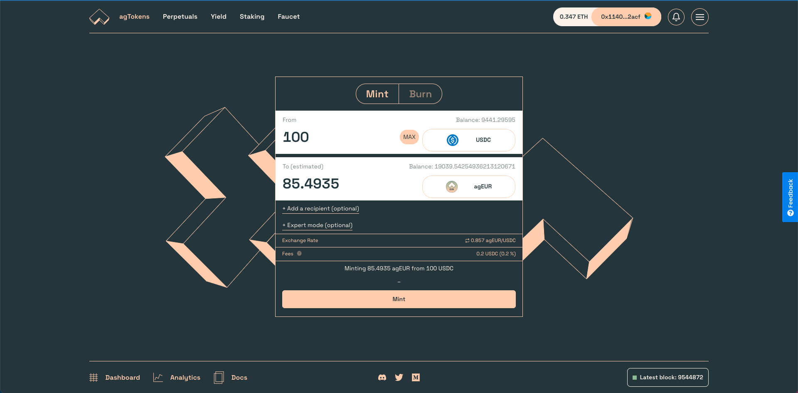
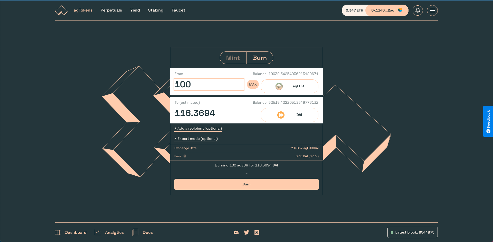

# 🇪🇺 Get agEUR

agEUR is a **EUR-pegged stablecoin**, meaning that it's built to mirror the value of the EUR. The objective behind stablecoins is to create tokens that hold their value against some tangible references, like central bank currencies, and make them available on decentralized and open blockchains such as Ethereum.

If you are new to crypto, follow our [guide for new crypto users](newbie.md). Then, keep reading here to see how you can get agEUR on the blockchain, or directly from your money at the bank.

## 🔎 TL;DR

There are multiple ways to buy agEUR:

1. With your tokens directly from the [Angle App](https://app.angle.money) or on a DEX ([Uniswap](https://app.uniswap.org), [1inch](https://app.1inch.io/#/1/swap/ETH/agEUR), ...)
2. With your credit card or bank transfer by using one of our **on-ramp partners**

## Buying agEUR from Angle

Anyone with tokens in their wallet can use the [Angle App](https://app.angle.money) to get agEUR.

The token can also be bought from multiple **decentralized exchanges** like Uniswap or DEX aggregators. It is also available on multiple chains besides Ethereum like Solana, Fantom, Polygon with deep liquidity.

### Approving tokens

To interact with Angle, you will need to approve (transaction) or give permissions (signature) for the tokens you want to spend. You can learn more about approving tokens [here](app-faq/#why-do-i-need-to-approve-the-same-token-multiple-times).

### Buying agEUR

Then, make sure you have ETH to pay for gas fees, as well as one of the accepted tokens, and follow these steps:

1. Go to [app.angle.money](https://app.angle.money/#/user/mint).
2. Select the token you want to spend, and the stablecoin you want to receive.
   * Supported collaterals\*: ETH, DAI, USDC, FEI, FRAX
   * Available agTokens: agEUR
3. Enter the amount of tokens you want to exchange.
4. Approve your tokens.
5. Buy stablecoins against your tokens.

You now have agEUR, a stablecoin that mirrors the value of the EUR!

\*_any token can be used. They will be swapped to one of the native collaterals._

### Selling agEUR

If you want to exchange your agEUR back to another token, you have a few options:

* Swap them against another token directly on [Angle](https://app.angle.money/#/user/burn) or a decentralized exchange like [Uniswap](https://app.uniswap.org).
* Send money back directly to your bank account through our off-ramp partner Mt Pelerin.

Swapping agEUR back to another token on Angle is a similar process than buying agEUR.

1. Click on the `Burn` tab.
2. Select how much agEUR you want to burn and the token you want to receive in exchange.
3. Click on `Burn` and confirm the transaction in your wallet. This will exchange your agEUR for the tokens you selected.


Tokens can be swappged against one of the supported collateral to mint the desired agTokens if the source token is not supported as collateral in Angle, or if it is cheaper to do so.


## Buying agEUR with credit card or bank transfer

**List of partners:**

* [Mt Pelerin](https://www.mtpelerin.com): **buy and sell** agEUR by card or bank transfer
* [Transak](https://transak.com): **buy** agEUR by card or transfer
* [Wert.io](https://widget.wert.io/01FPZ4G1VMZ67MGC83NADPB0F8/redirect/?commodity=agEUR\&commodities=agEUR,agEUR%3Aethereum): **buy** agEUR by card or transfer

Angle is working with on-ramp partners to provide users the opportunity to buy and sell agEUR directly between their credit card or bank account, and their on-chain wallet.

### From bank to wallet

If you are not familiar with Ethereum, you can create a wallet with [Ledger](https://www.ledger.com) or [Metamask](https://metamask.io). Once you have an address to send tokens to, you can go through one of these partners and look for agEUR in the list of available tokens.

agEUR can then be bought by paying through credit card or bank transfer. You can choose to receive it on the Ethereum or Polygon network. Note that fees might be high for low amounts due to Ethereum transaction costs.

Once received, you can use agEUR to buy other tokens or earn yield on lending markets.

### From wallet to bank

If you want to send your agEUR from your wallet as EUR in your bank account, you can do so by using [Mt Pelerin](https://www.mtpelerin.com). The Swiss based company allow user to send cryptocurrency and receive the equivalent directly in their bank account.


All these partners will ask users to enter personal information above a certain amount.


## Links and resources

* [agEUR value proposition article](https://blog.angle.money/angles-value-proposition-for-stablecoin-holders-68ee9a72d80b?source=collection\_home---4------17-----------------------)
* [Angle agEUR Analytics](https://analytics.angle.money/#/agEUR)
* [Coingecko - Market Info](https://www.coingecko.com/fr/pi%C3%A8ces/ageur)
* [Dune Analytics Dashboard](https://dune.xyz/SebVentures/Angle-Dashboard)
* [agEUR on Etherscan](https://etherscan.io/token/0x1a7e4e63778b4f12a199c062f3efdd288afcbce8)


A complete list of all agEUR integrations can be found on our Discord [here](https://discord.com/channels/835066439891157012/907535810067304458/907537277939482636).

