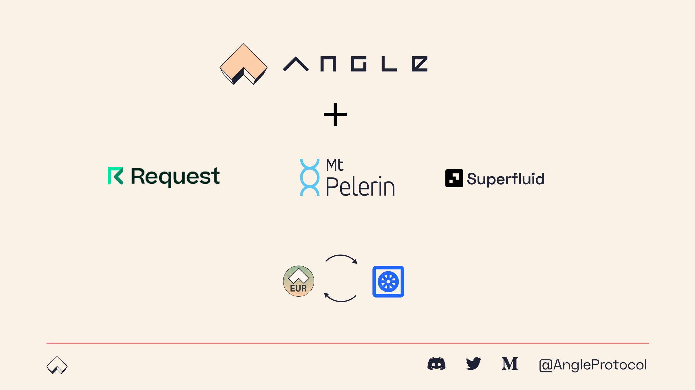
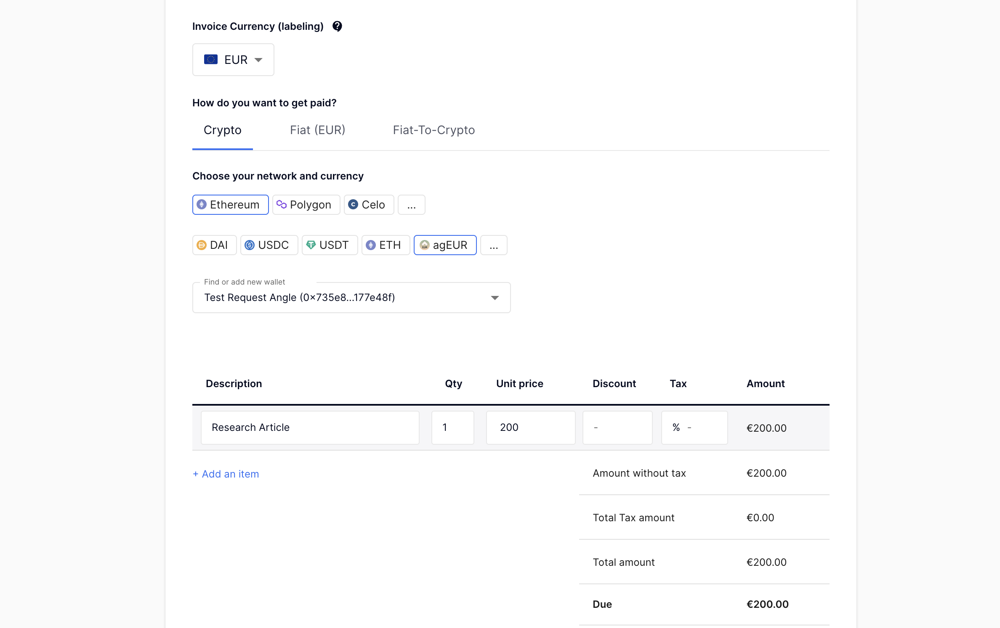
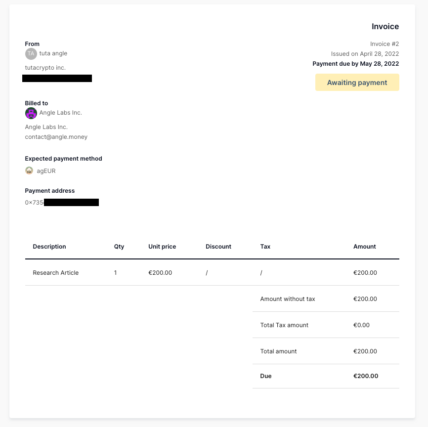
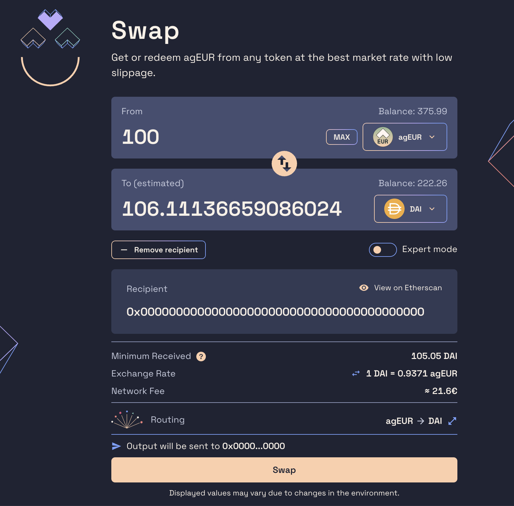
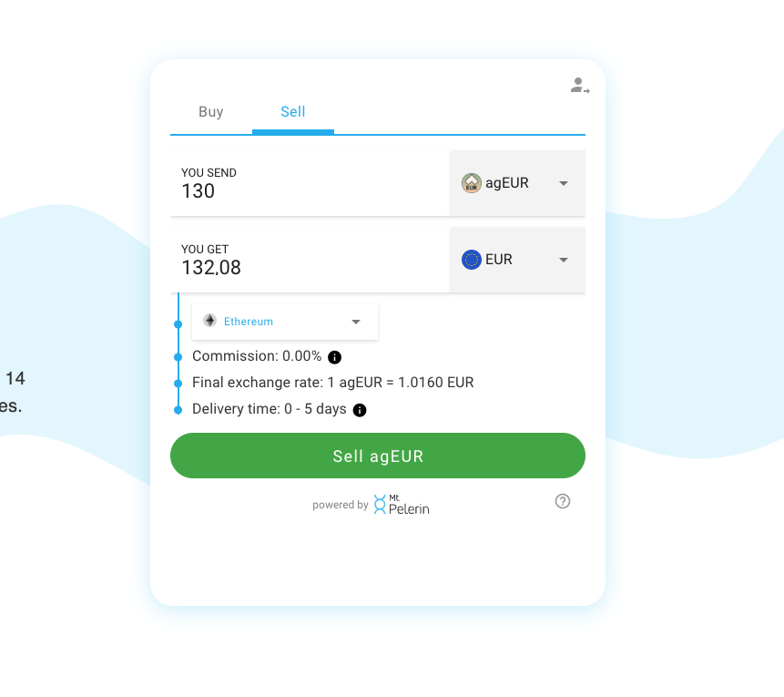
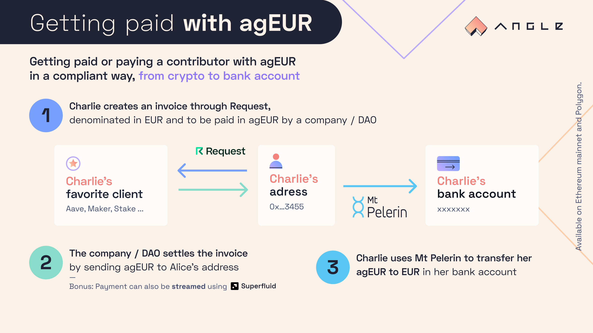
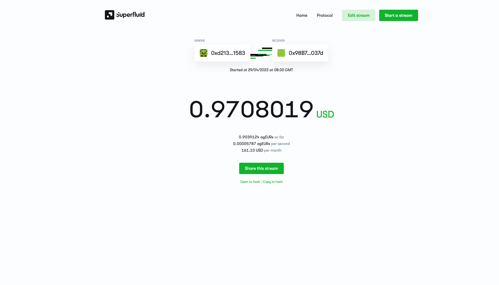

# 💸 Pay and get paid with agEUR

Thanks to its partners and integrations, agEUR can be used to pay and create invoices, as well as to transfer fiat to your home bank account.

This can be done from almost anywhere in the world, on Ethereum or Polygon.

Some DAOs might not have a bank account, or just prefer to pay their contributors in crypto. However, these contributors usually need a proper proof of payment (invoice) and a way to transfer those funds to their bank account easily, without taking care of the exchange rate.

agEUR can be a solution to such issues: anyone can invoice and get paid in agEUR, and transfer them directly to EUR or another fiat currency in their bank account.

More specifically, an agEUR integration can serve different types of users:

1. Companies or DAOs wanting to pay their contributors in crypto
2. Contributors happy to be paid in crypto but who still need fiat in a bank account for their everyday lives

In this guide, we try to show how companies, DAOs, and their contributors can leverage agEUR and Angle’s partners Request, Mt Pelerin, as well as Superfluid to handle salaries and payments quickly and in a compliant way.

## Invoicing in agEUR with Request

### Contributors side

[Request](https://app.request.finance) lets users create and send custom invoices to their clients. Users can denominate their invoice in crypto or fiat, and ask to be paid in crypto or fiat. For example, a German or French resident working for an international DAO could label their invoice in EUR, but ask to be paid in agEUR.

To do that, the person creating the invoice has to specify the wallet address that they want to receive the funds on.

Request invoices then look like that 👇

### Crypto Company / DAO side: pay contributor with agEUR from any token

On the company side, once they receive the invoice they can just send the required amount of agEUR to the specified address. If they don’t own agEUR yet, they can go through Angle’s app at [app.angle.money](http://app.angle.money), and add the invoicer address as recipient.

Then, they can select **any token they hold**, and use the expert mode to make sure the minimum amount received is that of the invoice.

**In one on-chain transaction, any company or DAO can pay their contributors with any token, almost instantly, and at very low fees.**

## Withdrawing the agEUR received to a bank account with Mt Pelerin

Once the contributors have received their payment from the DAO / company, they can simply withdraw the agEUR from their wallet to EUR in their bank account in one on-chain transaction by using [Mt Pelerin](https://www.mtpelerin.com/sell-crypto).

Mt Pelerin allows anyone to send their cryptos back to their bank account quickly and easily, at the cost and speed of one transaction. If you're a first time user selling less than 500 agEUR, you will not pay any fees in the process.

Above a certain amount, a KYC on Mt Pelerin’s mobile application may however be needed.

Obviously, users can also keep their agEUR and invest it to take advantage of the different yield opportunities available with it.

## Angle + Request + Mt Pelerin: New payment solution for people in crypto

agEUR can be used to pay and get paid from any crypto to a bank account in only two on-chain transactions! Specifically, it is designed to allow:

- **Companies or DAOs** to pay their contributors through agEUR through Angle from the token that they want
- **Contributors** to **invoice companies and get paid in agEUR** in a fully compliant way
- **Contributors** to **transfer agEUR** **to EUR in their bank account** to cover the cost of their everyday lives!

## 💸 Go further by streaming those payments with Superfluid

Thanks to its [Superfluid](https://www.superfluid.finance/home) integration, agEUR can also be used further to facilitate the administration of payments by companies. Specifically, it avoids them the need to create new transfer transactions every month.

Superfluid indeed allows people to **stream tokens on Polygon:** with Superfluid, users can receive their agEUR payments not as a one-time transactions, but through **a payment stream**. They can get paid continuously, and not just once at the end of each month.

To do so, payers just have to wrap their agEUR into agEURx. To withdraw the received agEURx, users simply need to unwrap them on their side.

As explained above, they can then use Mt Pelerin to send EUR back to their bank account, or find a good yield opportunity on Polygon.

