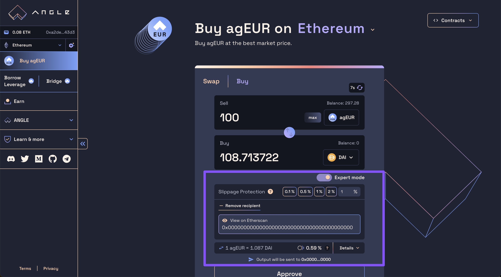

# 💸 Pay and get paid with agEUR

agEUR can be used to pay and get paid from any crypto to a bank account in only two onchain transactions. Specifically, it is designed to allow:

- **Companies or DAOs** to pay their contributors through agEUR through Angle from the token that they want
- **Contributors** to **invoice companies and get paid in agEUR** in a fully compliant way
- **Contributors** to **transfer and off-ramp their agEUR to EUR in their bank account** to cover the cost of their everyday lives!

In this guide, we show how companies, DAOs, and their contributors can leverage agEUR’s integrations to handle salaries, payments and off-ramps quickly and in a compliant way.

## Invoicing in agEUR with Request

### Contributors side

[Request](https://app.request.finance) is an invoicing solution that supports crypto assets and payments. With Request, users can denominate their invoice in crypto or fiat, and ask to be paid in crypto or fiat on the address of their choice.

A German or French resident working for an international DAO could for instance label their invoice in EUR, but ask to be paid in agEUR.

### Crypto Company / DAO side: pay contributor with agEUR from any token

As a company, once you receive an invoice, you just have to send the required amount of agEUR to the specified address.

If you don’t own agEUR yet, you can go through Angle app at [app.angle.money](http://app.angle.money), and add the invoicer address as recipient.

Then, just select **any token your company holds**, and use the expert mode to make sure the minimum amount received is that of the invoice.

**In one onchain transaction, you can pay your contributors with any token, almost instantly, and at very low fees.**

## Withdrawing agEUR to a bank account

agEUR is supported by several off-ramp providers that enable withdrawing agEUR from your wallet to your bank account.

Obviously, if you're paid in agEUR, you don't have to sell it immediately, and you can also use it to take advantage of the different yield opportunities available with it and listed [here](https://app.angle.money/earn).

### With Mt Pelerin

[Mt Pelerin](https://www.mtpelerin.com/sell-crypto) is an off-ramp provider that supports agEUR.

Mt Pelerin allows anyone to send their cryptos back to their bank account quickly and easily, at the cost and speed of one transaction. If you're a first time user selling less than 500 agEUR, you will not pay any fees in the process.

Above a certain amount, a KYC on Mt Pelerin’s mobile application may however be needed.

### With Transak

[Transak](https://global.transak.com/?apiKey=19f99004-7aee-40ff-93c6-7676a2c002ed&networks=ethereum,polygon&defaultCryptoCurrency=agEUR&cryptoCurrencyList=agEUR&productsAvailed=BUY,SELL) is another off-ramp provider that supports agEUR.

Above a certain amount, a KYC will be needed to sell agEUR and get EUR back to your bank account.

### Through tokens agEUR is liquid with

agEUR is a liquid token that can be easily exchanged onchain to other crypto assets which can be off-ramped or sold to fiat with little to no fees.

One easy way to get EUR in your bank account back from your agEUR is to swap them to [EURs](https://stasis.net), [EUROC](https://www.circle.com/en/), or [EURe](https://monerium.com/tokens/). These are centralized stablecoins, which even though they provide less yield opportunities than agEUR, remain simple ways to off-ramp to Euros in a bank account (provided that you have a KYC with the related entities).

If you don't care for bearing transiently a change risk, you can also swap your agEUR to USDC for 0.01% on 1inch and then convert your USDC back to EUR using Circle, or a centralized exchange.

## 💸 Streaming payments

agEUR is supported by several solutions designed to facilitate the administration of payments by companies (no need to create new transfer transactions every month) and to enable users to be paid continuously and not just once at the end of each month.

This includes:

- [LlamaPay](https://llamapay.io)
- [Superfluid](https://www.superfluid.finance/home): it only works on Polygon. To make it work, payers have to wrap their agEUR into agEURx, and users need to unwrap the agEURx they receive.

