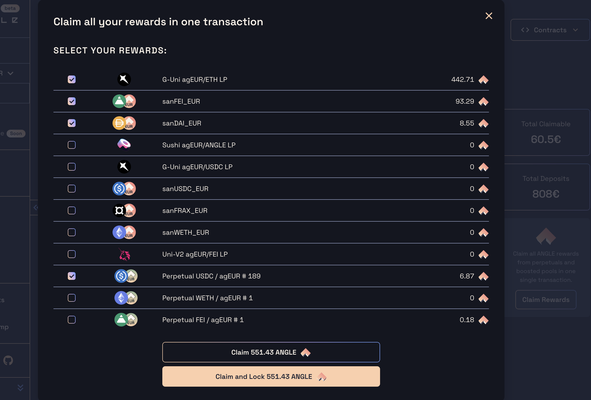
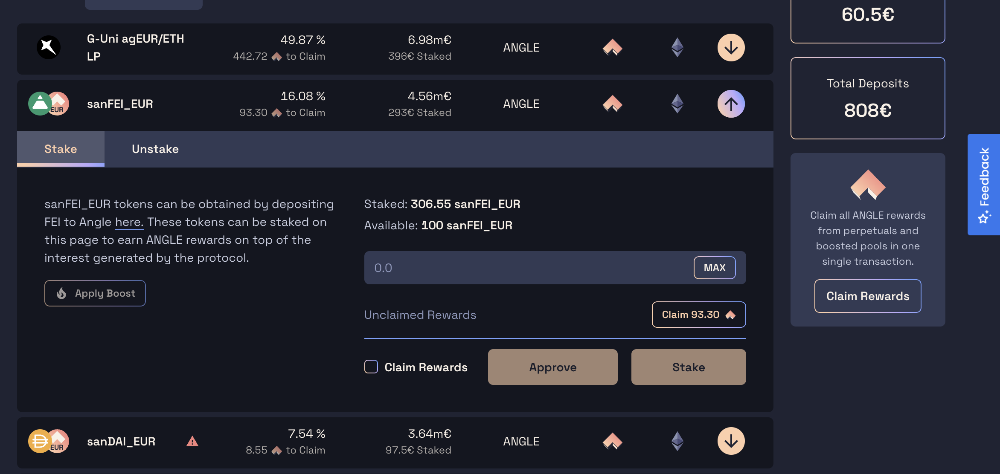

# Earning ANGLE and other rewards

ANGLE tokens are issued every week and distributed to different stakeholders of the Angle ecosystem.

To take advantage of that, you can among other things [deposit sanTokens](https://app.angle.money/#/deposit), [open long positions](https://app.angle.money/#/perpetuals) on the protocol, or deposit LP (liquidity providers) tokens.

The [Earn page](https://app.angle.money/#/earn) of the app lists all the pools and farms where it is possible to earn ANGLE tokens. It's also in this page that you can stake some tokens to start automatically accumulating ANGLE rewards.

There are some actions which automatically grant you the right to ANGLE tokens without having to stake (like opening a perpetual or becoming a Uni-V3 LP): these are also listed in this page.

More generally, the [Earn page](https://app.angle.money/#/earn) lists all Angle-related yield opportunities, not necessarily involving the ANGLE token.

## Claiming ANGLE

You have multiple options when claiming your ANGLE tokens:

- Claim from multiple Boosted and Perpetuals gauges in **one transaction** by clicking on the `Claim Rewards` button on the right. When using this modal, you can select/unselect the gauges you want to claim rewards from and then:
  - **`Claim ANGLE`**: this claims your ANGLE rewards from all the selected gauges in one transaction.
  - **`Claim and Lock ANGLE`**: this claims your ANGLE rewards from all the selected gauges in one transaction **and** lock them into your existing ANGLE lock. This increases your veANGLE balance and doesn't affect your lock expiration date. _NB: this is only possible if you already have ANGLE locked. You can lock ANGLE_ [_here_](https://app.angle.money/#/lock)_._&#x20;

- Claim from a specific gauge by clicking on the `Claim` button in the modal below the input:

