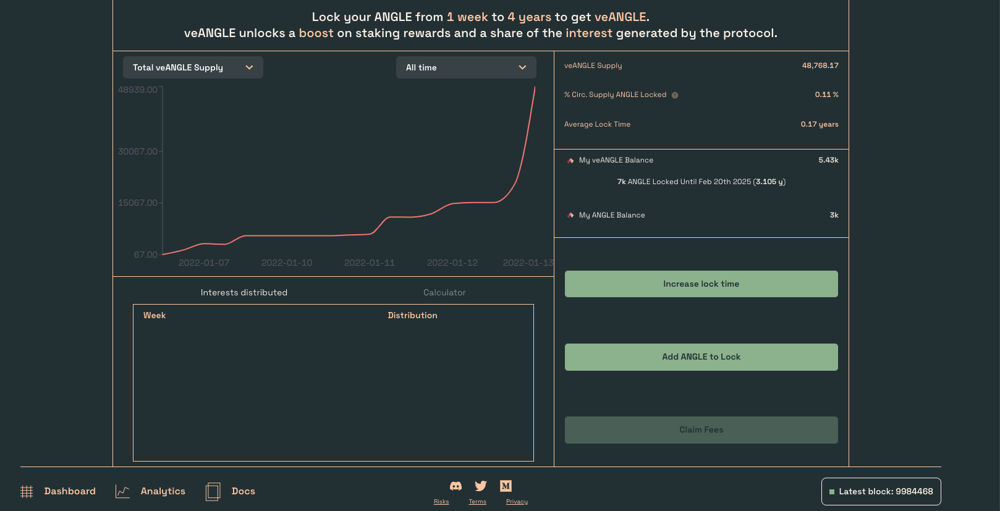
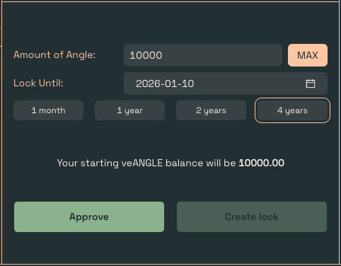
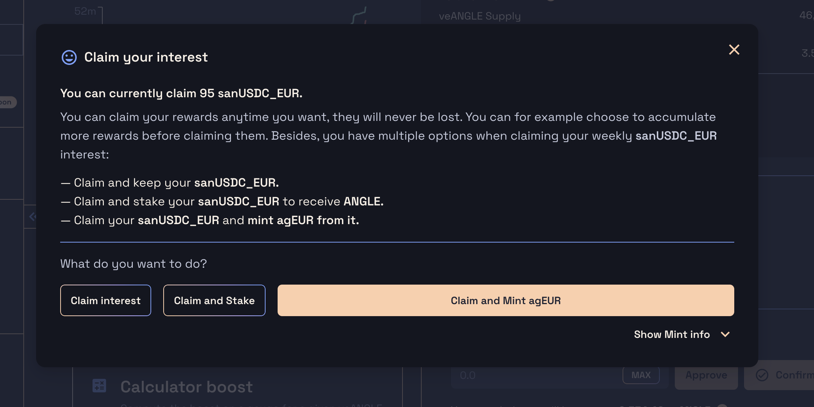
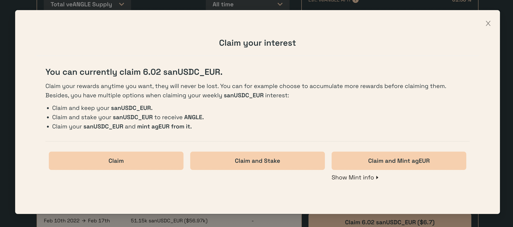

# Locking ANGLE

ANGLE holders will be able to lock their tokens between 1 week and 4 years to obtain veANGLE, granting them voting power in the new governance system, boost on rewards for some staking contracts, and a share of the interest generated by the protocol.

Before locking ANGLE, make sure you read all the details about veANGLE and locking [here](../../governance/veANGLE/).

## Locking ANGLE

ANGLE tokens can be locked at [dao.angle.money](https://dao.angle.money).

Before locking, remember that only one lock per address can be created. Once an address initiates a lock, it can either increase the lock expiration, or add tokens to the lock.

### Creating the lock

To create a lock, head over to the bottom right corner of the screen. There, an expiration date and quantity of tokens need to be specified. Then, two transactions are needed, first to approve the contract and then to create the lock with the specified amount of tokens.

### Locking ANGLE before staking

One particularity of the gauge system is that the staking contracts can’t fetch the veANGLE balance of stakers in realtime. Therefore, this information needs to be updated once in a while by the staking contracts. This happens at checkpoints, when users stake, unstake, or claim rewards from the gauge.

In practice, this means that it’s better to lock ANGLE into veANGLE **before staking** in order for the boost to be applied directly. If not, clamining a tiny amount of rewards **after** staking will be needed to apply the boost.

To compute the balance of veANGLE needed to get the max boost on rewards depending on the quantity of tokens staked, there is a calculator at [dao.angle.money](https://dao.angle.money).

### Increasing the lock or adding tokens

Once the lock has been created, to extend the lock expiration or add tokens, just click on one of the two buttons and choose a new expiration date (up to 4 years from now) or a quantity of tokens to add.

### Expired lock

Once a lock is expired, users need to execute a transaction to get their ANGLE token back from the lock. There will be a `Withdraw ANGLE` button on the [DAO App veANGLE](https://dao.angle.money/#/veANGLE) page, allowing you to get back your previously locked ANGLE tokens. 

## Claiming interest

Every week, a share of the interest generated by the protocol is redistributed with veANGLE holders. These interest are currently being distributed in the form of sanUSDC\_EUR tokens, earning yield from the protocol. They can always be redeemed for USDC from the protocol.

These interest can be claimed with a transaction initiated by clicking on the `Claim Interest` button on the bottom right corner of the above screnshot. Since the router release, users also have the options to `Claim and Stake`, and `Claim and Mint agEUR`

### Claim interest and Stake

This will claim the sanUSDC\_EUR and stake them directly in the associated gauge in the same transaction to start earning ANGLE rewards. You can check you staked sanUSDC\_EUR in the DAO App [Incentives page](https://dao.angle.money/#/).

### Claim interest and Mint agEUR

This will claim the sanUSDC\_EUR and use them to mint agEUR in the protocol. You will end up receiving agEUR in your wallet. The **fees** and **minimum amount of agEUR received** are displayed in the Show mint info toggle.

