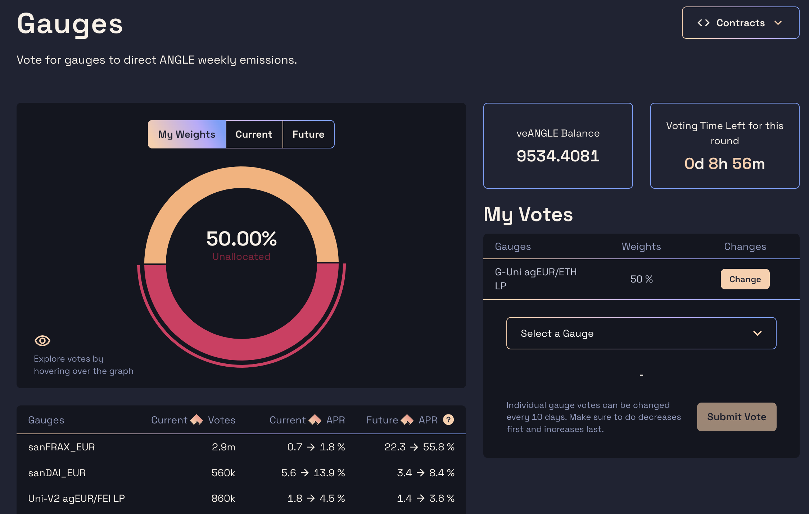
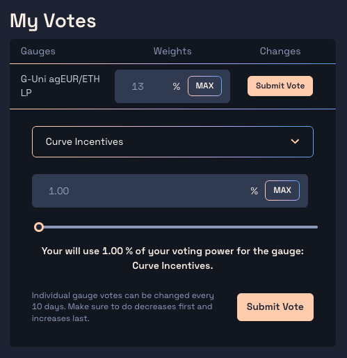

# Voting on Gauges

One key feature of veANGLE is its voting power to influence the distribution of token emissions as rewards across pools.

This happens by assigning weights of an address's voting power on the different gauges available. The way the gauge system is designed within Angle is explained in more details in the [gauges](../../governance/veANGLE/gauges.md) page.


This gauge voting feature is reserved to users which own veANGLE tokens (as well as ETH to pay for the transaction fees).


## Allocating voting weights to gauges with veANGLE

Voting for gauges happens on the [gauges page](https://app.angle.money/#/gauge) of the app.

There, on the right side of the page, you need to select the gauges you want to allocate voting power.

Once that is good, simply enter the share of your voting power you want to allocate to the gauge and submit your vote.

Submitting a gauge vote is a transaction which costs ETH transaction fees. Yet, once you've submitted your votes for the gauges of your choice, there is nothing you need to do in the following weeks and your vote will still be stored and taken into account.

You do not have to allocate 100% of your voting power. You can for instance choose to allocate only 10% of it, meaning that if you own 100k veANGLE, the gauge system will consider that only 10k veANGLE have voted.

Counterpart is that if your veANGLE balance increases, you will have to allocate this new voting power on gauges manually if you want to.

For instance, if you had used 100% of your 100k veANGLE voting power and your veANGLE balance is now 200k, you need to vote again for the gauges you were voting for to have this taken into consideration.

## Changing weights

Votes on a specific gauge can only be changed after 10 days. On top of that, if you want to change your vote weights and have used all your voting power, you need to decrease your votes on some gauges before increasing it on others.

To change the fraction of the voting power you are allocating to a gauge, click on the `Change` button in the line corresponding to that gauge in the `My Votes` table, enter the new fraction of your voting power you want to allocate and then submit your vote.

