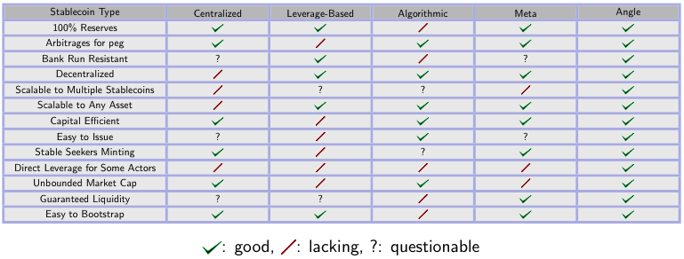

# 🇨🇳 Introducing Angle Protocol 🇨🇳

- Based on: [Angle Introduction Article](https://blog.angle.money/introducing-angle-protocol-3e3e603d3f60) posted in the Angle blog
- Last Updated: 22nd of October 2021
- Author: @licrazy#4951

## Angle 协议简介

Angle 协议：是一款被设计成超额抵押和加速资本运转的去中心化稳定币协议，它可以被用来发行任何类型的稳定币。并且，我们将很快发布我们的第一款欧元稳定币产品。

接下来我们将从以下几点来阐述我们构建去中心化稳定币金融的初衷和方式。

### 为什么我们需要更好的稳定币?

在过去的几个月里，稳定币的供应量一直在以前所未有的速度增加，预计在未来几个月或几年里稳定币的供应将大幅增加。随着全球无银行账户人口的快速增长,个人和企业正在寻求一种更快、更便宜的跨境支付方式，以及越来越多的机构投资者和零售公司正在探求进入加密世界和区块链的方式，比如：DEFI,基于以上，去中心化稳定币确实展现出巨大的增长潜力。

Joey Santoro 在他的 Fei Protocol 白皮书中对稳定币的现状有一个很好的描述:“像 USDC 和 USDT 这样的法定资产抵押稳定币是受中心化控制的，这预示着监管的风险，更是那些希望去中心化的应用程序的失败之处。由于资本效率低下，像 DAI 这样的加密资产抵押稳定币更是存在可扩展性的问题。”而 Iron Finance 和 Basis Cash 这样的协议，虽然资本效率和去中心程度相对较高，但他们往往抵押资产不足，无法应对可能发生的银行挤兑，且有可能出现严重的流动性危机。

此外，除了 Synthetix 协议外，大多数稳定币解决方案都是以美元为中心，不能扩展到其他资产，例如：目前还没有欧元稳定币。结果就是，欧洲的加密用户们在参与以美元锚定的 DEFI 活动时会面临汇率波动的风险。

简而言之就是，到目前为止还没有一种可扩展的、流动强的、资本效率高的、稳健的、去中心化的，且与 DEFI 完美融合的稳定币解决方案。这就是为什么我们花费大量时间去思考稳定币协议的最佳设计，经过几个月的研究，我们很自豪地推出完美的 Angle 协议:这是一种资本效率极高且超额抵押的去中心化稳定币设计方案。

### Angle 的设计理念?

Angle 的去中心化解决方案弥补了当下稳定协议的缺陷，并结合了中心化和去中心化协议的优点。它不但具有超额抵押方案的稳定性，同时保留了低抵押方案的资本效率。

Angle 的创新之处在于，人们综上可以以 1:1 的比率在资产之间进行互换，稳定币与抵押物之间不存在滑点:抵押 1 欧元的资产，你总可以得到 1 欧元稳定币，用 1 欧元稳定币，你总是可以赎回价值 1 欧元的抵押品。

就像其他 DEFI 协议一样，该协议主要涉及 3 种角色，它们都与 Angle 利益相关：

稳定币持有人（用户）：他们铸造、使用或者质押稳定币资产。

对冲代理(HA) 可以仅通过一笔交易以永续合约的形式获得链上杠杆，并通过这种形式确保协议免受其抵押品的波动。

标准流动性提供者(SLPs)为协议提供额外的抵押品，并自动赚取利息、交易费用和奖励。

Angle 将能够支持多种不同的稳定币，每种稳定币都有不同的抵押担保形式。即将推出的是由 USDC 和 DAI 作为抵押物的欧元稳定币。

### Angle 协议的第一类利益相关者:稳定币持有人

Angle 协议的设计基本上允许任何人，以一种资本高效运转的方式轻松发行和销毁稳定资产，该操作是通过 Oracle 喂价使得没有滑点且交易费用也很少。

对于以 USDC 和 DAI 作为抵押物且交易费用为零的欧元稳定币，如果您在 Angle 协议质押价值 1800 欧元的 2000USDC，您将获得 1800 欧元稳定币。然后，您可以返回 Angle 协议，用 1800 个稳定币获取价值 1800 欧元的抵押品，这意味着如果 1 欧元的价格现在值 1.2 美元，您可以获得 2160 (= 1800 \* 1.2)USDC 或 2160 DAI。这种可兑换性可使得发行的代币保持真正稳定。每当代币的市场价格偏离锚定汇率时，就会出现有利可图的套利机会，而不需要主动的治理来维持锚定汇率。

关键问题是:该协议如何总是能有足够的抵押品来维持这种可兑换性?

### Angle 协议的第二类利益相关者：对冲代理 (HA)

当有人参与协议并为稳定币提供抵押品时，协议受到此抵押品相对于所获得的稳定币的波动性的影响。在这种情况下，抵押品价格的飙升可能对协议有利，但由于抵押品不足，下跌不会立即发生。为了确保协议不受到用于支持稳定币的抵押品的波动性影响，Angle 给出了一个解决方案，将波动性转移给愿意在抵押品上获得杠杆的其他参与者:对冲代理(HAs)。这些人从协议中得到了永续合约。从他们的角度来看，通过这种方式，他们只是利用了抵押品相对于其所支持的稳定币的价格的波动。但是，从协议的角度来看，它们保证了系统不受抵押品价格下跌的影响，确保协议总是有足够的保证金来偿还稳定币持有人。

HAs 的流程是，他们访问 Angle 协议，提供一些抵押品，并从稳定币持有人那里选择他们想要覆盖的抵押品数量。在最初的投资中，他们承担了较大金额的波动性，在价格上涨时获得杠杆收益，但在价格下跌时会招致杠杆损失。

为了举例说明，假设：就像我们的路线图所规划的那样，Angle 协议也接受 ETH 作为其欧元稳定币的抵押品。

假设有人向协议中投入 1 个价值 2000 欧元的 ETH 来发行 2000 个稳定币，并假设对冲代理 (HA)向协议中投入 0.5 个 ETH，并承诺覆盖 1 个 ETH 资本收益波动。当他提现时，HA 将得到她的 0.5 ETH 和 1 ETH 的资本收益。

例如，如果 ETH 的价格从 2000 欧元翻倍涨到 4000 欧元，那么对冲代理 (HA)将获得她的 0.5 ETH 再加上拥有的覆盖 1 ETH 的资本收益（以 ETH 计）即值 2000 欧元的 ETH，按照当前价格为 0.5 ETH。最后，她将以投入 0.5 ETH 获得 1 ETH，从而以 1000 欧元初始资金的最终获得 4000 欧元。

虽然资金池目前只拥有 0.5 ETH，但这并不重要，因为它足以覆盖已铸造的 2000 个代币：这些在当前市场中可以兑换成 0.5 ETH。

同样的，如果 ETH 的价格下跌 25%，那么对冲代理(HA)将获得她的 0.5 ETH 减去她所覆盖的 1 个 ETH 的资本损失，即 500 欧元，以最新的市场价格计算价值 0.333 ETH。因此，对冲代理(HA)只能取回 0.1667 ETH。即资金池目前拥有 1.333 ETH，以稳定的流通资产保证其稳定性。

请注意，我们在这里所描述的对冲代理 (HA) 是类似于 Makerdao 上的一些金库所有者或 Compound 上的借款人：他们是期望获得杠杆的人。但是他们也可以直接通过多倍杠杆来实现这一点，而无需进行多次交易。在 Angle，您只需要访问协议，定制满足您需求的永续合约，并选择您的杠杆倍数。

简而言之，对冲代理的特点如下：

承受稳定币持有人投入的抵押品的波动。

当价格下跌时，确保协议免受影响。

以永续合约的形式获得协议的杠杆合约。

在上面的例子中，稳定币和抵押品之间 1:1 的兑换比率可以一直维持，因为 HAs 总能准确地覆盖稳定币持有人投入的抵押品的价格波动。

然而，在特定时间点，尤其是在新用户进入或 HAs 退出之后，可能会出现不匹配的情况。协议中，并非所有用户的头寸都可能被覆盖，并且以永续合约形式提供的波动性也可能没有充足的需求。因此，需要一种新型的流动性提供者来解决这些暂时的不平衡，并作为用户和 HAs 之间的缓冲。

### Angle 协议的第三类利益相关者：标准流动性提供者 (SLP)

标准流动性提供者 (SLPs) 是对冲代理在无法完全承受抵押品的波动时的缓冲。他们将流动性委托给 Angle，就像其他协议（Compound、Uniswap、Aave）中的流动性提供者一样，他们会自动从他们提供的资产中获取收益。当协议没有获得足够的抵押且当他们想要套现时，他们将面临的滑点的风险。

作为出借抵押品并承担较小风险的交换条件，SLPs 会获得与协议交互的稳定币持有人支付的部分交易费用。

此外，在每个时间点，该协议都拥有来自铸造稳定币的稳定币持有人、HA 和 SLPs 的储备。为了使协议积累一些收益并为其创造盈余，这些储备可以借给诸如 Compound 或 Aave 之类的协议，或用于类似 Yearn 金库的策略。例如，Angle 的第一个策略将涉及 Compound 和 Aave 之间的最佳 APY 的优化。

这些贷款利息的一部分将分配给 SLPs，这会产生有趣的乘数效应。假设协议中有 150 USDC，其中 50 USDC 来自于 SLPs。如果所有的 USDC 都借出去了，那么将会收到这 150 美元产生的利息，但是这些利息将会只分配给 50 美元的 SLPs，这意味着他们将会获得直接贷款给 Compound 的 3 倍利息。SLPs 越少，作为单一的 SLP 就能获得更高的利息，因为相同数量的回报由更小的群体共享。

简而言之，标准流动性提供者的特点是：

在协议中存入抵押品并自动产生利息。

作为稳定持有人和 HAs 之间的缓冲。

正如我们所描述的乘数效应，可以获得比直接使用 Compound、Aave 甚至 Yearn 更高的收益。

### Angle 和协议治理

Angle 协议的最终愿景是实现完全去中心化，并将依赖于其治理通证 ANGLE。ANGLE 通证将通过 Curve 联合曲线和发布后的抵押合约进行分配，以允许用户广泛和公平地访问 Angle。

Angle 系统的设计将使其治理慢慢弱化，并且可以完全自主地运行，因为协议的通证稳定性不需要治理的任何主动干预。

### Angle 稳定币以及 DEFI 的未来

综上所述，与现有的稳定币模型相比，Angle 协议具有关键性的优势:资本高效、深度流动性、对银行挤兑的稳定性，即使没有任何治理的主动干预，也可以展示出其强大的稳定性。

最近，我们很快将发布一系列文章，深入探讨不同的稳定币设计，并与 Angle 协议进行对比。如下表所示：

与现有稳定币协议相比，在 2021 年的大部分时间内，Angle 以一种极具创新的方式将单一协议的优势重新组合：易于铸造和销毁、比传统贷款平台更重要的挖矿产出更加灵活方便的永续杠杆交易。

### Angle 协议的下一步规划

目前，Angle 协议仍在核心团队和社区的管理下紧锣密鼓的开发。我们日前上线了 Kovan 和 Rinkeby 的压力测试，并在合约上运行了一些机器人进行测试。

智能合约的审计工作将于 7 月 26 日开始。Beta 测试网版本将于 8 月发布，届时每个人都可以与协议进行交互。

我们期望在 2021 年 10 月在 Ethereum 主网上推出由 USDC 和 DAI 作为抵押物的欧元稳定币。我们将在推出不久后扩展到其他抵押物类型（如 ETH）和新的稳定币。

随着我们启动日期的临近，我们将发布更多有关协议和如何参与的详细信息！

同时，非常欢迎任何支持该协议的的人提出帮助和建议！在区块链的世界，有很多方法可以构建一种去中心化的稳定币，在 Angle，我们将稳定币赛道视为一个大型游乐场，我们在其中探索制作酷炫、可持续和稳健设计的方法！我们依靠社区的帮助来使我们使 Angle 成为 DeFi 的终极稳定币协议。
