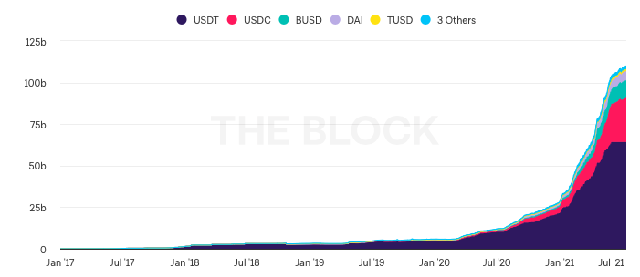
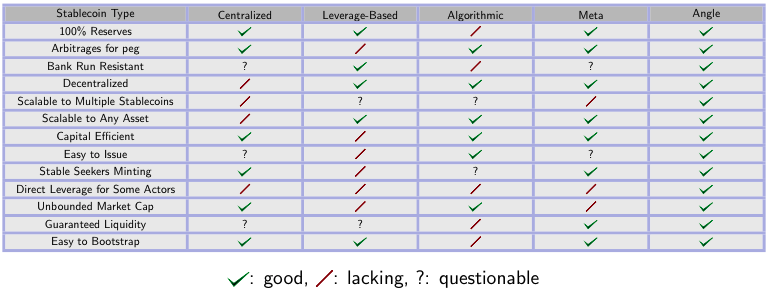

# 🇯🇵 Angle Introduction Article 🇯🇵

- Based on: [Angle Introduction Article](https://blog.angle.money/introducing-angle-protocol-3e3e603d3f60) posted in the Angle blog
- Last Updated: 29th of October 2021
- Authors: @Chuck K., @r0cketman

## Angle プロトコルの紹介

Angle では、あらゆる種類のステーブルコインを発行するために使用可能な、過剰担保型で資本効率の高い分散型ステーブルコインプロトコルを設計しました。まず始めに、私たちはまもなく信頼性と流動性を持ったユーロステーブルコインをリリースする予定です。
ここでは、なぜ、そしてどのようにして私たちが分散型ファイナンスに必要となるステーブルコインを構築しているのかを説明していきます。

### なぜ、より良いステーブルコインが必要なのか？

ここ数ヶ月間、ステーブルコインの供給量はかつてないほどの勢いで増加しており、今後数ヶ月から数年の間にステーブルコインの全体量は劇的に増加することが予想されます。

世界的に多く存在する銀行口座を持たない人々、速く安い国際送金を求める人々や企業、そして DeFi のような暗号通貨/ブロックチェーンサービスへのアクセスを求める機関投資家や小売企業の増加に伴い、ステーブルコインは大きな成長の可能性を秘めています。

ステーブルコインの現状については、Joey Santoro 氏の FEI ホワイトペーパーによくまとめられています。そこでは「USDC や USDT のようなフィアットを担保とするのステーブルコインは、集中管理されている。これは規制上のリスクであり、真の意味での非中央集権化を望むアプリにとっては単一障害点となる。DAI のような暗号担保型のステーブルコインは、資本効率の悪さからスケーラビリティに問題がある」と述べられています。分散型で資本効率の良いデザインはいくつかありますが、それらは過小担保型プロトコルに依存する傾向があり、6 月の Iron Finance、あるいは過去に Basis Cash が示したように、取り付け騒ぎへの耐性が無く、急激な流動性危機に見舞われる可能性があります。

さらに、Synthetix のようないくつかのプロトコルを除いて、ほとんどのステーブルコインのソリューションはドルを中心としたものであり、その他の資産には対応していません。例えば、流動性のあるステーブルユーロは今のところありません。その結果、日常生活でユーロを使っているヨーロッパの人々は、すべてがドル建ての DeFi とやり取りする際に、価値変動のリスクにさらされることになります。

つまり、スケーラブルで、流動性があり、資本効率が高く、堅牢で、分散化された、非中央集権型の金融に最適なステーブルコインのソリューションは存在しないのです。このような理由から、Angle では、ステーブルコインのプロトコルに最適なデザインを考えることに時間を費やしました。この数ヶ月の研究の成果として、私たちは自信を持って資本効率が高く、十分な担保を持つ Angle プロトコルをご紹介いたします。

### 要約 - Angle のデザイン

Angle の分散型ソリューションは、現在のアプローチの欠点を改善すると共に、集中型と分散型のプロトコルの長所を生かしています。また、過剰担保型のデザインの堅牢性と過小担保型の資本効率を維持しています。

Angle は、ステーブルアセットとその担保とのスワップを、スリッページのない 1 対 1 のレートで実施可能にすることで革新をもたらします。これは 1 ユーロ相当の担保があれば、1 枚のステーブルコインを得ることができ、1 枚のステーブルコインがあれば、常に 1 ユーロ相当の担保を償還することを意味します。

Angle プロトコルでは、他の DeFi プロトコルでも非常に一般的な 3 つのグループすべてが恩恵を受けることができます。

- 💱 ステーブルシーカーとホルダー（またはユーザー）はステーブルアセットのミント、利用、破棄(burn)を行うことができます。
- 🛡️ ヘッジングエージェント（HA）は、プロトコルからの 1 回のトランザクションで永久先物の形でレバレッジを得ることができ、その結果、プロトコルの担保のボラティリティに対して保証を行うことができます。
- 🍀 スタンダード・リクイディティ・プロバイダー（SLP）は、プロトコルに担保を追加し、自動的に利子、取引手数料、報酬を得ることができます。

Angle では、様々な種類の担保で支えられた多くのステーブルコインをサポートすることができ、まずは USDC と DAI を担保とするステーブルユーロからスタートする予定です。

### Angle のステークホルダー その１：ステーブルシーカーとホルダー 💱

Angle は基本的に誰でも簡単に少額の手数料のみで、オラクルの価格に基づいてスリッページ無くステーブルコインの発行・償還ができるよう設計されています。

USDC と DAI を担保とするユーロのステーブルコインを取引手数料ゼロで発行する場合、1800 ユーロに相当する 2000 USDC を Angle プロトコルに渡すと、1800 トークンが得られます。後日、その 1800 トークンを Angle プロトコルで償還すると、1800 ユーロ分の担保を得ることができます。つまり、1 ユーロの価値が 1.2 米ドルになった場合、2160(= 1800 \* 1.2) USDC または 2160 DAI を得ることができます。

この交換可能性こそが、発行されるトークンをとても安定したものにしています。トークンの市場価格がペッグから乖離するたびにアービトラージの機会が発生するため、ペッグを維持するための積極的な運営の介入は必要ありません。

ここで重要となるのが、この交換可能性を維持するのに常に十分な担保を Angle プロトコルがどのように確保するのか、ということです。

### Angle のステークホルダー その２：ヘッジングエージェント 🛡️

誰かが Angle プロトコルからステーブルコインを受け取るために担保を提供した場合、プロトコルは、このステーブルコインに紐づく担保のボラティリティの影響を受けます。担保価格の上昇はプロトコルにとって有益ですが、下落はプロトコルの担保不足を招くことになるため好ましくありません。ステーブルコインの裏付けとして使用される担保のボラティリティからプロトコルを保護するために、Angle はそのボラティリティを、担保にレバレッジをかけようとする他のアクター「ヘッジエージェント（HA）」に移転する方法を作成しました。ヘッジエージェントは、Angle プロトコルから永続的な先物を得ることができます。そうすることで、ヘッジエージェントの観点では、ステーブルコインとそれに対応する担保との相対的な価格の変化にレバレッジをかけることができるのです。しかし、プロトコルの観点から見ると、彼らは担保価格の下落からシステム保護し、プロトコルが安定してステーブルコインの保有者に払い戻しをするのに十分な準備金を維持することができるようにします。

HA は Angle に担保となる資産を持ち込み、ステーブルシーカーによって預け入れられた担保の中からカバーしたい担保とその金額を選択します。これにより HA は彼らがカバーする担保のボラティリティを引き受けることになります。担保の価格が上昇した場合には HA をレバレッジのかかった利益を得ることができますが、価格が下落した場合にはレバレッジのかかった損失を被ることになります。

ここでは説明のために、ロードマップで計画されているように、Angle がステーブルユーロの担保として ETH を受け入れると仮定します。

あるステーブルシーカーが 2,000 ユーロに相当する 1ETH を預け入れトークンを 2,000 発行し、ある HA が 0.5ETH を預け入れ、ステーブルシーカーの発行したトークンに対応する 1ETH の担保の変動をカバーするとします。この HA が預け入れた担保を引き出す場合、預け入れていた 0.5ETH の担保に加え、カバーしていたステーブルシーカーの担保 1ETH からのキャピタルゲインを得ることもできます。

ここでは ETH の価格が 2,000 ユーロから 4,000 ユーロに倍増した場合を考えましょう。HA は自分の預け入れた 0.5ETH に加えて、カバーしたステーブルシーカーの 1ETH を所有していた場合に得られるキャピタルゲインを ETH として得ることになります。つまりこの例では、値上がり分 2,000 ユーロを現在の ETH の価格で換算した、0.5ETH を得ることができます。最終的に、この HA は 0.5ETH を預け入れることで 1ETH を取得しました、これは言い換えると 1,000 ユーロから 4000 ユーロを得たことになります。

この時 Angle プロトコルは、担保として 0.5ETH しか保有していませんが、これまでに発行された 2,000 のトークンをカバーするのに十分な量なので問題ありません。発行された 2,000 のトークンは現在の市場価格で 0.5ETH と交換することができます。

同様に、ETH の価格が 25％下落した場合を考えてみましょう。HA が預け入れた ETH を引き出した場合、0.5ETH からカバーした 1ETH のキャピタルロス 500 ユーロ（ここでは現在の市場価格で 0.333ETH の価値）を差し引いた金額を受け取ることになります。つまり、HA は 0.1667ETH しか受け取ることができません。この時 Angle プロトコルは 1.333ETH を担保として所有しており、これは流通しているステーブルコインの安定性を保証するのに十分な量となります。

なお、ここで説明している HA は Maker における Vault オーナーや Compound における Borrowers と類似していることに注意してください。これらの人々はレバレッジを望むユーザです。Angle ではこれらのユーザはレバレッジを好きな倍率で設定し、複数のトランザクションを実行することなく直接的にそれを得ることができます。つまり、Angle プロトコルの永久先物を自分のニーズに合わせて調整することで、自分の好きな倍率のレバレッジをかけることができるのです。

端的にいうと、ヘッジエージェントは

- ステーブルシーカーが預け入れた担保のボラティリティをとります
- 担保価格の下落からプロトコルを保護します
- 永久先物という形で Angle プロトコルと直接レバレッジ契約を結びます

上述の例では、ステーブルコインと担保の間の 1:1 の交換可能性は、ステーブルシーカーが預け入れた担保のバリエーションを正確にカバーする HA が存在したため、常に維持することができました。

しかし、ある時点、特に新しいユーザーが参加した場合や HA が抜けた場合にはミスマッチが生じるかもしれません。言い換えると、一部のユーザーのポジションがカバーされておらず、プロトコルが永久先物として提供するボラティリティに対して十分な需要存在しないケースです。このような一時的な不均衡をに対応するため、ユーザーと HA の間のバッファとして機能する新しいタイプのリクイディティプロバイダーが必要となります。

### Angle のステークホルダー その３：スタンダードリクイディティプロバイダー (SLP) 🍀

スタンダードリクイディティプロバイダー(SLP)は、ステーブルシーカーが Angle プロトコルに預け入れた担保を、ヘッジングエージェントが完全には保証できない場合のバッファとして活用されます。

彼らは他のプロトコル（Compound、Uniswap、Aave）のリクイディティプロバイダーと同様に、Angle に流動性を提供することで預け入れた資産に対して自動的に利回りを得ることができます。彼らにとってのリスクは、Angle プロトコルに十分な担保が確保されていない状態でキャッシュアウトを行うと、スリッページが発生することです。

SLP は、担保を預け入れてわずかなリスクを負う代わりに、ステーブルシーカーが Angle プロトコルを利用する際に支払う取引手数料の一部を受け取ります。

また、Angle プロトコルは、ステーブルコインを発行したステーブルシーカー、HA、SLP からを預け入れられた担保を所有しています。この担保を Compound や Aave などのプロトコルに貸し出したり、Yearn Vault と同様の方法で運用することで、利回りを蓄積し Angle プロトコルの余剰金を生み出すことができます。また Angle が Compound と Aave の間で最も良い APY を得るため最適化戦略をとることも考えられるでしょう。
この運用益の一部を SLP に与えることで、興味深い乗数効果が得られます。例えば、Angle プロトコルに 150USDC が預けられており、そのうち 50USDC が SLP からのものだとします。Angle プロトコルがこのすべてを運用した場合，プロトコルは 150USDC に対しての利子を受け取ることになります。しかし、この得られた利子を 50USDC しか預け入れていない SLP に与えることで、SLP は Compound に直接貸し出すことで得られる利子の 3 倍を受け取ることができることになります。プロトコルに参加する SLP の数が少なければ少ないほど、同額のリターンを少人数で分け合うことができ、SLP としての面白さが増します。

端的にいうと、スタンダードリクイディティプロバイダーは

- プロトコルに担保を預け、それに対しての金利を得ます
- ステーブルコインのホルダーと HA の間のバッファーとしての役割を果たします
- 上述の乗数効果により、Compound や Aave、あるいは Yearn に直接貸し出すよりも高い利回りを得ることができます

### ANGLE とプロトコル運営

Angle プロトコルは最終的に完全に分散化され、運営は ANGLE ガバナンストークンに依存することになります。Angle トークンは、Angle への広範かつ公平なアクセスを可能にするため、ローンチ後にリリースされるボンディングカーブとステーキングコントラクトを通じて配布される予定です。

なお、Angle のシステムは運営が最小限となるような完全自律システムとして設計されており、Angle で使用されるトークンの安定性の確保にも積極的な介入は必要ありません。

### Angle とステーブルコイン、そして DeFi の未来

上述したように、Angle プロトコルは既存のステーブルコインと比較して、優れた資本効率、より深い流動性、取り付け騒ぎへの堅牢性、そして運営の積極的な介入を必要としない高い安定性といった利点を持っています。

私たちは近いうちに様々なステーブルコインのデザインを深く掘り下げ、Angle がそれとどう比較されるかという一連の記事をリリースする予定です。それらを簡略化すると以下のようになります。

Angle は既存のステーブルコインのプロトコルを改良するだけでなく、2021 年の DeFi のほとんどの要素を 1 つのプロトコルにまとめ、魅力的な方法で提供しています。これにより、ステーブルコインの簡単な発行と償還、従来の融資プラットフォームよりも高い利回りでのイールドファーミング、そして１トランザクションでの柔軟なレバレッジをかけた永久先物の購入などが可能になっています。

### 今後について

Angle プロトコルは現在もコアチームとコミュニティによって開発中で、本稿執筆時点では Kovan と Rinkeby 上でプロトコルのストレステストを行っており、コントラクト上で複数のボットを動作させています。

スマートコントラクトの監査は、7 月 26 日に開始されます。8 月にはベータテストネット版がリリースされ、誰でもプロトコルに触れることができるようになります。

そして 2021 年 10 月には Ethereum のメインネット上で、USDC と DAI を担保するユーロのステーブルコインをローンチしたいと考えています。またローンチ後すぐに、他の種類の担保（ETH など）や新しいステーブルコインにも拡大していく予定です。

これからもローンチに向けて、プロトコルの詳細や具体的な利用方法などを発表していきますのでお楽しみに！

ローンチまでの間、皆さんの Angle プロトコルに対するどのようなご支援も歓迎いたします。非中央集権的なステーブルコインを構築する方法は数多くありますが、私たち Angle は、ステーブルコインを、クールで持続可能かつ堅牢なデザインを作る方法を探求する大きな遊び場だと考えています。私たちは、Angle を DeFi における究極のステーブルコインプロトコルにするため、コミュニティの皆さんによるサポートを期待しています。
