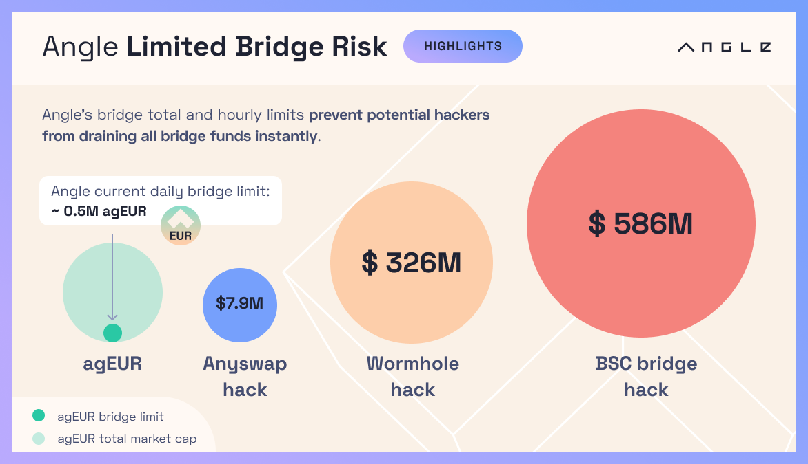

# 🌉 Angle Cross-Chain Infrastructure

Angle is a cross-chain protocol that allows the native issuance of its stablecoins (also called agTokens) on different chains.

To make sure that Angle stablecoins can easily be bridged from one chain to another and that the UX for interacting with the protocol remains smooth while keeping high security standards, the protocol relies on a custom bridge infrastructure.


Angle related contract addresses across different chains and L2s can be found [here](https://developers.angle.money/overview/smart-contracts).


## 🔎 TL;DR

- The protocol only keeps a single "canonical" representation of an agToken (and of the ANGLE token) per chain.
- Any bridge solution can be whitelisted to mint the canonical representation of an agToken on a chain.
- The smart contracts for the agTokens and for the ANGLE token implement global and hourly limits to reduce the exposure of the protocol in case of a bridge hack.
- So far, the most widely used solution to bridge agEUR and ANGLE cross-chain is LayerZero.

## Angle Bridge Infrastructure Details

### Single Token Representation per Chain

Bridges are what allow to bring a token from one network to another. Usually, they work by burning (or locking) tokens on an origin network and minting their own version of the token they bridge on a destination network.

There can be as many representations for a single token as there are bridges that support it. What protocols usually do to make sure that people only use a single standard for a token across a chain is that they create liquidity pools for people to swap between bridged representations of a token to the official one.

This comes with the disadvantage of increasing fees and slippage for people bridging on top of fragmenting token liquidity through different standards.

To keep a single standard for each of its tokens, Angle allows approved bridged versions of agEUR and ANGLE to be swapped 1:1 to a canonical ("official") version of agEUR (or ANGLE) on every chain.

This guarantees that only **a single standard is kept for each token** and that fees for users bridging are minimal (no slippage).

Any bridge solution can technically be whitelisted to mint the canonical representation of a token on a sidechain provided that it is voted positively by Angle governance.

### Bridge Limits

This system comes however at greater risks for the protocol. If a whitelisted bridge got exploited by a hacker, the hacker could mint itself an infinite amount of bridge tokens to get the canonical token on the associated chains.

To limit the risk associated with each bridge, a total and hourly cap on the quantity of each token that can be bridged to & from specific networks can be specified directly in the smart contracts of each token.

For instance, it's not possible to bridge on some chains more than 10k agEUR per hour and 1m agEUR overall using LayerZero. This guarantees that in case of a bridge hack, the exposure of the protocol would remain limited to what can be bridged for a couple of hours.

Limits can be set by Angle governance for each chain, for each token and for each bridge solution relatively to the amount of the given token circulating on the chain.

### About LayerZero

[LayerZero](https://layerzero.network/) is so far one of the only whitelisted solution to mint agTokens and the ANGLE token across a wide range of sidechains (the other solution being Polygon PoS bridge that is whitelisted just on Polygon). It is the solution that is used under the hood on the [Angle App](https://app.angle.money/#/bridges-agEUR).

The bridge is natively integrated with the agEUR and the ANGLE tokens on the chains on which it is supported: this means that users should not see the intermediary bridge token and directly receive canonical agEUR (or ANGLE) in one transaction when using the bridge.

With LayerZero, bridging transactions can revert on the origin chains when the amount to be bridged is above the limit that can currently be bridged. In this case, users can directly get their tokens back.

On the destination chains, transactions involving LayerZero cannot revert. While the Angle App prevents users from bridging when bridge limits are attained, users interacting programatically with the bridge contracts in such situations can still get their tokens back on the destination chain by interacting with the "bridge" (non-official) LayerZero token contract.


When bridging to a network with LayerZero, you need enough of the gas token on the origin chain to pay for the bridge transactions **both on the origin and destination chains**. For example, if you bridge from Polygon to Ethereum mainnet where transaction fees are higher, you will need more MATIC than usual on Polygon to pay for the transaction.


## Bridge Solutions

| Chain         | agEUR                                                                                                        | ANGLE                                                          |
| ------------- | ------------------------------------------------------------------------------------------------------------ | -------------------------------------------------------------- |
| Polygon       | [LayerZero](https://app.angle.com/#/bridges), [Polygon PoS bridge](https://wallet.polygon.technology/bridge) | [Polygon PoS bridge](https://wallet.polygon.technology/bridge) |
| Optimism      | [LayerZero](https://app.angle.com/#/bridges)                                                                 | [LayerZero](https://app.angle.com/#/bridges)                   |
| Arbitrum      | [LayerZero](https://app.angle.com/#/bridges)                                                                 | [LayerZero](https://app.angle.com/#/bridges)                   |
| Avalanche     | [LayerZero](https://app.angle.com/#/bridges)                                                                 | [LayerZero](https://app.angle.com/#/bridges)                   |
| BSC           | [LayerZero](https://app.angle.com/#/bridges)                                                                 | [LayerZero](https://app.angle.com/#/bridges)                   |
| Fantom        | [Multichain Router](https://app.multichain.org/#/router)                                                     | [Multichain Bridge](https://app.multichain.org/#/router)       |
| Harmony       | [Multichain Router](https://app.multichain.org/#/router)                                                     | [Multichain Bridge](https://app.multichain.org/#/router)       |
| Fuse          | [Multichain Router](https://app.multichain.org/#/router)                                                     | ❌                                                             |
| NEAR / Aurora | [Rainbow Bridge](https://rainbowbridge.app/transfer)                                                         | [Rainbow Bridge](https://rainbowbridge.app/transfer)           |
| Solana        | [Wormhole](https://wormholebridge.com/#/transfer)                                                            | [Wormhole](https://wormholebridge.com/#/transfer)              |

_**Multichain Router**: token can be bridged **between** chains with Router support for this token. **Multichain Bridge**: token can be bridged only from Ethereum mainnet to the specified chain, and not between chains._


The Angle Bridge infrastructure described in this page only applies to the chains where LayerZero is supported. On the other chains, the canonical version of the agEUR and ANGLE are the ones of the bridge written in the table.

