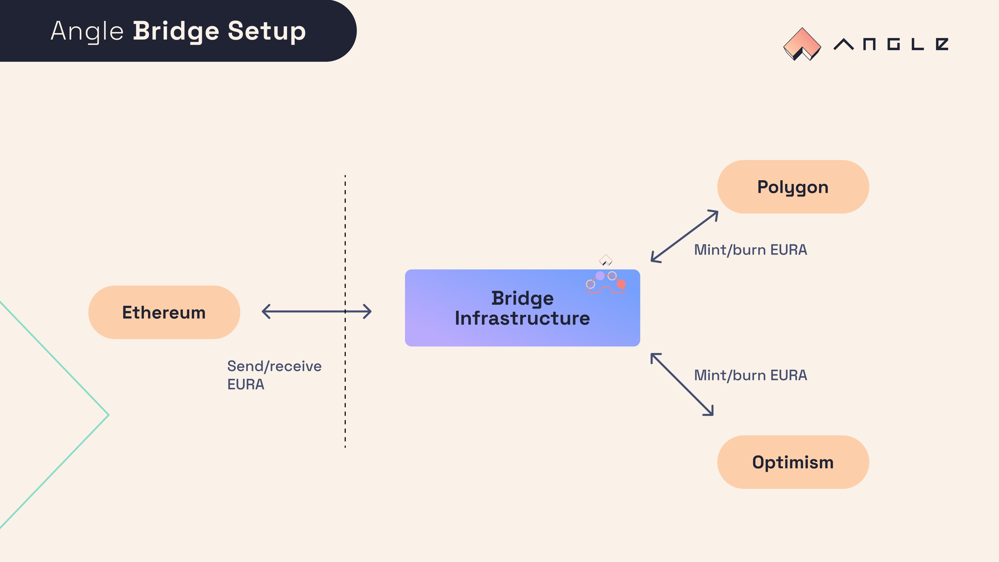

# ⛓ Angle Cross-Chain Infrastructure

## Angle on different networks

Angle Protocol is composed of two set of smart contracts: the Core module, and the Borrowing module.

While the Core module is only deployed on Ethereum mainnet, the Borrowing module is also deployed on other chains and layer 2s. This allows for native minting of agEUR on these other networks.



## Bridging between networks

Bridges are what allow agEUR and the ANGLE token to be available on different networks. At the top level, the bridges for agEUR (and ANGLE) all do the same thing: they burn (or lock) tokens on the origin network, and mint new tokens on the destination network. When bridging back tokens from the destination chain, tokens are burnt (or locked) there and minted (or released) from the smart contract on the origin chain.

AgEUR and ANGLE can be bridged between networks using Angle's infrastructure, compatible with multiple bridge solutions. Bridging agEUR is available natively on the [Angle App](https://app.angle.money/#/bridges).

### Angle bridge infrastructure details

Usually, bridges work by minting their own version of the tokens being bridged. To compensate, Angle allows approved bridges versions of agEUR to be swapped 1:1 to a canonical ("official") version of agEUR on every chain.

To limit the risk associated with each bridge, a total and hourly cap on the quantity of each token that can be bridged to & from specific networks has been implemented.

Some bridges, like LayerZero, are integrated natively with agEUR meaning that users should not see the intermediary bridge token and directly receive canonical agEUR.



## Bridge Solutions

| Chain         | agEUR                                                                                                       | ANGLE                                                          |
| ------------- | ----------------------------------------------------------------------------------------------------------- | -------------------------------------------------------------- |
| Polygon       | [LayerZero](https://app.angle.com/#/bridge), [Polygon PoS bridge](https://wallet.polygon.technology/bridge) | [Polygon PoS bridge](https://wallet.polygon.technology/bridge) |
| Optimism      | [LayerZero](https://app.angle.com/#/bridge)                                                                 | ❌                                                             |
| Avalanche     | [Multichain Router](https://app.multichain.org/#/router)                                                    | [Multichain Bridge](https://app.multichain.org/#/router)       |
| Fantom        | [Multichain Router](https://app.multichain.org/#/router)                                                    | [Multichain Bridge](https://app.multichain.org/#/router)       |
| BSC           | [Multichain Router](https://app.multichain.org/#/router)                                                    | [Multichain Bridge](https://app.multichain.org/#/router)       |
| Harmony       | [Multichain Router](https://app.multichain.org/#/router)                                                    | [Multichain Bridge](https://app.multichain.org/#/router)       |
| Fuse          | [Multichain Router](https://app.multichain.org/#/router)                                                    | ❌                                                             |
| NEAR / Aurora | [Rainbow Bridge](https://rainbowbridge.app/transfer)                                                        | [Rainbow Bridge](https://rainbowbridge.app/transfer)           |
| Solana        | [Wormhole](https://wormholebridge.com/#/transfer)                                                           | [Wormhole](https://wormholebridge.com/#/transfer)              |

_**Multichain Router**: token can be bridged **between** chains with Router support for this token. **Multichain Bridge**: token can be bridged only from Ethereum mainnet to the specified chain, and not between chains._


Angle related contract addresses across different chains and layer 2s can be found [here](https://developers.angle.money/protocol-overview/smart-contracts/sidechains-layer2s-contracts).

