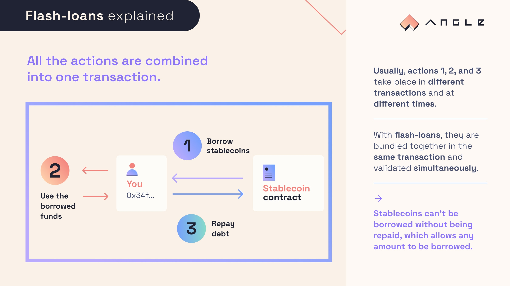

# ⚡️ Flash Loans

Some of the Angle stablecoins like EURA offer the possibility to take free flash loans.

## What are flash loans?

They are a type of loan that allow to borrow and repay tokens in one transaction. Thanks to that, the entity taking out the loan don't need to put down any collateral, as the lender is guaranteed to be paid back if the transaction is executed. This also allows them to borrow/mint huge amounts of stablecoins through flash loans.

The main use case for flash loans is arbitrage between pools, which usually helps rebalancing liquidity over the ecosystem.

## Flash loans with Angle stablecoin

Contrary to what is done in other lending protocols like Aave, tokens lent by the protocol during flash loans are not taken from a liquidity pool, but they are directly minted from the protocol's contracts.

Flash loans offered by the protocol are free. For each stablecoin, there is a cap on the amount that can be taken during a flash loan, this cap is controlled by governance and it could be removed so that anyone can borrow technically an infinite amount of agToken in a block.

More info on how to take a flash loan with Angle in our [developers documentation](https://developers.angle.money/overview/guides/flashloans).
